Part I
======

Here you will learn what this project is all about and what are the
initial steps to set up the automation scenario.

The general idea
----------------

The idea of the architecture is simple:

We have 3 apartments, each getting its own HA central. Another HA
central, with different duties, is in the basement. All systems are
interconnected but the components are shielded from unauthorized access.
For remote access one fine day I want to setup a cable modem or
surfstick based connection.

Any part of the system should be in some sense "open" - i.e. **not** a
proprietary technology that cannot be replaced at its "API level" by
another component more or less instantly. For the purpose of this
project it does not have to be "free", publicly documented or self-made.

The reason for this is simple: many components are too complex to be
manufactured completely yourself in a timely fashion, in production
quality or within a reasonable budget (and some of them all of this...).
But you can tell the components that will lock you in a certain
architecture (I only say : cloud, cloud, cloud) or provider and leave
them alone.

Appartment server
~~~~~~~~~~~~~~~~~

A "simple" home automation device with initially the following tasks

-  Control lighting via push buttons

-  Control shutters via push buttons

-  Control heating via thermostat and some "simple" rules

Clearly, this has the potential to grow....

Basement server
~~~~~~~~~~~~~~~

This one will eventually provide the connectivity to the whole wide
world, allowing for remote operation of the complete system.

Second, I want to provide door and house communication via this device.

Last not least one can setup more central services for all participants
and control for HVACR components.

Basic tools
-----------

Soldering iron
~~~~~~~~~~~~~~

If you too want to build the driver component yourself, you will need an
electronic soldering iron. This has not to be something special, we will
not solder SMDs or expensive chips.

Having an iron at hand will be reasonable anyway if you plan to do
tinkering with electric components yourself.

Copper Wire
~~~~~~~~~~~

For my project I needed two types of copper wire.

|image0|

Jumper Wire (or hook-up wire?), 0,8 mm diameter with plastic insulation.
This is used for wiring the low voltage components within the electric
distribution.

|image1|

Jumper wire with coating. 0,28 mm diameter. This is used for wiring the
electronic components on the proto board.

In this project we will deal with 24V and 5V components and currencies
up to 500mA (that will sum up, for sure).

Cable Connectors
~~~~~~~~~~~~~~~~

For patching the communication and other low voltage cables there is a
simple connector system from "Wago", series 243.

|image2|

The Wago 243 connector. You can get this in different colors and sizes.

|image3|

The Wago 243 holder is a great tool to mount the connectors on a DIN
rail.

For patching the 240V lines I used the Wago 222 series, the 3 and 5 slot
ones.

|image4|

|image5|

Again, the Wago 222 has a holder to mount - wherever you want.

Another very practical item is the WAGO "miniature" terminal block, e.g.
260-331.

|image6|

There are a couple of other parts in this series that make life easier,
just look through the catalog. I've used these items successfully for
wiring the heating valves. As DIN rail mounts are available, using them
in the cabinet for patching is another "hot spot" for the parts.

Appartment server
-----------------

Intro
~~~~~

The apartment server will control the internals of a single unit. Its
complexity is "modest". We will only provide basic control, no
sophisticated automation so far. It's the modern, scalable adaption of a
classical apartment installation.

First, we have a look at the hardware components, then we select and
install a software stack. Finally we make some tweaks that I consider
"basic requirements" for a production system.

Hardware for the server
~~~~~~~~~~~~~~~~~~~~~~~

For the central platform of this project we have the following
constraints

-  price tag

-  power consumption

-  availability of software

-  availability of hardware

-  availability of advice

-  interoperability features

-  stability/reliability

It's not very hard to come across the Raspberry Pi seeing this list. I
must admit, I am not a microcontroller or single board computer nerd.
The selection process was finally driven by the question "availability"
of all kind. Other SBCs may be better suited (and may be are
interchangeable in the design to come). But, whatever software and
hardware component you may want to use, if you don't find a tutorial for
the Pi, you will find none.

The greatest disadvantages (let's name it challenges) I found so far for
this platform:

- stability/reliability
	Based on the SD card as filesystem, one can expect failures on a
	regular base

- USB
	The USB connectivity for the Pi is known to be a weak spot. One may
	expect outages if network communication and other USB controlled
	communication will exceed a certain threshold.

Power supply
~~~~~~~~~~~~

A major concern of this project is stability and as such everybody
really recommends a good power supply. Using the Pi in a central
installation gives you the added benefit of using a DIN rail component
like the Meanwell DR-60-05. This should be enough to serve for all 5v
components planned so far in the "rack".

|image7|

Here you can see a "preview" for the new electric distribution with the
power supply. The power supply on the left, a 24V will drive the relays.

In addition, the internet advice is to always connect the Pi via the USB
plug, this ensures leveraging the fuse and some magic on the Pi's board
take care of good "vibrations".

Cabling
^^^^^^^

The PI needs power via USB cable (you may opt to power via the GPIO
Pins, but this is not easier in this case and seems to bring some issues
if you do so). So, simple solution is to buy some preconfigured USB, cut
the host adapter and patch the power line to the 5V supply, using the
Wago 243 "distribution" (you can see on the left of the supply).

|image8|

You will most probably find that the cables are not suited to be patched
directly - this is the first time you will have to heat up the soldering
iron and add some copper wire at the end.

For your reference I enclose the connector pinout here.

|image9|

USB 1 standard pinout

+-------+---------+---------+---------------+
| Pin   | Name    | Color   | Description   |
+=======+=========+=========+===============+
| 1     | V bus   | Red     | +5V           |
+-------+---------+---------+---------------+
| 2     | D-      | White   | Data-         |
+-------+---------+---------+---------------+
| 3     | D+      | Green   | Data+         |
+-------+---------+---------+---------------+
| 4     | GND     | Black   | Ground        |
+-------+---------+---------+---------------+

USB micro pinout

+-------+---------+---------+---------------+
| Pin   | Name    | Color   | Description   |
+=======+=========+=========+===============+
| 1     | V bus   | Red     | +5V           |
+-------+---------+---------+---------------+
| 2     | D-      | White   | Data-         |
+-------+---------+---------+---------------+
| 3     | D+      | Green   | Data+         |
+-------+---------+---------+---------------+
| 4     | ID      |         | USB OTG ID    |
+-------+---------+---------+---------------+
| 4     | GND     | Black   | Ground        |
+-------+---------+---------+---------------+

Push Buttons / Digital Input
~~~~~~~~~~~~~~~~~~~~~~~~~~~~

Even in the age of smartphones you will not omit plain buttons for
lights and shutters (at least if you want to avoid trouble with your
sweetheart).

I looked around a lot for this one and it is not easy to decide:

Direct wiring
^^^^^^^^^^^^^

One can setup a wire based scenario, using "cheap" buttons that finally
switch some GPIO directly, preferably using 24V technique. Every button
is connected to a GPIO line directly. In this small use case with around
10 switches planned upfront it is a viable solution. Performed correctly
one fine day you may switch the 1:1 cabling to a bus system, so there's
an upgrade possibility.

The greatest advantage of this solution (at least for my wife) was: if
anything goes wrong, one can still switch to a more conservative
solution later on.

The drawbacks:

-  you still pay for the cabling, which is not so cheap if you don't do
   it yourself.

-  you loose a great deal of flexibility - you have to decide upfront
   how many buttons you need and where they will go finally

-  it's not scalable (you need a single cable for each button planned)

-  it's still homegrown (not the buttons and infrastructure, but the
   central)

Bus wiring
^^^^^^^^^^

Next one is a bus system. Using KNX is an option here, but not if you
want to install a "cheap" solution (there may be other opinions on
this..).

There are also a couple of interesting "proprietary" solutions (e.g.
Eltako and Homematic wired) and if it wasn't for the fun of the project,
I would have chosen it. There's lot of information around, of the shelf
products are available.

More interesting is the possibility of using an "open" bus system like
Modbus, RS485, CAN or OneWire. The greatest problem here in my opinion
is the availability of the button hardware itself. I didn't find any off
the shelf product. One can (must) design his button and the bus endpoint
logic himself. While there's lot of information available this will
result in lot of work for creating you proprietary button yourself,
besides the fact that this button is **really** not cheap finally.

Don't forget that you have to design the central gateway of the bus to
the server also.

The advantage of bus wiring for me is the reliability while we still
have a scalable solution (if you call it scalable that you **can** add
another component, but you still have to tear apart your wall...).

This would have been the solution if I had unlimited time, I think. But
I don't have...

Radio
^^^^^

Again there is a very wide choice of solutions.

Homematic, FS20, Zigbee, ZWave, Enocean,... Countless providers for radio
solutions and every day more...

To be honest, I didn't test and setup a prototype for all of them, but I
think important criteria is

- Power consumption
	You won't get happy if you have to switch batteries 4 times a year...

- Reliability
	Pressing a button should switch the light. Every time.

- Range
	And don't forget to differentiate between the nominal and the real
	one. Take into account the specific anatomy of your building.
	Maybe you should consider making real measurements - it may seem
	that the devices are up and running. But in reality the connection
	quality may be so bad that numerous retransmissions are necessary,
	rapidly destroying your overall bandwidth.

- Scalability
	The different technologies differ in the way they use the radio
	band und the legal limitations to do so. In a small apartment this
	may be neglected, but mid sized or great installations might have
	to take action to circumvent the problem.
	Some technology comes along with built-in repeater features, some
	technology does not provide such things at all.

- Component availability
	Best is: all components, sensors and actors, are available from
	your preferred technology. But, as you will see, thanks to gateways
	and freely available software, this is not a real problem..

- Gateway availability
	Going for a SBC and open source controlled system, this is a real
	showstopper. Be sure there is a component you can plug into your
	SBC along with the appropriate drivers for your platform.

- Number or size of providers
	Personally I would not mind going for a new gadget that may get
	lost in 2 years. But a commercial grade project for three
	apartments has a lifecycle of at least 10 to 20 years (I hope...).

- Price
	Well...

- Design
	As you like...

Conclusion
^^^^^^^^^^

For this project I choose Enocean based buttons. The reasoning:

- Power consumption
	Well, it's "self contained". Power is harvested via a piezo element
	upon button press.

- Reliability
	It's an old and widespread technology, so I hoped that in this
	small scale project I will not meet any issues (which is not really
	true so far).

.. topic:: Time Travel

	As of today, Enocean is not really without problems. One of the
	original requirements "push a button triggers an action - every time"
	is not really true. Sometimes it is necessary to repeat a button press
	to get it recognized. That's a bit annoying but not really a
	showstopper.

	More of a problem was the unexplicable degradation of a single
	button/receiver combination. Only after changing the receiver stick,
	things got better.

- Range
	Range as specified and tested is enough in my max. 10m, single
	floor scenario.

- Scalability
	There exist really large installation, so I do not mind this one.

- Component availability
	There's a broad range of components from different suppliers.

- Gateway availability
	There are even different hardware gateways for the Pi.

- Number or size of providers
	See above.

- Price
	This are not the cheapest ones, especially in comparison with some
	other 433 MHZ technology, but from time to time you can hit a
	special offer.

- Design
	It's OK - and you can integrate to other standard (55mm) providers.

So here it is:

|image10|

A plain old button - besides the interesting fact that it is radio
based.

|image11|

The back is even more interesting (and yes, I know, one should not show
the serial). Here you find all the information to be applied when we
integrate the button in the software.

|image12|

This is the official Enocean USB adapter.

.. topic:: Time Travel

	Maybe today i would evaluate implementing radio based buttons using
	the ESP8266 - an inexpensive microcontroller with on board WIFI. This
	would fit perfectly in a HA design and the component may be used for
	other tasks, too.

	It has all kind of IOs on board, compare it with a very cheap Arduino
	with built in WIFI

Thermostat / Analog Input
~~~~~~~~~~~~~~~~~~~~~~~~~

Requirement
^^^^^^^^^^^

In Germany one is legally forced (!) to provide a thermostat unit for
each (!) room - even if we have a floor heating as in our project.
Anyway, my unit must have a temperature sensor, a display and some means
to enter the target temperature.

Direct wiring
^^^^^^^^^^^^^

Again, in theory you have the option of wiring a such a device directly.
In practice I do not know of any unit that fulfills the requirements and
has a "public" protocol that I could use with the Pi.

For sure you can fall back to the countless OneWire components with
regard to sensors. In this case you have to find an alternative solution
for entering the temperature (see below).

Radio
^^^^^

There's a bunch of (cheap) radio thermostats - but no public
documentation for the protocol. So, if you find some, get it..

There are some enocean based units - but they are really expensive. As I
need 12 of them, I skipped this option.

Finally I found a good offer for the Homematic thermostat. A cute unit
with all requirements and even humidity sensor. The drawback is, that I
have to add another gateway to my Pi - but that's fine anyway. It's not
too expensive and now we have access to the two most used radio
technologies in Germany (today).

Alternative
^^^^^^^^^^^

Instead of distributing a complete sensor/actor component in every room
you may look at the option of including a central control panel. E.g.
there are countless cheap options for a TFT touch screen in any size.

Then you can fall back to simple thermostat sensors in every room, while
the temperature selection is available only on the control panel.

Such a panel can range from a simple numeric display with some buttons
over a computer connected touch display (as a "console") to a remote
browser client, again with different hardware options.

While I plan to have a look at such an option later on, in the first
phase of the project I will stick with a console-less approach.

.. topic:: Time Travel

	Displays and tablets get cheaper and cheaper. Maybe today I'd evaluate
	a complete tablet based frontend and simple sensors in each room.
	While this will involve more software design on the other hand you get
	a frontend for all other items in your installation, too.

Conclusion
^^^^^^^^^^

The conservative approach: we take a pack of these

|image13|

Homematic Thermostat (HM-TC-IT-WM-W-EU).

|image14|

Homematic USB adapter

Relays / Digital output
~~~~~~~~~~~~~~~~~~~~~~~

Next task is the interaction with the output side. This is a relatively
small installation, so we do not need a lot of outputs (you will see,
the 16 GPIOS used later will be enough for me). If this is not the case,
a multiplexing solution is more appropriate.

Here in the first step we choose a straight forward solution:

-  Use 16 GPIO pins for output

-  Run every output through an amplifying stage - here a darlington arry

-  Connect the darlington output to either the terminal component (if
   output constraints are satisfied) or drive a relay.

ULN 2803 APG
^^^^^^^^^^^^

Controlling relays or other components means nearly always driving
currencies that are too high for a GPIO pin. There's lots of discussion
in the forums on which solution will fry the pi and which will work. I
think the best way to go is: make it "right" and make it flexible.

Still you will find several solution for this problem, one of them is
using a darlington transistor or in this case an array of it.

The ULN 2803 takes care you don't fry your Pi. It allows for up to 50V,
500mA per Output and as such, with a price tag of ~ 70 Euro Cent, it is
suitable as a joker for nearly all IO. Btw. there are some similar chips
to this one, even cheaper, with comparable capabilities. Just look
around for finding good tutorials.

+--------------------------------------------------+-------------+----------------+
| IN 1                                             ||image15|    |   OUT 1        |
+==================================================+=============+================+
| IN 2                                             |             | OUT 2          |
+--------------------------------------------------+-------------+----------------+
| IN 3                                             |             | OUT 3          |
+--------------------------------------------------+-------------+----------------+
| IN 4                                             |             | OUT 4          |
+--------------------------------------------------+-------------+----------------+
| IN 5                                             |             | OUT 5          |
+--------------------------------------------------+-------------+----------------+
| IN 6                                             |             | OUT 6          |
+--------------------------------------------------+-------------+----------------+
| IN 7                                             |             | OUT 7          |
+--------------------------------------------------+-------------+----------------+
| IN 8                                             |             | OUT 8          |
+--------------------------------------------------+-------------+----------------+
| GND                                              |             | 5V to 50V DC   |
| You need to connect Pi and secondary power GND   |             |                |
+--------------------------------------------------+-------------+----------------+

Some more advantages:

-  The chip allows to work with "active high" logic from the GPIO

-  You have built in protective resistors on the input, one pulling to
   ground and one constraining input current (see datasheet schematic
   diagram).

-  You have built in protective diodes on the output, so driving a relay
   or motor is fine

And some advice:

Keep in mind, that while you may use the 5V from Pi's power, consuming
too much current will make the Pi instable or completely dysfunctional.
If you need the chip to decouple and protect the Pi, chances are good
that you should use a separate power supply anyway.

Remember to always provide common ground to Pi, ULN2803 and secondary
power.

The concrete use of this chip in my project is multipurpose. On one hand
this should drive high voltage relays (see beyond), on the other hand I
want to drive heating valves directly. Some outputs will remain unused,
but the multipurpose chip will surely fit in all output scenarios to
come.

Eltako Relay
^^^^^^^^^^^^

The power lines are switched using plain relays for mounting in the
service cabinet.

|image16|\ |image17|

here the R12-100 for switching light and comparable und the R12-110 for
switching the shutters. I selected the 24VDC type, needing < 100mA.

Using the R12-100 type is straightforward. The control pins are
connected to a GPIO and 24V.

The R12-110 controls the shutter motor, you need one for up and one for
down. The R12-110 has an "opener" and a "closer". This feature is used
to forestall switching both circuits on. Here's the wiring scheme

|image18|

These relays are under heavy load, especially when reversing up and down
in short period. You really should add mechanisms in the control
software to delay for 200-400 ms between changing direction.

Heating Valve
^^^^^^^^^^^^^

The heating valves are 24VDC, the power consumption should be <100mA
(Danfoss 088H3141)

|image19|

The valves are "normally open", meaning that a correctly installed
heating system should never need any power. In case of failure the
heating is on.

Driver module
^^^^^^^^^^^^^

The "driver module" is a simple connector for the Pi to the outside
world, based on the ULN2803. I was eager to learn some details, so I
decided to start this component from scratch.

All in all I can not recommend following this strategy: It's a lot of
work if you don't have a PCB, it's error prone and it's not really
cheap. In some later chapters I will talk about some alternatives.

That said, let's get together the components we need (besides the basic
stuff mentioned in the beginning).

We have two ULN2803 for a total of 16 "amplified" IO ports. That's
enough for me for the moment, controlling 4 heat valves, some lights and
some shutters.\ |image20|

We have the prototyping board,

|image21|

two IC sockets for the ULN2803,

|image22|

some screw terminals. These are used for external power supply and all
outputs.

|image23|

A 20 pin male connector. This is used for connecting the components
inputs.

|image24|

A DIN rail case, 3 units

|image25|

A 20 pin female connector for the component input.

|image26|

A 40 pin female connector for the Pi GPIO.

|image27|

A ribbon cable, 20 cores

|image28|\ The module is set up on a generic prototyping board and
deployed in a din rail box. The input side is a 20 pin board connector
for the 16 GPIOS and GND and 4 small clamps for the secondary power.
Output power ULN2803 can be supplied separately this way.

The output is 19 small clamps (well - they just fitted in a 3 unit din
rail..) for 16 power outputs, common ground and the two secondary power
inputs.

In the middle we have the two ULN2803 (on a socket, accounting for both
my poor soldering abilities and the possibility that I may fry one of
them later on). The "top" one, near to the input lets call "A", the
other "B".

|image29|\ For your amusement I show the soldering side here. It's ok
for me, but I can testify that these are the most expensive modules you
can have. For me it was at least 2 hours per unit, 5 units in total.

Keep in mind that the overall current **may** be quite high and use
appropriate cables for GND and plus side.

|image30|\ In the din rail housing, where you can't see the nasty
details it already looks a little professional.

|image31|

|image32|

Wiring scheme
'''''''''''''

|image33|

In the following A and B reference the two ULN2803 chips.

The input power side (green clamp, upper right), numbered from top to
bottom

+-----+-------+
| 1   | GND   |
+=====+=======+
| 2   | A +   |
+-----+-------+
| 3   | GND   |
+-----+-------+
| 4   | B +   |
+-----+-------+

The board connector of the "driver module" is connected as follows
(where 1 is on the upper left on this picture).

+----------+------+------+----------+
|          |    1 |   2  | GND      |
+==========+======+======+==========+
|          |    3 |   4  | GND      |
+----------+------+------+----------+
| B IN 8   |    5 |   6  | A IN 8   |
+----------+------+------+----------+
| B IN 7   |   7  |   8  | A IN 7   |
+----------+------+------+----------+
| B IN 6   |   9  |   10 | A IN 6   |
+----------+------+------+----------+
| B IN 5   |   11 |   12 | A IN 5   |
+----------+------+------+----------+
| B IN 4   |   13 |   14 | A IN 4   |
+----------+------+------+----------+
| B IN 3   |   15 |   16 | A IN 3   |
+----------+------+------+----------+
| B IN 2   |   17 |   18 | A IN 2   |
+----------+------+------+----------+
| B IN 1   |   19 |   20 | A IN 1   |
+----------+------+------+----------+

And the clamps on the output side (numbered seen from the top on the
picture above)

+------+-----------+
| 1    | GND       |
+======+===========+
| 2    | A +       |
+------+-----------+
| 3    | B +       |
+------+-----------+
| 4    | A OUT 8   |
+------+-----------+
| 5    | A OUT 7   |
+------+-----------+
| 6    | A OUT 6   |
+------+-----------+
| 7    | A OUT 5   |
+------+-----------+
| 8    | A OUT 4   |
+------+-----------+
| 9    | A OUT 3   |
+------+-----------+
| 10   | A OUT 2   |
+------+-----------+
| 11   | A OUT 1   |
+------+-----------+
| 12   | A OUT 8   |
+------+-----------+
| 13   | B OUT 7   |
+------+-----------+
| 14   | B OUT 6   |
+------+-----------+
| 15   | B OUT 5   |
+------+-----------+
| 16   | B OUT 4   |
+------+-----------+
| 17   | B OUT 3   |
+------+-----------+
| 18   | B OUT 2   |
+------+-----------+
| 19   | B OUT 1   |
+------+-----------+

Connecting the Pi
^^^^^^^^^^^^^^^^^

Let's look at the Pi, this is the pinout of the connector.

|image34|\ |image35|

+------------------+-------+-------+------------------+
|                  | PIN   | PIN   |                  |
+==================+=======+=======+==================+
| 3.3V             | 1     | 2     | 5V               |
+------------------+-------+-------+------------------+
| GPIO 02 (I2C)    | 3     | 4     | 5V               |
+------------------+-------+-------+------------------+
| GPIO 03 (I2C)    | 5     | 6     | GND              |
+------------------+-------+-------+------------------+
| GPIO 04 (GCLK)   | 7     | 8     | GPIO 14 (TXD0)   |
+------------------+-------+-------+------------------+
| GND              | 9     | 10    | GPIO 15 (RXD0)   |
+------------------+-------+-------+------------------+
| GPIO 17 (GEN0)   | 11    | 12    | GPIO 18 (GEN1)   |
+------------------+-------+-------+------------------+
| GPIO 27 (GEN2)   | 13    | 14    | GND              |
+------------------+-------+-------+------------------+
| GPIO 22 (GEN3)   | 15    | 16    | GPIO 23 (GEN4)   |
+------------------+-------+-------+------------------+
| 3.3V             | 17    | 18    | GPIO 24 (GEN5)   |
+------------------+-------+-------+------------------+
| GPIO 10 (MOSI)   | 19    | 20    | GND              |
+------------------+-------+-------+------------------+
| GPIO 09 (MISO)   | 21    | 22    | GPIO 25 (GEN6)   |
+------------------+-------+-------+------------------+
| GPIO 11 (CLK)    | 23    | 24    | GPIO 08 (CE0)    |
+------------------+-------+-------+------------------+
|                  |       |       |                  |
+------------------+-------+-------+------------------+
| GND              | 25    | 26    | GPIO 07 (CE1)    |
+------------------+-------+-------+------------------+
| ID\_SD           | 27    | 28    | ID\_SC           |
+------------------+-------+-------+------------------+
| GPIO 05          | 29    | 30    | GND              |
+------------------+-------+-------+------------------+
| GPIO 06          | 31    | 32    | GPIO 12          |
+------------------+-------+-------+------------------+
| GPIO 13          | 33    | 34    | GND              |
+------------------+-------+-------+------------------+
| GPIO 19          | 35    | 36    | GPIO 16          |
+------------------+-------+-------+------------------+
| GPIO 26          | 37    | 38    | GPIO 20          |
+------------------+-------+-------+------------------+
| GND              | 39    | 40    | GPIO 21          |
+------------------+-------+-------+------------------+

Detailed information on the Pins is available e.g. at
http://elinux.org/RPi\_BCM2835\_GPIOs.

You can use any of the GPIO Pins, but selecting carefully may leave you
the option to add other features later on. The ones selected for this
project are rendered in green.

For the driver module board connector I "manufactured" a connector cable
from the above GPIOs. This is the board connector wiring scheme.

+-----------------+------+------+-----------+
| Red cable       | 1    | 2    | GND       |
+=================+======+======+===========+
|                 | 3    | 4    | GND       |
+-----------------+------+------+-----------+
| GPIO 21         | 5    | 6    | GPIO 20   |
+-----------------+------+------+-----------+
| GPIO 26         | 7    | 8    | GPIO 16   |
+-----------------+------+------+-----------+
| GPIO 19         | 9    | 10   | GPIO 13   |
+-----------------+------+------+-----------+
| GPIO 12         | 11   | 12   | GPIO 06   |
+-----------------+------+------+-----------+
| GPIO 05         | 13   | 14   | GPIO 25   |
+-----------------+------+------+-----------+
| GPIO 24         | 15   | 16   | GPIO 23   |
+-----------------+------+------+-----------+
| GPIO 22         | 17   | 18   | GPIO 27   |
+-----------------+------+------+-----------+
| GPIO 18         | 19   | 20   | GPIO 17   |
+-----------------+------+------+-----------+

The end to end connectivity on the driver module output clamps (numbered
as above) with this configuration is:

+------+-----------+
| 1    | GND       |
+======+===========+
| 2    | A +       |
+------+-----------+
| 3    | B +       |
+------+-----------+
| 4    | GPIO 20   |
+------+-----------+
| 5    | GPIO 16   |
+------+-----------+
| 6    | GPIO 13   |
+------+-----------+
| 7    | GPIO 06   |
+------+-----------+
| 8    | GPIO 25   |
+------+-----------+
| 9    | GPIO 23   |
+------+-----------+
| 10   | GPIO 27   |
+------+-----------+
| 11   | GPIO 17   |
+------+-----------+
| 12   | GPIO 21   |
+------+-----------+
| 13   | GPIO 26   |
+------+-----------+
| 14   | GPIO 19   |
+------+-----------+
| 15   | GPIO 12   |
+------+-----------+
| 16   | GPIO 05   |
+------+-----------+
| 17   | GPIO 24   |
+------+-----------+
| 18   | GPIO 22   |
+------+-----------+
| 19   | GPIO 18   |
+------+-----------+

Distribution Box Patching
^^^^^^^^^^^^^^^^^^^^^^^^^

Now we have to define a correspondence between the physical power lines
and valves and the GPIOs.

The electrician was a kind one, he provided terminal blocks for every
power line to the rooms. Power is distributed from the terminal blocks
to the rooms in a star topology, power is switched centrally via relays.

The power line is either patched directly to a corresponding fuse (for
wall outlets) or pathed to one of the relays. The relays power input is
patched to the fuse for the power line. The control input (24V) is
connected to the driver module.

|image36|

So, even if this is not of special interest for your project i document
the terminal block layout here - I recommend to do so yourself. The day
you will need this table for your reference is near...

Floor 1
'''''''

+---------+------------+---------+----------------------------+
| Block   | Terminal   | Relay   | Target                     |
+=========+============+=========+============================+
| 1       | 01         | .       | Oven                       |
+---------+------------+---------+----------------------------+
|         | 02         | .       | Oven/ Oven                 |
+---------+------------+---------+----------------------------+
|         |            |         |                            |
+---------+------------+---------+----------------------------+
| 2       | 01         | .       | kitchen                    |
+---------+------------+---------+----------------------------+
|         | 02         | .       | kitchen / washer           |
+---------+------------+---------+----------------------------+
|         | 03         | .       | kitchen / fridge           |
+---------+------------+---------+----------------------------+
|         |            |         |                            |
+---------+------------+---------+----------------------------+
| 3       | 01         | .       | roomL                      |
+---------+------------+---------+----------------------------+
|         | 02         | .       | roomR                      |
+---------+------------+---------+----------------------------+
|         | 03         | .       | hall                       |
+---------+------------+---------+----------------------------+
|         | 04         | .       | bath                       |
+---------+------------+---------+----------------------------+
|         | 05         | .       | heating                    |
+---------+------------+---------+----------------------------+
|         | 06         | .       | terrace                    |
+---------+------------+---------+----------------------------+
|         | 07         | R1      | kitchen                    |
+---------+------------+---------+----------------------------+
|         | 08         | R2      | roomL                      |
+---------+------------+---------+----------------------------+
|         | 09         | R2      | roomL                      |
+---------+------------+---------+----------------------------+
|         | 10         | R3      | roomR                      |
+---------+------------+---------+----------------------------+
|         | 11         | R3      | roomR                      |
+---------+------------+---------+----------------------------+
|         | 12         | R4      | hall                       |
+---------+------------+---------+----------------------------+
|         | 13         | R5      | bath                       |
+---------+------------+---------+----------------------------+
|         | 14         | R6      | terrace                    |
+---------+------------+---------+----------------------------+
|         |            |         |                            |
+---------+------------+---------+----------------------------+
| 4       | 01         |         | shutter left N             |
+---------+------------+---------+----------------------------+
|         | 02         | R7      | shutter left grey = up     |
+---------+------------+---------+----------------------------+
|         | 02         | R8      | shutter left black=down    |
+---------+------------+---------+----------------------------+
|         | 03         |         | shutter right N            |
+---------+------------+---------+----------------------------+
|         | 04         | R9      | shutter right grey = up    |
+---------+------------+---------+----------------------------+
|         | 04         | R10     | shutter right black=down   |
+---------+------------+---------+----------------------------+

Now you can map the power lines to the driver output. In the table below
you already see the technical names for the lines that are used
throughout the home automation installation from now on.

The name means for example "on floor 1, the kitchen light with index 0".
With this table (power line on the left and GPIO on the right) we are
able to program the openHab items.

+--------------------------------+-----------------+-----------+
| Target                         | Driver module   | GPIO      |
+================================+=================+===========+
| wbf1\_kitchen\_light0\_state   | 4               | GPIO 20   |
+--------------------------------+-----------------+-----------+
| wbf1\_roomL\_light0\_state     | 5               | GPIO 16   |
+--------------------------------+-----------------+-----------+
| wbf1\_roomR\_light0\_state     | 6               | GPIO 13   |
+--------------------------------+-----------------+-----------+
| wbf1\_hall\_light0\_state      | 7               | GPIO 06   |
+--------------------------------+-----------------+-----------+
| wbf1\_bath\_light0\_state      | 8               | GPIO 25   |
+--------------------------------+-----------------+-----------+
| wbf1\_terrace\_light0\_state   | 9               | GPIO 23   |
+--------------------------------+-----------------+-----------+
| wbf1\_roomL\_shutter0\_up      | 10              | GPIO 27   |
+--------------------------------+-----------------+-----------+
| wbf1\_roomL\_shutter0\_down    | 11              | GPIO 17   |
+--------------------------------+-----------------+-----------+
| wbf1\_roomR\_shutter0\_up      | 12              | GPIO 21   |
+--------------------------------+-----------------+-----------+
| wbf1\_roomR\_shutter0\_down    | 13              | GPIO 26   |
+--------------------------------+-----------------+-----------+
| wbf1\_roomL\_valve\_state      | 14              | GPIO 19   |
+--------------------------------+-----------------+-----------+
| wbf1\_kitchen\_valve\_state    | 15              | GPIO 12   |
+--------------------------------+-----------------+-----------+
| wbf1\_bath\_valve\_state       | 16              | GPIO 05   |
+--------------------------------+-----------------+-----------+
| wbf1\_roomR\_valve\_state      | 17              | GPIO 24   |
+--------------------------------+-----------------+-----------+
|                                | 18              | GPIO 22   |
+--------------------------------+-----------------+-----------+
|                                | 19              | GPIO 18   |
+--------------------------------+-----------------+-----------+

Floor 2
'''''''

+---------+------------+---------+----------------------------+
| Block   | Terminal   | Relay   | Target                     |
+=========+============+=========+============================+
| 1       | 01         | .       | Oven                       |
+---------+------------+---------+----------------------------+
|         | 02         | .       | Oven/ Oven                 |
+---------+------------+---------+----------------------------+
|         |            |         |                            |
+---------+------------+---------+----------------------------+
| 2       | 01         | .       | kitchen                    |
+---------+------------+---------+----------------------------+
|         | 02         | .       | kitchen / washer           |
+---------+------------+---------+----------------------------+
|         | 03         | .       | kitchen / fridge           |
+---------+------------+---------+----------------------------+
|         |            |         |                            |
+---------+------------+---------+----------------------------+
| 3       | 01         | .       | roomL                      |
+---------+------------+---------+----------------------------+
|         | 02         | .       | roomR                      |
+---------+------------+---------+----------------------------+
|         | 03         | .       | hall                       |
+---------+------------+---------+----------------------------+
|         | 04         | .       | bath                       |
+---------+------------+---------+----------------------------+
|         | 05         | .       | heating                    |
+---------+------------+---------+----------------------------+
|         | 06         | .       | terrace                    |
+---------+------------+---------+----------------------------+
|         | 07         | R1      | terrace                    |
+---------+------------+---------+----------------------------+
|         | 08         | R2      | kitchen                    |
+---------+------------+---------+----------------------------+
|         | 09         | R3      | roomL                      |
+---------+------------+---------+----------------------------+
|         | 10         | R3      | roomL                      |
+---------+------------+---------+----------------------------+
|         | 11         | R4      | roomR                      |
+---------+------------+---------+----------------------------+
|         | 12         | R4      | roomR                      |
+---------+------------+---------+----------------------------+
|         | 13         | R5      | hall                       |
+---------+------------+---------+----------------------------+
|         | 14         | R6      | bath                       |
+---------+------------+---------+----------------------------+
|         |            |         |                            |
+---------+------------+---------+----------------------------+
| 4       | 06         |         | shutter left N             |
+---------+------------+---------+----------------------------+
|         | 07         | R7      | shutter left grey = up     |
+---------+------------+---------+----------------------------+
|         | 07         | R8      | shutter left black=down    |
+---------+------------+---------+----------------------------+
|         | 10         |         | shutter right N            |
+---------+------------+---------+----------------------------+
|         | 11         | R11     | shutter right grey = up    |
+---------+------------+---------+----------------------------+
|         | 11         | R12     | shutter right black=down   |
+---------+------------+---------+----------------------------+

+--------------------------------+-----------------+-----------+
| Target                         | Driver module   | GPIO      |
+================================+=================+===========+
| wbf2\_kitchen\_light0\_state   | 4               | GPIO 20   |
+--------------------------------+-----------------+-----------+
| wbf2\_roomR\_light0\_state     | 5               | GPIO 16   |
+--------------------------------+-----------------+-----------+
| wbf2\_roomL\_light0\_state     | 6               | GPIO 13   |
+--------------------------------+-----------------+-----------+
| wbf2\_hall\_light0\_state      | 7               | GPIO 06   |
+--------------------------------+-----------------+-----------+
| wbf2\_bath\_light0\_state      | 8               | GPIO 25   |
+--------------------------------+-----------------+-----------+
| wbf2\_terrace\_light0\_state   | 9               | GPIO 23   |
+--------------------------------+-----------------+-----------+
| wbf2\_roomR\_shutter0\_up      | 10              | GPIO 27   |
+--------------------------------+-----------------+-----------+
| wbf2\_roomR\_shutter0\_down    | 11              | GPIO 17   |
+--------------------------------+-----------------+-----------+
| wbf2\_roomL\_shutter0\_up      | 12              | GPIO 21   |
+--------------------------------+-----------------+-----------+
| wbf2\_roomL\_shutter0\_down    | 13              | GPIO 26   |
+--------------------------------+-----------------+-----------+
| wbf2\_roomL\_valve\_state      | 14              | GPIO 19   |
+--------------------------------+-----------------+-----------+
| wbf2\_kitchen\_valve\_state    | 15              | GPIO 12   |
+--------------------------------+-----------------+-----------+
| wbf2\_bath\_valve\_state       | 16              | GPIO 05   |
+--------------------------------+-----------------+-----------+
| wbf2\_roomR\_valve\_state      | 17              | GPIO 24   |
+--------------------------------+-----------------+-----------+
|                                | 18              | GPIO 22   |
+--------------------------------+-----------------+-----------+
|                                | 19              | GPIO 18   |
+--------------------------------+-----------------+-----------+

Floor 3
'''''''

+---------+------------+---------+-----------------------------+
| Block   | Terminal   | Relay   | Target                      |
+=========+============+=========+=============================+
| 1       | 01         | .       | Oven                        |
+---------+------------+---------+-----------------------------+
|         | 02         | .       | Oven/ Oven                  |
+---------+------------+---------+-----------------------------+
|         |            |         |                             |
+---------+------------+---------+-----------------------------+
| 2       | 03         | .       | kitchen                     |
+---------+------------+---------+-----------------------------+
|         | 04         | .       | kitchen / washer            |
+---------+------------+---------+-----------------------------+
|         | 05         | .       | kitchen / fridge            |
+---------+------------+---------+-----------------------------+
|         |            |         |                             |
+---------+------------+---------+-----------------------------+
| 3       | 01         | .       | roomR                       |
+---------+------------+---------+-----------------------------+
|         | 02         | .       | roomL                       |
+---------+------------+---------+-----------------------------+
|         | 03         | .       | kitchen                     |
+---------+------------+---------+-----------------------------+
|         | 04         | .       | hall                        |
+---------+------------+---------+-----------------------------+
|         | 05         | .       | bath                        |
+---------+------------+---------+-----------------------------+
|         | 06         | .       | heating                     |
+---------+------------+---------+-----------------------------+
|         | 07         | .       | terrace                     |
+---------+------------+---------+-----------------------------+
|         | 08         | R1      | kitchen                     |
+---------+------------+---------+-----------------------------+
|         | 09         | R2      | roomR                       |
+---------+------------+---------+-----------------------------+
|         | 10         | R3      | roomL                       |
+---------+------------+---------+-----------------------------+
|         | 11         | R1      | kitchen                     |
+---------+------------+---------+-----------------------------+
|         | 12         | R4      | hall                        |
+---------+------------+---------+-----------------------------+
|         | 13         | R5      | bath                        |
+---------+------------+---------+-----------------------------+
|         | 14         | R6      | terrace                     |
+---------+------------+---------+-----------------------------+
|         |            |         |                             |
+---------+------------+---------+-----------------------------+
| 4       | 06         |         | shutter left N              |
+---------+------------+---------+-----------------------------+
|         | 07         | R7      | shutter left grey = up      |
+---------+------------+---------+-----------------------------+
|         | 07         | R8      | shutter left black=down     |
+---------+------------+---------+-----------------------------+
|         | 08         |         | shutter middle N            |
+---------+------------+---------+-----------------------------+
|         | 09         | R9      | shutter middle grey = up    |
+---------+------------+---------+-----------------------------+
|         | 09         | R10     | shutter middle black=down   |
+---------+------------+---------+-----------------------------+
|         | 10         |         | shutter right N             |
+---------+------------+---------+-----------------------------+
|         | 11         | R11     | shutter right grey = up     |
+---------+------------+---------+-----------------------------+
|         | 11         | R12     | shutter right black=down    |
+---------+------------+---------+-----------------------------+

+--------------------------------+-----------------+-----------+
| Target                         | Driver module   | GPIO      |
+================================+=================+===========+
| wbf3\_kitchen\_light0\_state   | 4               | GPIO 20   |
+--------------------------------+-----------------+-----------+
| wbf3\_roomR\_light0\_state     | 5               | GPIO 16   |
+--------------------------------+-----------------+-----------+
| wbf3\_roomL\_light0\_state     | 6               | GPIO 13   |
+--------------------------------+-----------------+-----------+
| wbf3\_hall\_light0\_state      | 7               | GPIO 06   |
+--------------------------------+-----------------+-----------+
| wbf3\_bath\_light0\_state      | 8               | GPIO 25   |
+--------------------------------+-----------------+-----------+
| wbf3\_terrace\_light0\_state   | 9               | GPIO 23   |
+--------------------------------+-----------------+-----------+
| wbf3\_roomL\_shutter0\_up      | 10              | GPIO 27   |
+--------------------------------+-----------------+-----------+
| wbf3\_roomL\_shutter0\_down    | 11              | GPIO 17   |
+--------------------------------+-----------------+-----------+
| wbf3\_roomR\_shutter0\_up      | 12              | GPIO 21   |
+--------------------------------+-----------------+-----------+
| wbf3\_roomR\_shutter0\_down    | 13              | GPIO 26   |
+--------------------------------+-----------------+-----------+
| wbf3\_roomR\_shutter1\_up      | 14              | GPIO 19   |
+--------------------------------+-----------------+-----------+
| wbf3\_roomR\_shutter1\_down    | 15              | GPIO 12   |
+--------------------------------+-----------------+-----------+
| wbf3\_roomL\_valve\_state      | 16              | GPIO 05   |
+--------------------------------+-----------------+-----------+
| wbf3\_bath\_valve\_state       | 17              | GPIO 24   |
+--------------------------------+-----------------+-----------+
| wbf3\_kitchen\_valve\_state    | 18              | GPIO 22   |
+--------------------------------+-----------------+-----------+
| wbf3\_roomR\_valve\_state      | 19              | GPIO 18   |
+--------------------------------+-----------------+-----------+

Software stack
~~~~~~~~~~~~~~

Intro
^^^^^

This is the software stack to run my apartment server.

Basic requirements are:

-  run unattended

-  run 24/7

-  reboot completely after power down

-  do not allow unauthorized access

-  maybe some day detect failures and reboot

Raspbian
^^^^^^^^

This is the most simple choice. I didn't look for an alternative to
deviate as little as possible from the widespread know how on the net
(and found it was wise to do so). Even with upgrading at some point from
this "Debian wheezy" based image to a "Debian Jessie" distribution I had
incompatibilities that I was not able to resolve with my basic Unix know
how.

Most information for the Pi and most pre-built software components use
this one.

There are tons of installation manuals to do this, I will not repeat the
steps in detail - only some advice for the uninitiated:

-  Use high quality SD cards

-  Follow the basic installation steps

   -  Download image

   -  Copy to card

   -  Launch Pi

   -  Resize Image

   -  Do internationalization stuff

-  Now you are fine and ready to take off. But I recommend to come back
   after playing around for some more detail steps (see chapter beyond)
   - most of them quite useful

   -  Clean your image from unused stuff

      -  Games/Learning stuff

      -  X11

      -  ..

   -  User administration

   -  Set a Static IP

   -  Read Only SD card

-  Make a backup

-  Go on...

Hmland
^^^^^^

This installation manual is in **correct** (layered) order, so "hmland"
is first. This requirement stems from:

-  I want to use openHAB for control

-  I want to use Homematic devices

-  openHab does not have a builtin engine to control this stuff, it
   always needs a native device to do this. And i don't want another
   CCU.

-  So I need homegear, an open source reimplementation of the Homematic
   software, running on the Pi, too.

-  homegear does need a "physical" device to talk to the Homematic
   endpoints. This is some radio chip. Again, this may be embedded in a
   Homematic device like the LAN adapter, USB stick or a directly
   soldered CC1101 radio chip.

-  I decided for a simple Homematic USB stick. At this moment it was
   cheap, there exists a fallback scenario (use the stick in another
   controller) and it was few work (I thought so..).

-  This stick can not be controlled by homegear directly

-  This is where hmland comes into play. Some enlightened guy has a
   module that controls the stick and behaves like a Homematic LAN
   adapter, which you can use in homegear, which is needed by openHAB.
   So easy.

hmland is not prebuilt for the Pi, but even me was able to do it in
minutes. Follow the instructions and everything is fine. If compiled and
moved all the stuff to

.. code::

	/opt/hmcfgusb/

Some caveats:

-  hmland should start as a daemon ???, do the init.d stuff

-  You can use "hmland -r" to do a fast debug

-  Letting hmland serve only on the loopback (127.0.0.1) is a good idea.
   What happened to me one day was that the loopback interface
   disappeared (from /etc/network, dunno why) and hmland didn't start
   any longer. It takes some time to find the reason, maybe you are
   warned.

Homegear
^^^^^^^^

In the chapter before we motivated already why we need homegear. I must
say this is a nice and powerful piece of software itself. The forums are
responsive and development is active.

We simply use it as a gateway from openHAB to Homematic devices - this
is by far only a piece of its features. If we'd skip the requirement for
Enocean compatibility (and the option to support a lot of more
bindings), we would have easily stopped with our software stack at this
point.

The install of the pre-built Pi package is effortless. Setup is done in
/etc/homegear, log is written to /var/log/homegear/ by default.

The working data set is found in /var/lib/homegear, most importantly the
device databases. Consider these when setting up backups.

One thing you may consider:

-  Enhance the init.d script to require "hmland" in the startup

Java
^^^^

openHAB is a Java application, we will need an up-to-date installation.
I choose and recommend the Oracle JDK.

openHAB 
^^^^^^^^

openHAB should be the workhorse for the system. With a Pi 2 I assume
there's plenty of memory and CPU for this quite big component.

This is a central hub (pun intended?) for a huge set of so called
bindings. Bindings abstract the source and sink of sensor and actor
communication and allow for the routing of information via rules.

This way I can get an event from an Enocean component and route it to a
GPIO based relay actor, the same way with the information from a
Homematic thermostat to a GPIO based driver for an electric valve.

Besides fulfilling this basic integration requirement, openHAB leaves
tons of possibilities to scale the solution up own day:

-  call external web services

   -  calendar based control

   -  notification

-  internal web services

   -  control any feature via web service

-  integrate other actor / sensor communication protocols

-  integrate system level via "exec"

-  time based events

-  persistence and monitoring

-  web ui

One word of advice: for this installation I used version 1.7.2. Most
development effort is spent on the upcoming version 2.0. With this
background information and some playing around with the software you can
quickly get the impression that you're on the dead end of an initial
design prototype. The community has collected a lot of knowledge and
ideas, that now are realized in a "completely" new product.

So the bad news is that many issues on the 1.7.2 version will never get
fixed or urgent features will never be implemented. You will have to
work around different issues and you will fight with suboptimal design
decisions.

The good news is - I still think this a very good idea and I hope that
2.0 will bring a lot of compatibility along with solutions for all the
nasty ticks of the current version.

.. topic:: Time Travel

	At the point of this writing 2.0 is entering beta, what a pity that I'm
	not able to switch the installation and make my tenants beta testing...
	but you know, never change a running system...

The installation of 1.7.2 itself is not as straightforward as one may
think. There are at least two "mainstream" installation instructions.
One works by "apt-get" the installation, but this one didn't work for
me. Manual installation using the "wget" approach worked fine, but you
have to set up some things yourself, most importantly the init.d
scripts.

Configuration details
~~~~~~~~~~~~~~~~~~~~~

Raspbian
^^^^^^^^

Maybe it's not so obvious, so a little explanation: I have the following
chapters on handling the Pi:

- Installation (above)
	This one is about the most basic steps to get the system running
	and general advice that is needed on any system. You've got a
	"multi purpose" Pi now.

- Configuration (this one)
	This is about special setup needed for our apartment server and the
	software stack we will use here. Things like user setup, GPIO
	stuff...

- Advanced (beyond)
	Here we **may** dig even deeper to make the Pi even more well
	suited for an home automation server. It's quite system specific
	(and you may ruin your system doing it ).

Hmland
^^^^^^

The hmland is quite simple to setup. Any change is made directly in the
init.d script.

-  port

-  logging

-  special options

Especially for achieving "low write profile" there's nothing you must do
here, the defaults are fine.

Homegear
^^^^^^^^

Configuration
'''''''''''''

Homegear configuration is done in two files for my scenario.

First, we look at "/etc/homegear/main.conf". Besides logging (see
chapter below), for me there was no need for further changes.

The next one will be "/etc/homegear/physicalinterfaces.conf". Here you
setup the real devices and communication channels.

I only set up an id and "rfKey", the base for the AES encryption with
the Homematic endpoints. Everything else is default with my
installation.

.. code::

	## The device family this interface is for
	[HomeMaticBidCoS]

	## Specify an unique id here to identify this device in Homegear
	id = wbf2

	## Specify a 16 byte (32 characters) long AES key here to protect your
	wireless communication

	## !!! IMPORTANT: Never ever lose this key. That would render your devices useless.
	## To remove the key from your devices, you need to factory reset them
	# wbbase
	#rfKey = 00000000000000000000000000000000

As the documentation states, keep this key in a safe place just in case.
Loosing the key will render your Homematic equipment useless.

Important commands
''''''''''''''''''

To deal with homegear, you have to setup some configuration on the
commandline, as this information is not stored in config files but in a
database.

To enter "command mode" type

.. code::

	sudo homegear -r

while the homegear daemon is already running.

Now you enter the homegear commandline. On any context you can enter
"help" to get directives on what you can do.

The first thing to do is selecting the Homematic family of devices
(there are short forms of the respective commands, for readability
reasons I give only the long forms here)

.. code::

	families select 0

In the Homematic context you can do some magic with "virtual" Homematic
devices, but we don't need none of this. We want to access the "main"
device to handle "peer" gadgets.

.. code::

	devices select 1

Here's where we want to work. You can

- list all peers "peers list"
	This gives you a informative list of all peers paired with the
	device

- reset a paired peer "peers reset <id>"
	You can unpair and remove the peer. The peer is reset to factory
	state. This is important if you want to add the peer to another
	Homematic device later, otherwise the AES key is not removed.

- select a peer for further inspection "peers select <id>"
	To go on working with a dedicated peer, you must select it.

- enter pairing mode for new peers "pairing on"
	If you want to add new peers to the device, you should do this
	using the pairing mode. After enabling pairing mode, for 60 seconds
	the device scans for peers that enter pairing mode themselves.
	After the pairing mode is finished, you can look up the peers
	detected using "peers list".

Send a list of all devices to a file
''''''''''''''''''''''''''''''''''''

.. code::

   sudo homegear -r | tee /home/pi/homegear-peers.txt

In the homegear commandline enter

.. code::

   families select 0
   devices select 1
   peers list

and you will get

.. code::

	>
	> families select 0
	Device family "HomeMatic BidCoS" selected.
	For information about the family's commands type: "help"
	(Family)> devices select 1
	Device selected.
	For information about the device's commands type: "help"
	(Device)> peers list
	ID  Name  Address Serial      Type  Type String       FW   CP  Unreach
	
	                                                              
	1         123450  LEQxxxxxxx  00AD  HM-TC-IT-WM-W-EU  1.2  No  Yes
	2         123451  MEQxxxxxxx  00AD  HM-TC-IT-WM-W-EU  1.2  No  Yes
	3         123452  LEQxxxxxxx  00AD  HM-TC-IT-WM-W-EU  1.2  No  Yes
	4         123453  LEQxxxxxxx  00AD  HM-TC-IT-WM-W-EU  1.2  No  Yes
	
	(Device)>

Pairing
'''''''

Enter the pairing mode for the main Homematic device

.. code::

	families select 0
	devices select 1
	pairing on

Now enter the pairing mode for each peer you want to add.

Database
''''''''

The database for the devices and peers is written to
/var/lib/homegear/db.sql. For my installation i pre-built 3 different
device configurations in my lab, not in the production environment.

To do this, I setup all devices for a single installation

-  Change RF key

-  peer all device

-  backup db

Then I "reverted" by

-  delete BidCos central device (via homegear commandline)

-  create new one

-  replay steps above

openHAB 
^^^^^^^^

Intro
'''''

openHAB is **big**. There's fewer documentation than there should have
been, and I think because of this there's a lot of third party advice of
how to do something. The bad news is that this is often incomplete or
outdated.

I will give you the info I have built up so far with no guarantee that
this is the best practice way or that it still holds true at the time of
your reading..

Installation
''''''''''''

.. topic:: Time Travel

	When I first installed openHAB, it was still version 1.6.x and, as I
	said above, it was not clear what was the official and the best way to
	install. There have been 2 different installation directory
	recommendations and the choice between manual and automatic
	installation.

Today the situation is similar, but with a little more advice from
openHAB itself

-  The recommended installation directory is /opt/openhab for a manual
   installation

-  The recommended way for a Pi (Linux) is using the automatic
   repository based installation. This has the advantage ofa utomatic
   software updates and automatic startup scripts. But it still installs
   somewhere else:

   -  /usr/share/openhab holds the "binaries"

   -  /etc/openhab holds the configuration

You should have this difference in mind when reading some tutorials with
references to directories.

Java
''''

But first, to run openHAB you must have installed the Java Runtime. This
process is simplified, too and only requires

.. code::

	sudo apt-get install oracle-java8-jdk

Even if this is already installed on your system, you should check if
this VM is the default to be used when running java.

.. code::

	pi@wbbase ~ $ java -version
	>java version "1.8.0"
	>Java(TM) SE Runtime Environment (build 1.8.0-b132)
	>Java HotSpot(TM) Client VM (build 25.0-b70, mixed mode)

If the version is not what you expected, you may have to switch the
"alternative" implementation.

.. code::

	sudo update-alternatives --config java
	sudo update-alternatives --config javac

Dabei jeweils die neu installierte Version auswhlen.

openHAB runtime
'''''''''''''''

While the installation via apt-get is more straightforward, you have to
add the repositories first.

This will add the public key for the signature.

.. code::

	wget -qO -'https://bintray.com/user/downloadSubjectPublicKey?username=openhab' | sudo apt-key add -

And this will add a new repository source where the openHAB artifacts
are found.

.. code::

	echo "deb http://dl.bintray.com/openhab/apt-repo stable main" | sudo tee /etc/apt/sources.list.d/openhab.list

The "stable" token refers to the version you want to track in your
installation. "stable" means stable releases, so this will include
vaersion changes from 1.6.x to 1.7.x, too. If you don't want this, you
can restrict to a versioned release (e.g. using "1.8.0" instead of
"stable").

After changing the sources, you can update the apt meta information

.. code::

	sudo apt-get update

Now you are ready to install openHab

.. code::

	sudo apt-get install openhab-runtime

If you want to autostart openHAB (and you should), update the startup
meta data

.. code::

	sudo update-rc.d openhab defaults

The installation will add an openhab" user, but installation artifacts
are owned by "root". You may want to change this.

openHAB service configuration
'''''''''''''''''''''''''''''

If you have installed and plan to use the service, you should have a
look at /etc/default/openhab. This is where you find the main settings
the binaries are using when starting the openHAB container. The user
openHAB is running under is of particular interest - some bindings still
require "root" access. At the time of installation this was the easiest
way to interact with GPIO, so I switched it to root.

.. code::

	USER_AND_GROUP=openhab:openhab

to

.. code::

	USER_AND_GROUP=root:root

openHAB runtime configuration
'''''''''''''''''''''''''''''

There are other numerous configuration options around, here a short
overview:

- login.conf
	You can set up authentication for accessing openHAB

- quartz.properties
	openHAB relies on quartz for scheduling tasks. This is the global
	quartz configuration file

- logback.xml
	The "logback" logging framework configuration

- jetty/ directory
	"jetty" is the built-in web server. You can provide detailed
	configuration here

- configurations/ directory
	The main openHAB site settings

- configurations/openhab.cfg
	The global settings for all bindings and the container. You should
	copy "openhab\_default.cfg" for a fully documented configuration
	template. Because of the size of this file I really recommend
	deleting all addon configuration that is not used at your site. We
	will come back to this file when we are talking about concrete
	addons we will have to include.

openHAB runtime data
''''''''''''''''''''

.. code::

	/var/lib/openhab

openHAB logging
'''''''''''''''

By default you can find the openHAB log files in /var/log/openhab

openHAB addons
''''''''''''''

Now you need to add some flesh to the bones, openHAB is only the
"framework". The interesting stuff is done in "extensions" and you have
to carefully select which one to use. Adding all extensions will bring
down your Pi.

This command will show you everything you have at hand to add to your
installation (and the list is pretty long). You can add extensions at
any time later on.

.. code::

	sudo apt-cache search openhab

For installation, enter

.. code::

	sudo apt-get install openhab-addon-${addon-type}-${addon-name}

For the most important tasks in this project we will use the following
addons

-  openhab-addon-io-gpio

-  openhab-addon-binding-gpio

-  openhab-addon-action-homematic

-  openhab-addon-binding-homematic

-  openhab-addon-binding-enocean

This will provide us with the possibility to switch Pi GPIOS for
controlling our power lines and heating valves and to interact with the
homematic and enocean based sensors.

We will go through some of the other extensions later.

openHAB Items
~~~~~~~~~~~~~

As openHAB is at the center of all automation here, we have this special
chapter that finally puts together the concrete components.

As already said, this is not a really "complex" automation scenario and
you can argue that openHAB is a bit oversized. You're right if you will
stop after these initial steps - but I bet you won't.

The great plan
^^^^^^^^^^^^^^

As always it is important to have a "great plan".

One of my most stressed points in real life is "naming". You will never
get a scalable and maintainable solution if you do not strive for
consistent naming. Every change or issue will send you in a nightmare of
"wtf"...

One of the caveats in openHAB declarations is the namespacing ( a sure
indication that this is still on the hobbyist scale... imho).

Even so you can have different declaration files like "unit1.items" and
"unit2.items" all of them live in the same namespace. You can't simply
add a new floor to a central installation by copying the "items" file to
a new name, the namespace must be explicit in the items name. There's no
concept of an include with a parameter either.

So, for our project we have to duplicate the item definitions and choose
a slightly different name prefix or suffix in each one.

I further recommend using names that seem reasonable compatible to a
later integration in scripting environments. This means using only

-  a-z, A-Z

-  0-9

-  underscore

Items
^^^^^

I recommend using a consistent naming scheme, e.g.

.. code::

	<site>_<group>_<target>_<property>

Example

.. code::

	wbf1_kitchen_light1_state

An example for an overall namespace definition

+------------+--------------------------------------------------------------+
| site       | wbbase \|  |br|                                              | 
|            | wbf1 \|    |br|                                              | 
|            | wbf2 \|    |br|                                              | 
|            | wbf3       |br|                                              |
+============+==============================================================+
| group      | kitchen \|        |br|                                       |
|            | bath \|           |br|                                       |
|            | hall \|           |br|                                       |
|            | roomL \|          |br|                                       |
|            | roomR \|          |br|                                       |
|            | terrace \|        |br|                                       |
|            | heating \|        |br|                                       |
|            | service \|        |br|                                       |
|            | <any top level group you think off>                          |
+------------+--------------------------------------------------------------+
| target     | switch<n> \|       |br|                                      |
|            | light<n> \|        |br|                                      |
|            | shutter<n> \|      |br|                                      |
|            | therm<n> \|        |br|                                      |
|            | valve<n>           |br|                                      |
+------------+--------------------------------------------------------------+
| property   | state \| up \| down \| <other item boolean properties>   |br||
|            | lowbat\| rssi \| <other item meta properties>            |br||
|            | tempAct \| tempSet \| humidity \| <other item sensor data>   |
+------------+--------------------------------------------------------------+

GPIO
^^^^

Overview
''''''''

GPIO - the "general purpose Input/Output" of the Pi can be used to sense
or switch a digital (on/off) signal. The binding within openHAB is done
based on the generic Linux GPIO framework.

For a raspberry in the current openHAB version you should not need to
add anything to the openhab.cfg to use GPIO.

This is an example on how to control the pins using standard Linux
commands.

.. code::

	cd/sys/class/gpio
	sudo sh -c 'echo 17 > export'
	sudo sh -c 'echo out > gpio17/direction'
	sudo sh -c 'echo 1 > gpio17/value'
	sudo sh -c 'echo 0 > gpio17/value'
	sudo sh -c 'echo 17 > unexport'

Its important that you must "reserve" the pin using "export" and finally
"release" the pin using "unexport". Another application (or the same
application after a restart) cannot access the pin resource otherwise.
Even when in newer versions a "force" property tries to forcefully
unexport/export the pin before use, I recommend adding those directives
to the start/stop script instead.

Initially only "root" has access to these resources. If you do not run
openHAB as <root>, you must allow access to the GPIO resources

.. code::

	sudo adduser openhab gpio

openHAB will really try to release its GPIO resources, but it's better
not to rely on this, there are enough reasons why you may find dangling
state when starting up to always set up GPIO before properly. For the
setup defined in this project you should add the following code to your
startup script

.. code::

	echo unexport GPIO
	echo 17 > /sys/class/gpio/unexport
	... // for every pin you use

Item definition
'''''''''''''''

The basic template for GPIO item definition is

.. code::

	gpio="pin:PIN_NUMBER "

You can find more details in the
https://github.com/openhab/openhab/wiki/GPIO-Binding page.

Defining a "Switch" item will make the pin an output, defining a
"Contact" item will make it an input.

Full item example

.. code::

	Switch btnTest "TestOut" { gpio="pin:17 }
	Contact ctcTest "TestIn" { gpio="pin:18 }

We use this basic pattern heavily to define the control for power lines
and heating valves.

Enocean
^^^^^^^

The enocan binding allows to include Enocean push buttons in your
installation easily. We use them for controlling the GPIOs only here,
but you can launch anything from this event source.

To enable enocean, you have to add the serial port that is used by
openHAB to communicate with the enocean hardware. I used a USB based
gateway that registers itself as /dev/ttyUSB0. So you have to configure
in openhab.cfg

.. code::

	##############################
	# enocean
	#
	# USB serial port
	enocean:serialPort=/dev/ttyUSB0

Now we need to define the items we are communicating with.

All buttons come with an id printed on them - this is the "id" parameter
for the binding string in the item definition, eg. "ab:cd:f0:e3".

In addition you must declare the enocean item type "eep" (Enocean
equipment profile) (which is "F6:02:01" for the common push button).
Enocean is a well documented technology, you find all supported item
types in the respective specification.

Depending on the item types, additional "channel" and "parameter"
arguments may be given.

All in all the syntax for the binding is

.. code::

	enocean="{id=<myid>, eep=<mytype> [, channel=<mychannel>] [,parameter=<myparameter>]}

Full item example

.. code::

	Switch btnTest "Test enocean" { enocean="{id=aa:bb:cc:dd, eep=F6:02:01,channel=A}" }

Depending on the openHAB item type a lot of magic is done behind the
scenes, you can map the button to a switch, a dimmer or a rollershutter.

I only use the push button in my installation, so i only dare to rant
about this one.

A push button (of type "F6:02:01") as described in the Enocean Equipment
Profile specification, supports an enumeration of buttons "AI", "AO",
"BI"and "BO", this is one channel for each of the 4 sensor areas.

In an unknown logic this transforms to openHAB parameters

-  channel "A" and "B", the left and right switch

-  optional parameter "I" (an uppercase "i") and "O" (an uppercase "o"),
   the "up" and "down" sensors

You can map the item to a "Switch" type, with 2 different behaviors.

- enocean="{id=00:00:00:00, eep=F6:02:01 , channel=A}"
	This will result in a switch that updates to **ON** when AI is
	pressed, nothing happens when the button is released. The switch is
	turned **OFF** when AO is pressed. You need two physical button
	sensors to control the switch

- enocean="{id=00:00:00:00, eep=F6:02:01 , channel=A, parameter=I}"
	This will result in a switch that updates to **ON** when AI is
	pressed, and to **OFF** when the button is released. Nothing
	happens when AO is pressed.

Homematic
^^^^^^^^^

homematic is an established german provider of home automation
appliances, dating back to times when home automation was not a hype
yet.

To support homematic, you need a homematic server appliance, either in
the form of a real homematic "ccu" or the already mentioned and
installed **homegear**.

Basically you only need to add to openhab.cfg

.. code::

	############################### Homematic Binding
	#####################################
	#
	# Hostname / IP address of the Homematic CCU
	homematic:host=127.0.0.1

I left all other settings untouched. This will make all devices and
their properties available for use in your item definitions.

Thermometer
'''''''''''

from
https://forum.homegear.eu/viewtopic.php?f=23&t=169&p=1147&hilit=boost\_state#p1147

"CONTROL\_MODE" ist nur lesbar und zeigt dir den aktuellen Modus an.

"BOOST\_STATE" ist ebenfalls nur lesbar und wird als Ereignis gesendet,
sobald "BOOST" aktiviert wurde. Die angegebene Zeit ist die Dauer des
Boostmodus ab diesem Ereignis.

AUTO\_MODE, BOOST\_MODE, COMFORT\_MODE und LOWERING\_MODE sind vom Typ
"Action", d. h. sie haben eigentlich keinen Wert. bergeben musst du
aber einen "Boolean" "true". Durch setzen der Variablen setzt du den
entsprechenden Modus.

MANU\_MODE akzeptiert als Parameter die manuell einzustellende
Temperatur als Float, d. h. es wird sowohl der Modus "manuell" aktiviert
als auch die manuelle Temperatur gesetzt.

Fehlt noch PARTY\_MODE. Da sollte immer PARTY\_MODE\_SUBMIT verwendet
werden, da sonst unntig viele Pakete ber den ther gesendet werden.
Siehe:
https://forum.homegear.eu/viewtopic.php?f=17&t=115&p=736&hilit=PARTY\_MODE\_SUBMIT#p736

openHAB Rules
~~~~~~~~~~~~~

Overview
^^^^^^^^

Rules define the logic ffor your site. What happens when a certain event
arrives. The rules are the wires between your sensors and actors.

Any file ending with ".rules" in the <openHAB>/configuration/rules
folder is parsed and inserted in the rule set.

System events
^^^^^^^^^^^^^

Currently two system events are supported

-  System started

-  System shuts down

You may nearly always need "System started" to initialize the items to
their state. After the system is started, the state of each item is set
to "Uninitialized". This state is altered then as soon as information
from associated bindings start to drop in or when previous state from
persistence providers is found. All other stay "Uninitialized" (Be aware
that the state is reset, too, when items are reloaded - and that in this
case there is no "System started" event, so you simply have no choice to
get them initialized).

Example

.. code::

	rule "init"
	when System started
	then
		wbf1_heating.postUpdate(ON)
	end

Cron events
^^^^^^^^^^^

An interesting feature is triggering an event via a timer expression.
The name "Cron" stems from well known unix system component that
schedules scripts in the background based on time expressions.

The expression consists of 7 fields

.. code::

	<seconds> <minutes> <hours> <dayOfMonth> <month> <dayOfWeek> [<year>]

Supported values

+--------------+--------------------------------------------------------------+
| Field        | Values                                                       |
+==============+==============================================================+
| seconds      | 0-59                                                         |
+--------------+--------------------------------------------------------------+
| minutes      | 0-59                                                         |
+--------------+--------------------------------------------------------------+
| hours        | 0-23                                                         |
+--------------+--------------------------------------------------------------+
| dayOfMonth   | 1-31                                                         |
+--------------+--------------------------------------------------------------+
| month        | 0-11                                                         |
|              | JAN, FEB, MAR, APR, MAY, JUN, JUL, AUG, SEP, OCT, NOV, DEC   |
+--------------+--------------------------------------------------------------+
| dayOfWeek    | 1-7                                                          |
|              |                                                              |
|              | SUN, MON, TUE, WED, THU, FRI, SAT                            |
|              |                                                              |
|              | 1=Sunday                                                     |
+--------------+--------------------------------------------------------------+

The wildcard '\*' character stands for "every possible value".

The questionmark '?' means no specific value and can only be used in
**dayOfMonth** and **dayOfWeek** to leave one the fields undefined.

The slash '/' specifies increments in the form of "base/increment" and
can be used with numeric values. For example to specify "every 10
minutes, starting at 0" one could

.. code::

	0 0,10,20,30,40,50 * * * ?

or better

.. code::

	0 0/10 * * * ?

There are some other specialties, for more information you should look
up some cron manual. Most of the times this syntax will suffice.

Examples

Every Monday at 12:00:00

.. code::

	0 0 12 ? * MON

At 0:0:0 on the 15\ :sup:`th` of april

.. code::

	0 0 0 15 APR ?

This cron expression can be used as the condition in a rule

.. code::

	rule "cron based rule"
	when
	Time cron "0 0 0 15 APR ?"
	then
		// do your stuff
	end

Item events 
^^^^^^^^^^^^

The "real meat" is provided by the events that are triggered by the
items.

You can check for commands received of state changes. Every trigger
condition can optionally be restricted to a specific command or state.

.. code::

	Item <item> received command [<command>]
	Item <item> received update [<state>]
	Item <item> changed [from <state>] [to <state>]

A typical and simple rule would be

.. code::

	rule "switch light"
	when wbf1_kitchen_switch_state changed
	then
		wbf1_kitchen_light_state.postUpdate()
	end

Lighting
^^^^^^^^

Heating
^^^^^^^

openHAB Sites
~~~~~~~~~~~~~

UI
^^

For this installation a UI is not planned immediately. The user will
interact using physical sensors. Nevertheless, I created sitemap for
"personal use".

I bet some geeky tenant will show up soon and requesting remote access...

openHAB Persistence
~~~~~~~~~~~~~~~~~~~

One of the original goals of the installation was to get away "write
cycle free" or at least rely only on tmpfs compatible information.

With openHAB this gets difficult for two reasons

-  You may have bindings that don't send state when they are not changed

-  You may have "virtual items" that only interact via computations or
   the UI

Initializing these items may get challenging without a persistence
service.

MapDB
^^^^^

The simplest solution to get a system up in its previous state may be
the MapDB based persistence service.

First

.. code::

	sudo apt-get install openhab-addon-persistence-mapdb

The plugin will save (unconfigurable) its file in
/var/lib/openhab/persistence/mapbd/storage.mapdb.

To configure the persistence, create a new file "mapdb.persist" in
"configurations/persistence".

.. code::

	Strategies {
	}
	Items {
		gRestore* : strategy = everyChange, restoreOnStartup
	}

This is the simplest one - it declares that every item that belongs to
group "gRestore" is automatically saved after a change and restored upon
startup.

You can tweak the settings in "openhab.cfg", but they seem reasonable.

You can perform a simple test - add a "Switch" item, map it on a
sitemap. After switching on, wait at least 5 seconds and restart
openHAB. If the sitemap comes up with the switch activated, it was
restored from mapDB.

Excerpt from the items definition.

.. code::

	Group gRestore
	...
	Switch mapdbTest (gRestore)

Adding a simple rule like

.. code::

	rule mapdbTestRule
	when Item mapdbTest changed
	then
		logInfo("demo", "mapdbTest is " + mapdbTest.state)
	end

will demonstrate you, that the rule is executed (as expected) after the
change initiated by the persistence service.

openHAB - more addons
~~~~~~~~~~~~~~~~~~~~~

Here we will have a short look at some of the more interesting and
commonly used addons (imho).

Persistence
^^^^^^^^^^^

We have already looked at the mapDB plugin. Depending on your needs,
there are other plugins around you may want to use.

- openhab-addon-persistence-exec
	You can perform a shell script for every item storage. You can not
	retrieve item state with this plugin.

- openhab-addon-persistence-jdbc
	You can use plain JDBC to store and restore item state

- openhab-addon-persistence-mqtt
	You can publish the item state via MQTT. This again is a write only
	service.

- openhab-addon-persistence-rrd4j
	This is one of the most often used persistence services. Item state
	is stored in sa RRD database, allowing for the availability of
	historic data and the quick creation of complex charts. Mastering
	RRD is a topic of its own and maybe we will add another chapter
	some day.

Pushing information
^^^^^^^^^^^^^^^^^^^

Getting information about the state is one of the key features of home
automation. Besides the basic building blocks (like TCP, MQTT or HTTP)
to create an information source openHAB comes along with interesting
plug and play components

- openhab-addon-action-mail
	You can directly address an SMTP service to send mail from your
	rules.

- openhab-addon-action-pushover
	A well known provider with a sophisticated (and free)
	infrastructure for pushing information

- openhab-addon-action-telegram
	Another provider, much like "pushover"

- openhab-addon-action-twitter
	Well, should have heard about Twitter. Here you can connect your
	installation to a (typically dedicated) account.

All this addons provide some simple means to tasks like

-  get informed when washer is ready

-  motion detection warning

-  ...

Making sound
^^^^^^^^^^^^

openhab-addon-binding-mpd - openHAB MPD Binding

openhab-addon-io-multimedia-marytts - openHAB Multimedia MaryTTS

openhab-addon-io-multimedia-speechdispatcher - openHAB Multimedia
SpeechDispatch

Generic integration
^^^^^^^^^^^^^^^^^^^

-  openhab-addon-action-mqtt

- openhab-addon-binding-mqtt
	An MQTT client for sending and receiving MQTT events

- openhab-addon-binding-exec
	A bi-directional connection to the platform shell. Use executables
	to read state and interact

- openhab-addon-binding-http
	This is a bi-directional binding to any HTTP server

- openhab-addon-binding-serial

- openhab-addon-io-serial - openHAB Serial Transport
	Support serial IO

- openhab-addon-binding-tcp
	Support plain socket communication

Receiving events
^^^^^^^^^^^^^^^^

openhab-addon-binding-bluetooth - openHAB Bluetooth Binding

openhab-addon-binding-mailcontrol - openHAB MailControl Binding

openhab-addon-binding-asterisk - openHAB Asterisk Binding

External conditions
^^^^^^^^^^^^^^^^^^^

openhab-addon-action-astro - openHAB Astro Action

openhab-addon-binding-astro - openHAB Astro Binding

openhab-addon-binding-networkhealth - openHAB NetworkHealth Binding

openhab-addon-binding-systeminfo - openHAB Systeminfo Binding

openhab-addon-binding-weather - openHAB Weather Binding

Date & time based control
^^^^^^^^^^^^^^^^^^^^^^^^^

- openhab-addon-io-caldav
	This is the basic protocol implementation that is always needed

- openhab-addon-binding-caldav-command
	You need this to send commands via calender entries

- openhab-addon-binding-caldav-personal
	Retrieve entries for display

- openhab-addon-persistence-caldav
	Save item state in a calendar

After installation of the addons you want to use, we can start to
configure our binding.

The obvious choice (for some of us) is using the Google calendar for
this task. To my regret this is not really supported. The (yet) working
old Google CalDav URL is officially deprecated and not an acceptable
choice for a production scenario. The new URLs can only be accessed
after OAuth2 authorization - which is basically a good idea but does not
work out really good for a headless application like openHAB. With 1.9.0
a beta is available that supports access to a certain extent - but for
authentication (and re-authentication) manual intervention is needed. I
dropped this for the moment, maybe some day we will see better support
with some configuration pages.

When starting to search for alternatives we will soon discover that free
CalDav services are rare. The last option remaining is hosting the
service yourself. Having already installed such a bunch of software for this project, this
seems a viable alternative. For this project we opted to give the lightweight
"radicale" server a chance. Everything you need to know you will find in the 
"Tools & Applications" part.

Now we have everything at hand we need. We can now send commands via
calendar entries using the simple syntax in the event description.

.. code::

	<BEGIN|END>:<Item-Name>:<Command>

"BEGIN" will trigger the command at the beginning of the event, "END" at
the end. You can have as many triggers in the description as you want,
each on a line of its own.

The event summary is free to use as you like.

.. attention::
	An event is read and re-scheduled as long as it is still "active" (its
	start time is smaller than current time and its end time is larger than
	current time).

This means:

-  For events that are longer than the reload time (default 10 minutes),
   the BEGIN command is executed multiple times.

-  If multiple events are active and act on the same item, command
   execution sequence is undefined

Tracking
^^^^^^^^

Another interesting option is "tracking" - position based events.

-  openhab-addon-binding-mqttitude

-  openhab-addon-binding-openpaths

openHAB - caveats
~~~~~~~~~~~~~~~~~

Really, I do not want to rant around blaming some guys great work. But
be warned, openHAB is not only a visionary, great tool. It's a time hog
when you are sitting around and the small little "features" play hide
and seek with you.

Item initialization
^^^^^^^^^^^^^^^^^^^

The item values get reset every time the \*.items file is reloaded. You
may give them initial values in a rule that fires on startup, but this
is not executed when only \*.items has changed - you have to touch
\*.rules, too.

Another solution might be to check the item against "Uninitialized"
within rules before use, but this does not help when you simply map them
to a UI. If for example you map a Number item directly to a Setpoint UI
element, after reloading you can no longer access, because it is
undefined.

You might get along by adding some persistence service, but this seems
quite far-fetched for such a basic task as an objects initial value.

The item state
^^^^^^^^^^^^^^

Don't confuse an item and its state. While you might think in a \*items
file the line

.. code::

	Number foo

will define a numeric variable like in other scripting languages you
have used, it declares an observable value holder that interacts with
the system, especially the event bus that **holds** a numeric value in
its **state** property.

In addition, openHAB introduces a type system of its own, so that the
Number state is not a Java number or primitive type, but derived from
the **State** interface. For a Number item the concrete state value will
be a **DecimalType** (inherited from java.lang.Number).

So, this is how you read **rule** statements dealing with these items

.. code::

	// this is a real java.lang.Number definition
	var Number value

	// here we want to know what value the item really holds.
	// as "state" is defined as **State**, we must cast it to a **Number**  compatible
	value = (foo.state as DecimalType)

	// now you can use it for computation
	value = value * 2

	// or squeeze the primitive value out of it
	var int valuePrimitive = value.intValue
	// assign a new **State** to the item
	// as this method is internally overloaded, a variety of parameter  types
	// are accepted, e.g. **Number** or **String** (and their literals,  for sure)
	foo.postUpdate(3)

openHAB is **quite** underspecified at this point. For me the most
irritating fact was, while we have a **Scripting** and **DSL** approach,
from time to time the internals pop up. To find a solution you either
copy some strange expression some clever contributor sends you in the
forums (my kudos at this point for the active and supportive community)
or you have to dig deep in the code to understand what's going on.

The DateTime item
^^^^^^^^^^^^^^^^^

While an item like all the others I think this one deserves a topic of
its own as it is **very** special in all respects.

We now know that a DateItem in the \*.items file defines the value
holder.

.. code::

	DateTime date_item

We cleverly guess that the **State** it returns is of **DateTimeType.**
But this implementation does not share anything with Date/Time
implementations you know and as such, as said above, you must go to the
plain basics to understand what's going on.

To get a value out of this item you can act upon you have only two
options, **getCalendar** gets you a Java Calendar and **toString** gets
you a String in format

.. code::

	"yyyy-MM-dd'T'HH:mm:ss"

(use **format(pattern)** to get any other pattern).

Example reading state

.. code::

	var value = (date_item.state as DateTimeType).calendar
	var value = (date_item.state as DateTimeType).toString()

To get something into it, you only have the options of using a String
(again in the above format) or a **DateTimeType** instance. The
DateTimeType in return only has constructors for a Calendar or a String
(besides the empty one, creating the current date).

Examples writing state

.. code::

	postUpdate(date_item, "2016-01-01T01:01:00")

.. code::

	var Calendar cal = Calendar::getInstance()
	cal.setTime(someMillis)
	postUpdate(date_item, new DateTimeType(cal))

To make things more complicated, much of the examples (and the built-in
methods or variables like **parse** and **now**) return
**org.joda.time.DateTime** instances (which have **nothing** to do with
any DateTime item or DateTimeType). Joda DateTime is very useful for
date handling and a good choice anyway. The bad news: there's neither an
overload for **postUpdate** nor a constructor for **DateItemType**.

Example

.. code::

	var org.joda.time.DateTime dateJoda = parse("2016-01-01")
	// do some computation...
	// and update item via DateTimeType
	date_item.postUpdate(new DateTimeType(dateJoda.toGregorianCalendar()))
	// this is equivalent
	date_item.postUpdate(new DateTimeType(dateJoda.toString()))

This is an epic failure:

.. code::

	var org.joda.time.DateTime dateJoda = parse("2016-01-01")
	// do some computation...
	// and update item via DateTimeType
	date_item.postUpdate(new DateTimeType(dateJoda.toGregorianCalendar()))
	// this is equivalent
	date_item.postUpdate(dateJoda)

Why? Not only that it does not work - for reasons we explained above and
that you will understand looking in the source code. But this is the log
entry you will find to help you debugging:

.. code::

	2016-07-24 11:25:48.755 [ERROR] [o.o.c.s.ScriptExecutionThread ] - Error during the execution of rule 'SetDate': Could not invoke method: org.openhab.model.script.actions.BusEvent.postUpdate(org.openhab.core.items.Item,java.lang.Number) on instance: null

The DateTime UI
^^^^^^^^^^^^^^^

The last (?) annoyance with DateTime is its UI element. To be more exact
the fact that it does not exist. You cannot enter dates or times. There
are some workarounds for this.

First you might choose to "construct" a composite UI from primitives,
such as this

|image37|

The items definition

.. code::

	DateTime date_item "Date [%1$td.%1$tB]"
	Number date_month_item "Month [%d]"
	Number date_day_item "Day [%d]"

The sitemap definition

.. code::

	sitemap default label="Main Menu" {
		Frame label="Date" {
			Text item=date_item
			Setpoint item=date_month_item minValue=1 maxValue=12 step=1
			Setpoint item=date_day_item minValue=1 maxValue=31 step=1
		}
	}

The rules definition

.. code::

	import org.openhab.core.library.types.*
	import org.joda.time.*

	rule Startup
	when System started
	then
		logInfo("wbfRule", "initializing system")
		postUpdate(date_month_item,1)
		postUpdate(date_day_item,1)
	end

	rule SetDate
	when
		Item date_month_item changed or
		Item date_day_item changed
	then
		var int year = now.getYear()
		var int month = (date_month_item.state as DecimalType).intValue()
		var int day = (date_day_item.state as DecimalType).intValue()
		var org.joda.time.DateTime dateJoda = parse(year + "-" + month + "-" + day)
		date_item.postUpdate(new DateTimeType(dateJoda.toString()))
	end

Similar things can be done with times and examples can be found in the
forum.

openHAB special use cases
~~~~~~~~~~~~~~~~~~~~~~~~~

Intro
^^^^^

Home automation is not only the simple trigger / action stuff we are
used to think in because of our "socialization". In everyday life we are
used to leverage simple tools like a switch to control things like
lights or other electrical devices. It seems natural because tools are
not intelligent and we do all the rule processing implicitly and
unconscious.

We enter a room and its dark, so we touch the light button. A phone call
is pending, so we turn TV down to better understand what is said.

The most interesting home automation comes up when we integrate context
information and implicit rule processing and delegate to the system.
This project is far from doing exiting stuff, but even in small scale
applications you will find that there are many solutions to a problem
and that it's fun to inspect it from many sides.

Date based decisions
^^^^^^^^^^^^^^^^^^^^

One of the tasks when controlling the heating is switching of the floor
heating in summer. The most basic way may be to go to your apartment two
times a year and switch it off for summer and on for winter.

After fooling around with openHAB dates for some time this may be the
option of choice for some of us .

But heaving read this book and following many forum conversations you
will finally see reason that openHAB behavior is nevertheless
deterministic and give it a try. How many options will we find?

Using a timer based rule
''''''''''''''''''''''''

If the date when the heating goes off is fix, you can create a cron
based rule

.. code::

	import org.joda.time.*
	import org.openhab.core.library.types.*

	rule "heating off cron based"
	when Time cron "0 0 0 15 APR ?"
	then
		wbf1_heating.postUpdate(OFF)
	end

	rule "heating on cron based"
	when Time cron "0 0 0 15 OCT ?"
	then
		wbf1_heating.postUpdate(ON)
	end

	rule "initialization"
	when System started
	then
		var DateTime stopTime = new DateTime(now.getYear(), 4, 15, 0, 0)
		var DateTime startTime = new DateTime(now.getYear(), 10, 15, 0, 0)
		if (now.isBefore(stopTime)) {
			wbf1_heating.postUpdate(ON)
		} else if (now.isBefore(startTime)) {
			wbf1_heating.postUpdate(OFF)
		} else {
			wbf1_heating.postUpdate(ON)
		}
	end

On April, 15\ :sup:`th` the heating is switched off, on October,
15\ :sup:`th` it is switched on. Do not forget to define an initial
state - this is a pattern you will need to apply **everywhere** in an
event based system. A better alternative might be the correct
integration of item state persistence (see below).

The resulting addition in the code for controlling the heating valves

.. code::

	...
	if (wbf1_heating.state == OFF){
		return false
	}
	...

The ugly thing about this solution:

-  the relevant dates are coded redundant, in different syntax formats

-  the dates are hard coded and cannot be changed via UI or REST

Using DateTime items in rules
'''''''''''''''''''''''''''''

Another solution might bring up two DateTime items. This way we could
read and set the respective dates via UI or REST.

.. code::

	DateItem wbf1_heating_startDate
	DateItem wbf1_heating_stopDate

The UI part is quite ugly (see chapters above), but, that's the way it
is.

As we do not have an event in this solution, we must either define a
cron rule that regularly checks if the heating should be on or off and
set **wbf1\_heating** accordingly or we must include the check if the
heating valves should be triggered within the heating valve rules itself
(I don't know if setting a timer instance for such a one shot event in
the startup rule is a viable solution).

A possible implementation in the code for controlling the heating valves

.. code::

	...
	var DateTime startTime = new DateTime((wbf1_heating_startDate.state as DateTimeType).calendar)
	var DateTime startTimeThisYear = new DateTime(now.getYear(), startTime.getMonthOfYear(), startTime.getDayOfMonth(), 0 , 0 );
	var DateTime stopTime = new DateTime((wbf1_heating_stopDate.state as DateTimeType).calendar)
	var DateTime stopTimeThisYear = new DateTime(now.getYear(), stopTime.getMonthOfYear(), stopTime.getDayOfMonth(), 0 , 0 );
	if (now.isBefore(stopTimeThisYear)) {
		// go on
	} else if (now.isBefore(startTimeThisYear)) {
		return false
	} else {
		// go on
	}
	...

Using a calendar binding
''''''''''''''''''''''''

A quite elegant solution would be the use of a CalDav calendar. Instead
of having hardcoded values, ugly user interfaces or polluted code we
stay with our

.. code::

	Switch wbf1_heating

and control the state via some calendar entries.

.. code::

	BEGIN:wbf1_heating:OFF

The caveat is again the item initialization after restart, you should
use a persistence service like MapDB here.

Basement server
---------------

Intro
~~~~~

As previously said, this one mainly handles door communication. In the
more advanced parts this component will receive additional services
(WAN, network file system) for the complete installation.

In these times I simply found it anachronistic to install an expensive
proprietary solution that finally will provide less features than a
plain telephony based infrastructure.

Hardware
~~~~~~~~

Server
^^^^^^

Well, here the same reasoning as in chapter "apartment server" applies.
To no surprise we choose a raspberry here.

Switch
^^^^^^

As we will have a bunch of components attached to the basement server,
we will need a little switch. I thought about being clever and take an
"oversized" one, having 8 ports at hand.

|image38|

I decided for no special reason for a EDI ES-3308PV3. Be warned: they
are always to small...

At the moment these components are connected:

-  The three apartment satellite Pis

-  The indoor DECT gateway

-  The outdoor VOIP adapter

-  The heating

Doorphone outdoor
^^^^^^^^^^^^^^^^^

The outdoor part was quite problematic to decide.

There are interesting attempts in the community to create the station
completely from scratch ("Doorberry"). But I think there are a some
problems to overcome that should not be underestimated

-  An outdoor installation has heavy requirements regarding humidity and
   temperature

-  Some complain about poor speech quality, both on the hearing and
   speaking side.

-  The risk of needing "maintenance" on the doorphone (reboot, change
   SDcard,..) is higher than with a standard product.

-  The price difference to a prebuilt module is not that big to justify
   the risk in my opinion

In short, I wanted a shrink wrapped product.

A proprietary solution was not viable, leaving only an analog or IP
based component.

While my initial intention was to go for a completely IP based system, I
abandoned the plan simply for pricing reasons. The cheapest solution,
based on an EntryCom Vario IP is around 300 more expensive than a plain
analog solution.

The alternative is a plain a/b outdoor telephony station with an ATA
adapter. The devices of choice were an "Auerswald Dialog 304" and a
"GrandStream HandyTone 701". This sums up to a total of ~270 . In my
opinion this is a valid fallback.

|image39|

|image40|

The connections are straightforward, the Auerswald is very good
documented.

Doorphone indoor
^^^^^^^^^^^^^^^^

While "open" outdoor solutions still seem a little bit exotic and
expensive, indoor ones are less problematic.

I decided to go for a complete phone instead of a slimmed dedicated
doorphone. The main reason: I didn't find a dedicated indoor doorstation
based on a/b or IP. But the whole wide world of standard phones is
available here...

One possibility is to use a simple (20) analog phone and an ATA adapter
to attach to asterisk. Here i disliked the idea of a stationary phone
for this new installation, something cordless would be fine...

At least in Germany a "Fritz!Box" is an interesting component to look
at. It has

-  Router

-  Switch

-  DECT base

-  Analog phone input

-  Telephony software

built in. As you may not need the WAN feature you can buy very cheap
ones used around 40. There's no way to pay less...

The solution I finally selected was DECT based, too. I liked the idea of
taking the door bell, door phone and door opener simply with you... With a
new product "Gigaset Go Box" I found an interesting solution to do it
all digital. It has VOIP support for 6 channels on the incoming side, 6
DECT channels on the handset side. This is enough and even has a small
buffer to play around one day.

|image41|

Along with some "cheap" handsets you are very flexible with your new
"door opener".

|image42|

One should also consider the drawbacks of the telephony approach:

-  You can accept the "call" only as long the phone is ringing

-  You need a time based automatic hangup (as the visitor will not
   hangup himself)

-  After timeout, the indoor can no longer simply off-hook the phone and
   talk to the outside - you have to dial a number to reconnect. The
   outside phone must support auto-accept.

-  You have to enter a code combination to open the door instead of a
   simple push button (at least in a basic installation).

-  Some people may see handling this "many buttons" a bit scary in
   comparison to a plain doorphone.

.. topic:: Time Travel

	I have had no user acceptance problem with the "doorbell" so far.

Software
~~~~~~~~

Raspbian
^^^^^^^^

The same basic rules apply to the Raspbian used in this installation.

Freeswitch
^^^^^^^^^^

This is a short story. While having tested successfully freeswitch on my
PC and decided to go for it, I didn't manage a clean install on the Pi.
I liked Freeswitch very much for its design and ideas, but hey, it must
solve a problem, not create one.

There's an old installer for the 1.4 version and maybe its working.

For the 1.6

-  There's no Pi package

-  You have to switch to Debian Jessie

-  You have to compile yourself

-  There's no dedicated help for this setup

I tried the above and failed. Especially switching the distribution did
some harm to the already existing installations of my home automation
stack.

If you are more of a unix geek you may get it up and running and I
assume that a running freeswitch is just fine...

Asterisk
^^^^^^^^

After some failed attempts to stick with the freeswitch know how I
gathered on the PC platform, for the sake of eventually coming to a
working end I finally installed asterisk.

Installing asterisk was a breeze (even if not the newest release, but my
requirements are not on the edge of technology). With a little know how
on the tasks and architecture of a telephony software, getting a basic
understanding and setting up a working environment was a matter of
hours.

.. code::

	sudo apt-get install asterisk

Configuration
~~~~~~~~~~~~~

Asterisk
^^^^^^^^

Again, there are a lot of tutorials available. One particular important
resource is the (free) "Asterisk-the definitive resource".

The first step in this environment is a relatively small one. We have to
go for some configuration files. You will find them in /etc/asterisk.

For our system we only need to look at

-  modules.conf

-  sip.conf

-  extensions.conf

It's best to leave all other files untouched.

modules
'''''''

Asterisk has a hell of extension modules and I do not claim to know what
they do. I can again recommend the excellent book and internet
resources.

For me it was important that I have a small footprint, all modules that
are immediately needed and a bunch that I plan to use in the near
future.

An important point is the "autoload=no" in the header. We do not want
asterisk to load anything it stumbles upon. For the rest I started with
a listing of all available modules and moved backwards...

Most important is the support of SIP. The rest are dependencies or
"future feature" modules (musiconhold, playback).

This is the /etc/asterisk/modules..conf

.. code::

	[modules]
	autoload=no
	load => res_clioriginate.so
	load => res_crypto.so
	load => res_curl.so
	load => res_http_post.so
	load => res_http_websocket.so
	load => res_musiconhold.so
	load => res_rtp_asterisk.so
	load => res_speech.so
	load => res_srtp.so
	load => res_stun_monitor.so
	load => res_timing_timerfd.so
	load => app_authenticate.so
	load => app_confbridge.so
	load => app_dial.so
	load => app_echo.so
	load => app_exec.so
	load => app_macro.so
	load => app_mp3.so
	load => app_originate.so
	load => app_page.so
	load => app_playback.so
	load => app_playtones.so
	load => app_read.so
	load => app_saycountpl.so
	load => app_senddtmf.so
	load => app_sendtext.so
	load => app_softhangup.so
	load => app_system.so
	load => app_transfer.so
	load => app_verbose.so
	load => chan_local.so
	load => codec_alaw.so
	load => codec_gsm.so
	load => codec_ulaw.so
	load => format_gsm.so
	load => format_wav_gsm.so
	load => format_wav.so
	load => func_base64.so
	load => func_curl.so
	load => pbx_config.so

sip
'''

SIP (session initiation protocol) is the most important component here.
It's the heart of VOIP connections.

The outdoor and indoor phones are finally terminated on the asterisk
machine, dispatching door bell and internal calls using the SIP protocol
- just as if they were on different corners of the world.

Every participant is mentioned in the sip.conf

.. code::

	[wbf901]
	type=friend
	host=dynamic
	secret=password
	context=wb

	[wbf101]
	type=friend
	host=dynamic
	secret=password
	context=wb

	[wbf201]
	type=friend
	host=dynamic
	secret=password
	context=wb

	[wbf301]
	type=friend
	host=dynamic
	secret=password
	context=wb

extensions
''''''''''

Extensions finally define what asterisk should do when a certain number
is dialed. The dial codes are the default codes used by the Auerswald
outdoor phone (except the 901).

Here we have our minimal rule set. If for example the first button is
pressed, a "101" is dialed. This in turn is sent (through the
Grandstream) to Asterisk which will activate the wbf101 participant.
This participant is attached to Asterisk in the form on one of the IP
slots of the Gigaset Go Box.

This is /etc/asterisk/extensions.conf

.. code::

	[wb]
	exten => 101,1,Dial(SIP/wbf101,20)
	exten => 201,1,Dial(SIP/wbf201,20)
	exten => 301,1,Dial(SIP/wbf301,20)
	exten => 901,1,Dial(SIP/wbf901,20)

Well, from here everyone should be able to discover that maybe our
software installation is not really challenged with what we do. But
then, there are a lot of bells and whistles we can attach using
asterisk, especially in combination with the other home automation
components.

How about some interactive voice response implementation, sending your
annoying visitor to the neighbor next door, a mailbox registering a
short message for you or forwarding the visitor to your cellphone.

Dialing special numbers (initiating a call or even while talking to
somebody) can trigger scripts or enter the openHAB scene...

GO/Box 100
^^^^^^^^^^

This small box is the in-door part of the door com.

We will go through the configuration and connection to Asterisk shortly.

|image43|

I really recommend changing the PIN - you surely don't want some geeky
nerd in the house reconfigure your system.

|image44|

From the start page, we go immediately to the settings.

|image45|

I setup every HA component with a static address - you may go for DHCP,
but I recommend setting sticky address assignment.

|image46|

I set up 3 independent IP accounts as clients to the Asterisk VOIP
server.

|image47|

As Asterisk is running on the "gateway" itself, the server IP is
192.168.42.1, the rest is default.

|image48|

|image49|

Next, we setup the three handsets and assign each an IP account of its
own. This does not mean that we cannot make in-house calls using the
handsets.

|image50|

The rest is standard again.

No you should be able to contact the handsets via Asterisk.

Grandstream HT701
^^^^^^^^^^^^^^^^^

This component is the interface between the analog outside phone
(Auerswald) and the VOIP based internals.

|image51|

|image52|

|image53|

Once again I use static IP.

|image54|

|image55|

|image56|

The call progress tone generator settings were trial and error and I
really did not get it as smooth as I thought it should be: The analog
outdoor phone for example was not able to detect the tone when hung up.

|image57|

The SIP configuration is mostly standard.

|image58|

|image59|

|image60|

|image61|

With most of the settings you may play around until you're satisfied
with voice quality (along with the settings of the outside phone). You
can easily see that the installation is not really a corner case for the
Grandstream.

One thing that was important with me: To get the Auerswald reliably
"hooked" after calling, I had to enable "Look current Disconnect".

.. |image0| image:: media/image1.jpeg
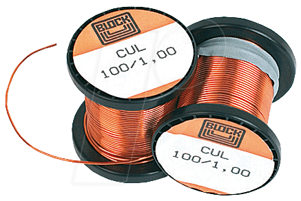
.. |image2| image:: media/image3.jpeg
   :width: 2.26389in
   :height: 2.26389in
.. |image3| image:: media/image4.jpeg
   :width: 2.18750in
   :height: 1.63889in
.. |image4| image:: media/image5.jpeg
.. |image5| image:: media/image6.jpeg
.. |image6| image:: media/image7.jpeg
   :width: 3.57639in
   :height: 2.77778in
.. |image7| image:: media/image8.jpeg
.. |image8| image:: media/image9.jpeg
.. |image9| image:: media/image10.png
   :width: 2.76978in
   :height: 2.91667in
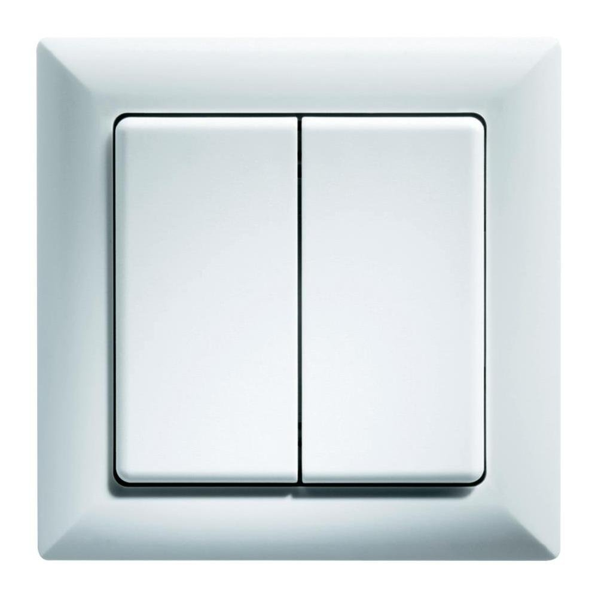
.. |image11| image:: media/image12.jpeg
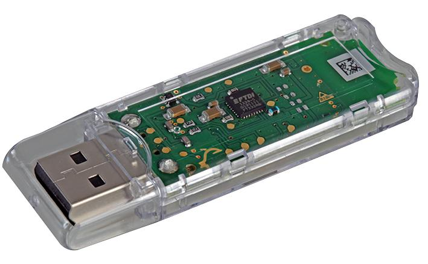
.. |image13| image:: media/image14.jpeg
.. |image14| image:: media/image15.jpeg
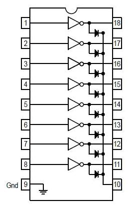
.. |image16| image:: media/image17.jpeg
.. |image17| image:: media/image18.jpeg
   :width: 0.56962in
   :height: 1.73489in
.. |image18| image:: media/image19.png
.. |image19| image:: media/image20.jpeg
.. |image20| image:: media/image21.jpeg
   :width: 1.97222in
   :height: 1.97222in
.. |image21| image:: media/image22.jpeg
   :width: 1.97222in
   :height: 1.97222in
.. |image22| image:: media/image23.jpeg
   :width: 1.97222in
   :height: 1.74306in
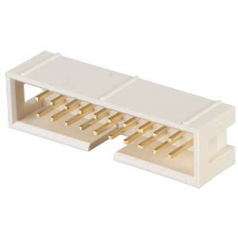
.. |image24| image:: media/image25.jpeg
.. |image25| image:: media/image26.jpeg
.. |image26| image:: media/image27.jpeg
.. |image27| image:: media/image28.jpeg
.. |image28| image:: media/image29.jpeg
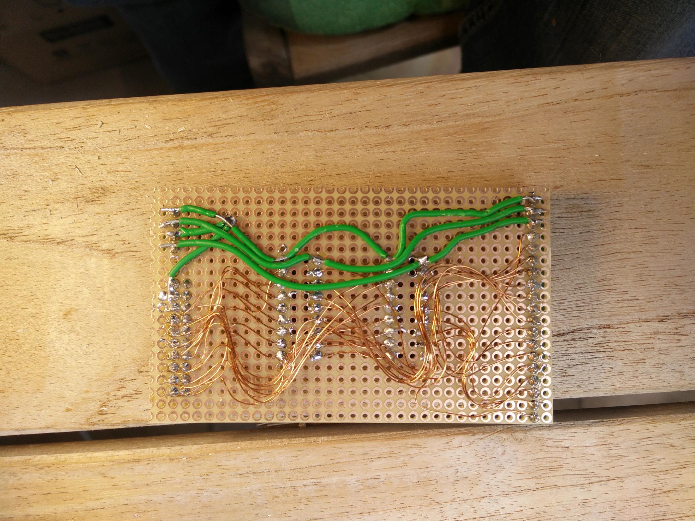
.. |image30| image:: media/image31.jpeg
.. |image31| image:: media/image32.jpeg
   :width: 3.93681in
   :height: 5.24861in
.. |image32| image:: media/image33.jpeg
   :width: 2.0in
   :height: 2.0in
.. |image33| image:: media/image34.jpeg
   :width: 2.0in
   :height: 2.0in
.. |image34| image:: media/image35.png
   :width: 2.0in
   :height: 2.0in
.. |image35| image:: media/image36.jpeg
   :width: 2.0in
   :height: 2.0in
.. |image36| image:: media/image37.jpeg
   :width: 2.0in
   :height: 2.0in
.. |image37| image:: media/image38.png
   :width: 2.0in
   :height: 2.0in
.. |image38| image:: media/image39.jpeg
.. |image39| image:: media/image40.jpeg
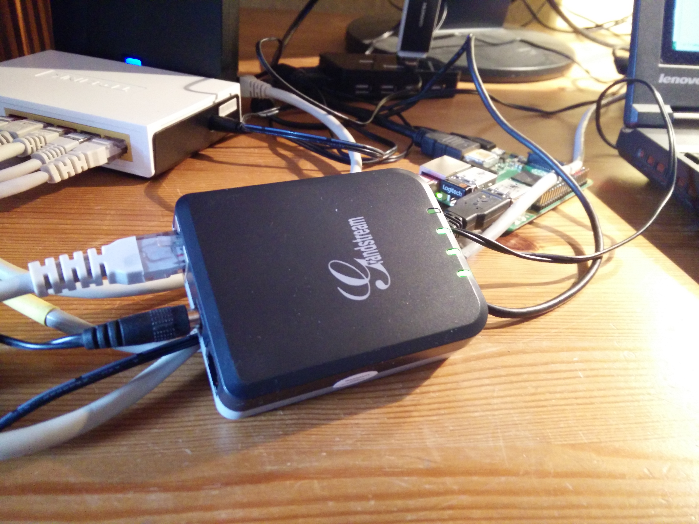
.. |image41| image:: media/image42.jpeg
.. |image42| image:: media/image43.jpeg
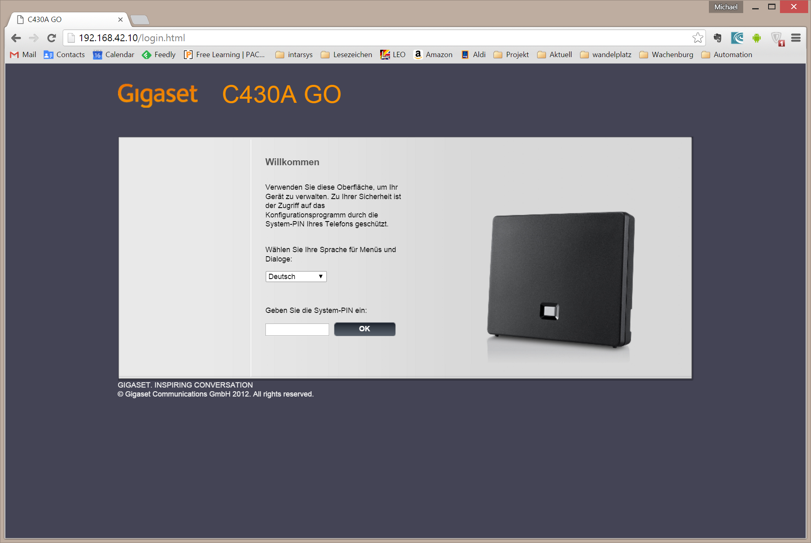
.. |image44| image:: media/image45.png
   :width: 4.64583in
   :height: 3.11389in
.. |image45| image:: media/image46.png
   :width: 4.64583in
   :height: 3.11389in
.. |image46| image:: media/image47.png
   :width: 4.64583in
   :height: 3.11389in
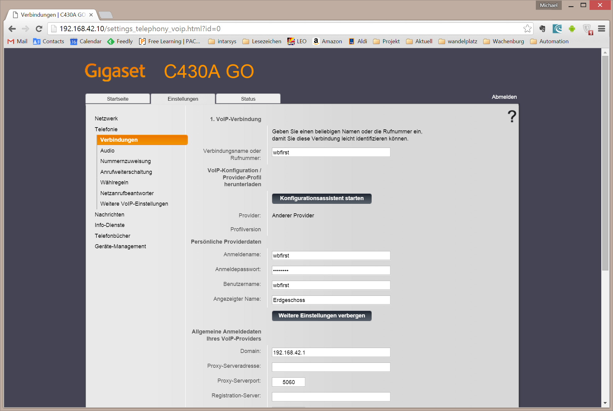
.. |image48| image:: media/image49.png
   :width: 4.64583in
   :height: 3.11389in
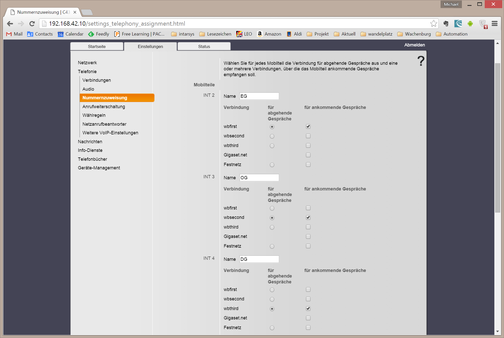
.. |image50| image:: media/image51.png
   :width: 4.64583in
   :height: 3.53264in
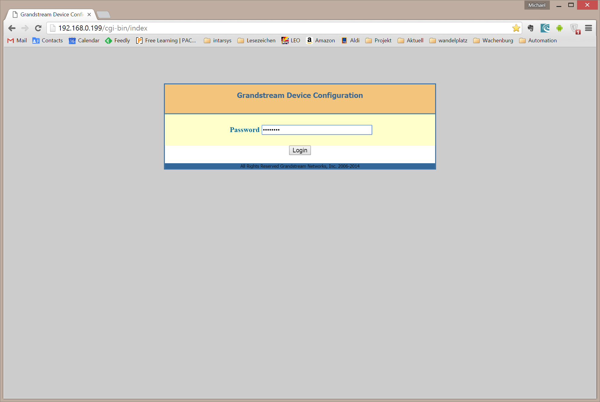
.. |image52| image:: media/image53.png
   :width: 4.64583in
   :height: 3.11250in
.. |image53| image:: media/image54.png
   :width: 4.64583in
   :height: 3.31875in
.. |image54| image:: media/image55.png
   :width: 4.64583in
   :height: 3.27431in
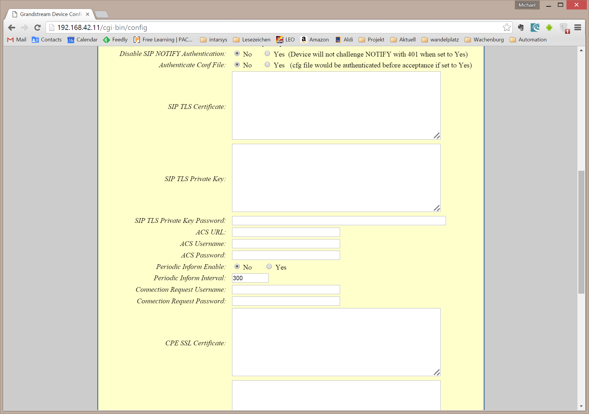
.. |image56| image:: media/image57.png
   :width: 4.64583in
   :height: 3.27431in
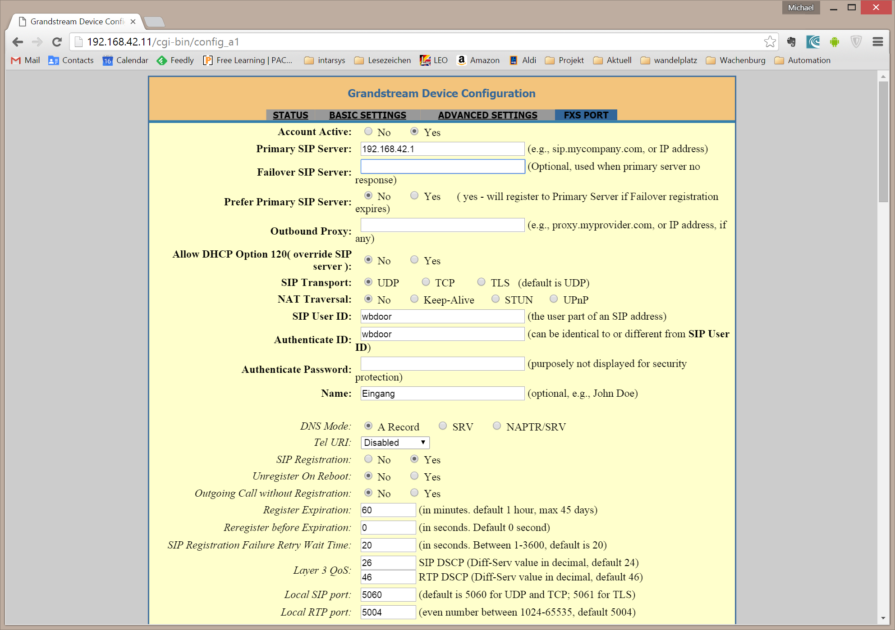
.. |image58| image:: media/image59.png
   :width: 4.64583in
   :height: 3.27431in
.. |image59| image:: media/image60.png
   :width: 4.64583in
   :height: 3.27431in
.. |image60| image:: media/image61.png
   :width: 4.64583in
   :height: 3.27431in
.. |image61| image:: media/image62.png
   :width: 4.64583in
   :height: 3.27431in
.. |image62| image:: media/image63.jpeg
   :width: 4.28472in
   :height: 4.28472in
.. |image63| image:: media/image64.png
   :width: 4.42242in
   :height: 4.71098in
.. |image64| image:: media/image65.png
   :width: 6.10208in
   :height: 3.37708in
.. |image65| image:: media/image66.jpeg
   :width: 5.03878in
   :height: 6.71856in
.. |image66| image:: media/image67.png
   :width: 6.30069in
   :height: 4.07431in
.. |image67| image:: media/image68.png
   :width: 4.15716in
   :height: 4.44444in
.. |image68| image:: media/image69.png
   :width: 5.11712in
   :height: 2.72917in
.. |image69| image:: media/image70.png
   :width: 4.36175in
   :height: 4.31944in
.. |image70| image:: media/image71.png
   :width: 4.70833in
   :height: 3.71664in
.. |image71| image:: media/image72.png
   :width: 4.65278in
   :height: 3.77945in
.. |image72| image:: media/image73.png
   :width: 5.44547in
   :height: 2.97917in
.. |image73| image:: media/image74.png
   :width: 5.48454in
   :height: 3.00054in
   
.. |br| raw:: html

     