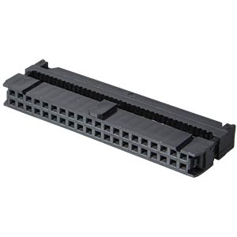

Part II
=======

Now we have some island components - already with nice functionality,
but we can do better. Here are the basic steps to provide
interoperability.

Network setup
-------------

Static IP
~~~~~~~~~

To set up a static IP address, you have to edit the
/etc/network/interfaces in your Pi. A typical configuration would look
like this, important settings are bold.

.. code::

	# Ethernet
	auto etho
	allow-hotplug eth0
	iface eth0 inet static
	address 192.168.42.210
	netmask 255.255.255.0
	gateway 192.168.42.1
	dns-nameservers 8.8.8.8

For sure you have to take care to use an address that is unique in your
network and that does not lie in the dynamic address range of your DHCP
server.

If your Pi should be able to resolve logical host names (as
"google.com"), you must add a "dns-nameservers" entry.

It may be necessary to disable the DHCP daemon on your Pi to make things
work

.. code::

	sudo service dhcpcd stop
	sudo update-rc.d -f dhcpcd remove

To activate your new settings, you must restart the network

.. code::

	sudo /etc/init.d/networking restart

Dynamic IP
~~~~~~~~~~

If you want to run a Pi with dynamic IP address, you can use the
following configuration in /etc/network/interfaces

.. code::

	# Ethernet
	auto etho
	allow-hotplug eth0
	iface eth0 inet dhcp

You should assure that somewhere in the network a DHCP server is up and
running...

IP address setup
~~~~~~~~~~~~~~~~

To administrate your network, it is important to have convenient access
to the components. While the system has a DHCP server, I found it the
easiest way to give each of the components a static IP.

+----------------+------------------+------------------------------------+
| Hostname       | IP               | services                           |
+================+==================+====================================+
| wbbase         | 192.168.42.1     | isc-dhcp-server, asterisk, samba   |
+----------------+------------------+------------------------------------+
| wbf1           | 192.168.42.210   | hmland, homegear, openhab          |
+----------------+------------------+------------------------------------+
| wbf2           | 192.168.42.220   | hmland, homegear, openhab          |
+----------------+------------------+------------------------------------+
| wbf3           | 192.168.42.230   | hmland, homegear, openhab          |
+----------------+------------------+------------------------------------+
| wbgo100        | 192.168.42.10    | VOIP Client(s)                     |
+----------------+------------------+------------------------------------+
| wbht701        | 192.168.42.11    | VOIP Adapter                       |
+----------------+------------------+------------------------------------+
| wbpellematic   | 192.168.42.2     | Heating                            |
+----------------+------------------+------------------------------------+
|                |                  |                                    |
+----------------+------------------+------------------------------------+
| DHCP Clients   | 192.168.42.1xx   | ... all the rest                   |
+----------------+------------------+------------------------------------+
|                |                  |                                    |
+----------------+------------------+------------------------------------+

Hostname and hosts
~~~~~~~~~~~~~~~~~~

If you want your Pi to have a more meaningful hostname (or as in this
case you don't want your Pi's to have all the same name), you should
change /etc/hostname

.. code::

	wbf1

This information is simply required on every Linux and used in many
places where the identifying the host is required (mail,...).

In addition you should edit the /etc/hosts, the poor mans DNS, so that
accessing the component using its hostname will resolve to the correct
component. And if you are already about to edit the file, you should add
all other components in your network as we do not set up a local DNS.
This allows to access the components via their logical names instead of
the IP addresses.

Example for /etc/hosts

.. code::

	127.0.0.1 localhost
	127.0.1.1 raspberry

	192.168.42.1 wbbase
	192.168.42.210 wbf1
	192.168.42.220 wbf2
	192.168.42.230 wbf3
	192.168.42.2 wbpellematic
	192.168.42.10 wbgo100
	192.168.42.11 wbht701

Provide DHCP services
~~~~~~~~~~~~~~~~~~~~~

If you want one of your Pi's to provide a DHCP server (mmmh, your
gateway maybe..) you should install and configure the DHCP server.

For me, using the ISC server simply worked.

.. code::

	sudo apt-get install isc-dhcp-server

An error message at this point is OK, as the default configuration is
not working yet. You must edit the configuration at /etc/dhcp/dhcpd.conf

This is what is working for me - the important pieces are bold. You have
to mention the gateway ("option routers"), the DNS servers ("option
domain-name-servers", here a Google server), a flag that this is the one
and only valid DHCP source ("authoritative") and then the definition of
the subrange of addresses that are available for dynamic clients.

.. code::

	# The ddns-updates-style parameter controls whether or not the server will
	# attempt to do a DNS update when a lease is confirmed. We default to the
	# behavior of the version 2 packages ('none', since DHCP v2 didn't
	# have support for DDNS.)
	ddns-update-style none;

	# option definitions common to all supported networks...
	option domain-name "wb.local";

	default-lease-time 86400; # 24 hours
	max-lease-time 172800; # 48 hours

	option routers 192.168.42.1;
	option domain-name-servers 8.8.8.8;
	authoritative;

	subnet 192.168.42.0 netmask 255.255.255.0 {
		range 192.168.42.100 192.168.42.199;
	}

Restart the DHCP server after configuration changes

.. code::

	sudo service isc-dhcp-server restart

Mass Storage
------------

Storing data on the SD card has some serious drawbacks

-  Many operations will wear out the SD card

-  SD card capacity is quite restricted

-  Each unit has its own card, central storage is not available

The solution is to add some mass storage as a service.

USB Hub
~~~~~~~

While you may get away with connecting smaller gadgets directly to the
Pi's USB, sucking all of the power it has to give and pushing it to the
limit of getting unstable (well, maybe this sounds a little dramatic...) -
attaching a USB powered disk is definitely **not** what you want to do.

I bought a small USB hub that can neatly be hidden beneath the Pi in the
cabinet, in this case a i-tec 4-Port USB 2.0 component.

|image62|

USB Disk
~~~~~~~~

Checking the available disks for the Pi can be done using

.. code::

	sudo fdisk -l

You will see something similar to

.. code::

	Disk /dev/mmcblk0: 7948 MB, 7948206080 bytes
	4 heads, 16 sectors/track, 242560 cylinders, total 15523840 sectors
	Units = sectors of 1 * 512 = 512 bytes
	Sector size (logical/physical): 512 bytes / 512 bytes
	I/O size (minimum/optimal): 512 bytes / 512 bytes
	Disk identifier: 0xa6202af7
	Device Boot Start End Blocks Id System
	/dev/mmcblk0p1 8192 122879 57344 c W95 FAT32 (LBA)
	/dev/mmcblk0p2 122880 15523839 7700480 83 Linux

This is the SD card "disk" and its partitioning.

Plugging in a USB disk will change the matter - you will see an
additional disk now:

.. code::

	Disk /dev/sda: 500.1 GB, 500107861504 bytes
	255 heads, 63 sectors/track, 60801 cylinders, total 976773167 sectors
	Units = sectors of 1 * 512 = 512 bytes
	Sector size (logical/physical): 512 bytes / 512 bytes
	I/O size (minimum/optimal): 512 bytes / 512 bytes
	Disk identifier: 0x386abe69
	Device Boot Start End Blocks Id System
	/dev/sda1 2048 976768064 488383008+ 7 HPFS/NTFS/exFAT

This one is preformatted NTFS on a Windows system.

To get this far you must have installed the NTFS support on the PI. This
is easy, simply

.. code::

	sudo apt-get -y install ntfs-3g

Now we need a "mount point" on the Pi, this is a location in the "main
file system" where the USB disk is "mounted", i.e. the USB disk
filesystem is seen as if it is underneath this mount point.

.. code::

	sudo mkdir /media/wbdisk

Furthermore we need the UUID of the disk, as the name device name
"/dev/sda1" is assigned dynamically and may change in other
circumstances. To get the UUID enter

.. code::

	sudo blkid

This will show you something like

.. code::

	/dev/mmcblk0p1: SEC_TYPE="msdos" LABEL="boot" UUID="15CD-3B79" TYPE="vfat"
	/dev/mmcblk0p2: UUID="13d368bf-6dbf-4751-8ba1-88bed06bef77" TYPE="ext4"
	/dev/sda1: LABEL="wbdisk" UUID="340CC0590CC017AE" TYPE="ntfs"

Now we have everything we need to mount the disk for further use.
Manually you can mount the disk using

.. code::

	sudo mount -t ntfs-3g -o utf8,noatime /dev/sda1 /media/wbdisk

and unmount

.. code::

	sudo umount /media/wbdisk

As we don't want to do this anytime we launch the Pi, we make this a
permanent feature. To do this edit the /etc/fstab file and add a line
like this. Do not forget to use your correct UUID and file system
driver.

.. code::

	# here's the USB disk
	UUID=340CC0590CC017AE /media/wbdisk/ ntfs-3g utf8,noatime 0

Directory layout
~~~~~~~~~~~~~~~~

Now lets design the layout in the USB disk itself.

We already know that storage devices are mounted at /media and that we
called our device "wbdisk".

On this device I'd like to mark a section as reserved for server
storage, "srv". Below we make a directory for "shared" data and one for
each active participant, this makes up for "wbf1", "wbf2", "wbf3" and
"wbbase".

|image63|

If you make extensions to this layout, ensure that you create
directories upfront that you want to reference from mounts, they are not
created automatically for you.

In the client directories i have created a layout mirroring the original
file system layout whenever I wanted to switch from the original data
location to a server based one.

NFS
~~~

There must be a reason we added a USB disk and here it is: we add a
network file system (NFS) and have plenty of space for writing logs,
database and whatsoever...

So far as theory is concerned. NFS may be an easy to install, performant
solution, but it's an island. For me ease of access from other platforms
(ok, lets give it a name: Windows) is crucial and that's where NFS
simply fails.

I decided quickly (after having nearly havocked my Windows installation
in the attempt to access the shares) to migrate to Samba.

Samba
~~~~~

Misc
^^^^

https://wiki.samba.org/index.php/Mounting\_samba\_shares\_from\_a\_unix\_client

Pi server
^^^^^^^^^

Working with NFS when we also want to include a Windows PC in the
network is a pain. For the sake of interoperability we switch to Samba
here.

Install

.. code::

	apt-get install samba samba-common-bin

Configuration

.. code::

	sudo nano /etc/samba/smb.conf

Here we will setup a share for every client and a shared one, using the
already defined directories on the mounted USB disk. As you can see, we
do not care much about privacy at this point - this may or may not be
appropriate for you.

At the end of the file, below all other sections add:

.. code::

	[wbf1]
	path = /media/wbdisk/srv/wbf1
	writeable = yes
	guest ok = yes

	[wbf2]
	path = /media/wbdisk/srv/wbf2
	writeable = yes
	guest ok = yes

	[wbf3]
	path = /media/wbdisk/srv/wbf3
	writeable = yes
	guest ok = yes

	[wbbase]
	path = /media/wbdisk/srv/wbbase
	writeable = yes
	guest ok = yes

	[shared]
	path = /media/wbdisk/srv/shared
	writeable = yes
	guest ok = yes

Most probably, at least to support hardlinks, you will want to add this
in the [global] section. Be sure to add this near the beginning of the
configuration file.

.. code::

	unix extensions = yes
	follow symlinks = yes

After a change to the configuration, you must restart the samba service.

Pi client
^^^^^^^^^

To access a Samba share, the client must install

.. code::

	sudo apt-get install cifs-utils

As this is available by default on the standard Raspbian, you should be
able to omit this.

Now you can mount the network share on your client.

We create a mount point in each client at

.. code::

	mkdir /media/remote/wbdisk/private
	mkdir /media/remote/wbdisk/shared

The mount point must belong to the root user. It is a very clever idea
to name the mount points locally using the same name (they will be
mapped to a different server location later). This gives you the ability
to reuse the same scripts on every component (e.g. backup scripts)
without any change.

Now you can mount the shares, for example for "wbf1" with the commands
below. This will work only if you have guests allowed on the server.
Omitting "-o guest" will nag you with a password prompt.

Note how each component will map its private share to a dedicated
directory on the server.

mount -t cifs //wbbase/shared /media/remote/wbdisk/shared -o guest

mount -t cifs //wbbase/wbf1 /media/remote/wbdisk/private -o guest

Here we use the network aliases defined in /etc/hosts, you can use the
IP address if you want.

to manually unmount you can call

.. code::

	umount /media/remote/wbdisk/shared
	umount /media/remote/wbdisk/private

Eventually we want to make this bindings permanent, so we change the
/etc/fstab and add

.. code::

	//wbbase/shared /media/remote/wbdisk/shared cifs auto,guest,_netdev 0 0
	//wbbase/wbf1 /media/remote/wbdisk/private cifs auto,guest,_netdev 0 0

Windows client
^^^^^^^^^^^^^^

Well, a windows client should be able to access the share without
effort, you only have to use the IP address as in the standard
installation the Pi names are not propagated to Windows (this can be
done, though).

Open an explorer and type "\\\\<address>" in the address field (don't
forget the backslashes".

    |image64|

Backup
------

So why?
~~~~~~~

Even if it seems to be unnecessary (well, it isn't) - consider setting
up a backup.

In the beginning my intention was to setup each station and then keep
copies of the respective SD cards. On failure I'd simply plug in the SD
copy and things are all right. So while in theory this was a good idea,
in practice it's not really feasible.

Already after 5 days of "production" the image of the respective clients
was outdated because of little tweaks in the settings, added operating
system features and so on.

Having a live backup possibility is the best you can do (IMHO). So after
we already decided to go for a fully networked system, added an USB disk
and installed Samba, why wouldn't we provide a simple backup... Simply
starting the script after some non trivial changes is a very simple task
and gives you a quite good feeling when going to sleep...

rsync
~~~~~

rsync is a classical tool for synchronizing two file system hierarchies.
It is widespread and has a very efficient implementation. Because of its
many options it may seem intimidating at first, but you have come this
far, so give it a try.

First, I created a directory at /opt/backup for all backup related
scripts.

Then we create the following shell script. While there exist much more
sophisticated scripts and full fledged programs, it will do the job. The
skeleton to this script and the parameters used are borrowed from a
plethora of rsync related blog entries, blame all errors on me and all
fame on them.

This is my /opt/backup/backup.sh (don't you forget to make it
executable).

.. code::

	#!/bin/sh
	SOURCE=/
	DEST=/media/remote/wbdisk/private/backup/
	TODAY=$(date +%Y-%m-%d)

	rsync -avqRH -stats --delete-during --exclude-from=/opt/backup/exclude.txt \\
	  "${SOURCE}" "${DEST}${TODAY}/" --link-dest="${DEST}last/" > \\
	  /var/log/rsync.log
	ln -nsf "${DEST}${TODAY}" "${DEST}last"

	exit 0

First, we have some variable definitions to ease script changes. With

.. code::

	SOURCE=/

we backup everything starting from root (exceptions see later).

.. code::

	DEST=/media/remote/wbdisk/private/backup/

The destination is our private share on the Samba server. Notice that
you have to create the target "backup" directory by hand.

.. code::

	TODAY=$(date +%Y-%m-%d)

This is a helper variable that holds a date string with year, month and
day. We will use this for incremental backups.

.. code::

	rsync -aqRH

+----------+-------------------------------+
| Option   | Description                   |
+==========+===============================+
| -a       | combines -rlptgoD             |
+----------+-------------------------------+
| -r       | Copy subdirectories           |
+----------+-------------------------------+
| -l       | Copy symbolic links           |
+----------+-------------------------------+
| -p       | keep permissions              |
+----------+-------------------------------+
| -t       | keep timestamps               |
+----------+-------------------------------+
| -g       | keep group settings           |
+----------+-------------------------------+
| -o       | keep owner settings           |
+----------+-------------------------------+
| -D       | keep device files             |
+----------+-------------------------------+
| -q       | suppress non error messages   |
+----------+-------------------------------+
| -R       | use relative path names       |
+----------+-------------------------------+
| -H       | preserve hard links           |
+----------+-------------------------------+

.. code::

	rsync ... -stats

Create statistical output at the end of the backup

.. code::

	rsync ... --delete-during

I have a incremental backup where I delete files in the destination when
they are deleted in the source. "delete-during" keeps time and memory
consumption low.

.. code::

	rsync ... --exclude-from=/opt/backup/exclude.txt \\

Now this is important: we create a file with a list of exclusions I do
not want to be backed up, starting from my SOURCE.

For me this is /opt/backup/exclude.txt

.. code::

	/proc/*
	/sys/*
	/dev/*
	/boot/*
	/tmp/*
	/run/*
	/mnt/*
	/media/*
	/var/log/*
	/var/run/*
	/var/lock/*

Most (all?) dynamic or transient parts of the system are ignored.

.. code::

	rsync ... "${SOURCE}" "${DEST}${TODAY}/" --link-dest="${DEST}last/"

This is the copy itself, from SOURCE to DEST/TODAY, so we create a new
directory every day we create a backup. Together with the symbolic link
feature "—link-dest" we ensure that files that are unchanged exist only
once in the target. As this needs the underlying "symbolic link" feature
of the file system, be sure your target does support this (e.g. by
activating it in your samba configuration).

.. code::

	rsync ... > /var/log/rsync.log

For everything we have done so far, a detailed log file is written.

After rsync is ready we create a new symbolic link to the new backup
named "last". This is in turn the reference for the next incremental
backup.

.. code::

	ln -nsf "${DEST}${TODAY}" "${DEST}last"

Now you can start the backup manually or add it to crontab. I decided
against a scheduled backup as I do not expect extensive working on the
configuration or content.

.. |image1| image:: media/image2.png
   :width: 3.18056in
   :height: 2.12500in
.. |image2| image:: media/image3.jpeg
   :width: 2.26389in
   :height: 2.26389in
.. |image3| image:: media/image4.jpeg
   :width: 2.18750in
   :height: 1.63889in

.. |image6| image:: media/image7.jpeg
   :width: 3.57639in
   :height: 2.77778in
.. |image7| image:: media/image8.jpeg

.. |image9| image:: media/image10.png
   :width: 2.76978in
   :height: 2.91667in
.. |image10| image:: media/image11.jpeg
   :width: 3.10417in
   :height: 3.10417in
.. |image11| image:: media/image12.jpeg
.. |image12| image:: media/image13.jpeg
   :width: 4.01389in
   :height: 2.47782in
.. |image13| image:: media/image14.jpeg

.. |image15| image:: media/image16.jpeg
   :width: 2.25404in
   :height: 3.52023in
.. |image16| image:: media/image17.jpeg
.. |image17| image:: media/image18.jpeg
   :width: 0.56962in
   :height: 1.73489in
.. |image18| image:: media/image19.png
.. |image19| image:: media/image20.jpeg

.. |image21| image:: media/image22.jpeg
   :width: 1.97222in
   :height: 1.97222in
.. |image22| image:: media/image23.jpeg
   :width: 1.97222in
   :height: 1.74306in
.. |image23| image:: media/image24.jpeg
   :width: 1.97222in
   :height: 1.97222in
.. |image24| image:: media/image25.jpeg
.. |image25| image:: media/image26.jpeg

.. |image27| image:: media/image28.jpeg
.. |image28| image:: media/image29.jpeg
.. |image29| image:: media/image30.jpeg
.. |image30| image:: media/image31.jpeg
.. |image31| image:: media/image32.jpeg
   :width: 3.93681in
   :height: 5.24861in

.. |image34| image:: media/image35.png
   :width: 2.0in
   :height: 2.0in
.. |image35| image:: media/image36.jpeg
   :width: 2.0in
   :height: 2.0in
.. |image36| image:: media/image37.jpeg
   :width: 2.0in
   :height: 2.0in

.. |image38| image:: media/image39.jpeg
.. |image39| image:: media/image40.jpeg
.. |image40| image:: media/image41.jpeg
.. |image41| image:: media/image42.jpeg
.. |image42| image:: media/image43.jpeg
.. |image43| image:: media/image44.png
   :width: 4.64583in
   :height: 3.11389in

.. |image45| image:: media/image46.png
   :width: 4.64583in
   :height: 3.11389in
.. |image46| image:: media/image47.png
   :width: 4.64583in
   :height: 3.11389in
.. |image47| image:: media/image48.png
   :width: 4.64583in
   :height: 3.11389in
.. |image48| image:: media/image49.png
   :width: 4.64583in
   :height: 3.11389in
.. |image49| image:: media/image50.png
   :width: 4.64583in
   :height: 3.11389in
.. |image50| image:: media/image51.png
   :width: 4.64583in
   :height: 3.53264in
.. |image51| image:: media/image52.png
   :width: 4.02183in
   :height: 2.69444in

.. |image53| image:: media/image54.png
   :width: 4.64583in
   :height: 3.31875in

.. |image55| image:: media/image56.png
   :width: 4.64583in
   :height: 3.27431in

.. |image57| image:: media/image58.png
   :width: 4.64583in
   :height: 3.27431in
.. |image58| image:: media/image59.png
   :width: 4.64583in
   :height: 3.27431in
.. |image59| image:: media/image60.png
   :width: 4.64583in
   :height: 3.27431in
.. |image60| image:: media/image61.png
   :width: 4.64583in
   :height: 3.27431in
.. |image61| image:: media/image62.png
   :width: 4.64583in
   :height: 3.27431in
.. |image62| image:: media/image63.jpeg
   :width: 4.28472in
   :height: 4.28472in
.. |image63| image:: media/image64.png
   :width: 4.42242in
   :height: 4.71098in
.. |image64| image:: media/image65.png
   :width: 6.10208in
   :height: 3.37708in
.. |image65| image:: media/image66.jpeg
   :width: 5.03878in
   :height: 6.71856in
.. |image66| image:: media/image67.png
   :width: 6.30069in
   :height: 4.07431in

.. |image70| image:: media/image71.png
   :width: 4.70833in
   :height: 3.71664in
.. |image71| image:: media/image72.png
   :width: 4.65278in
   :height: 3.77945in
.. |image72| image:: media/image73.png
   :width: 5.44547in
   :height: 2.97917in

.. |br| raw:: html

     