Part III
========

We have a basic system up and running. Now we can start with the bells
and whistles that will improve the design and bring the project from lab
to real life.
  
Access Point
------------

wbf1, wbf2 and wbf3 should provide Access Point features. The eth0 and
wlan0 interfaces need to be bridged only.  

This is a very special chapter and not everything I did here is really
understood.

First, I made the mistake of getting one of the much praised Edimax WLAN
sticks (EDIMAX-7612UAn V2). While these are plug and play with regard to
WLAN client mode building an access point is not. The problem with them
is that they need a driver that is not available by default for the
"hostapd" package.

-  Switch hostapd

-  Configure hostapd

-  Switch of power saving

-  Run hostapd as daemon   

-  Install dhcp server

-  Configure dhcp server

/etc/network/interfaces
~~~~~~~~~~~~~~~~~~~~~~~

The following network configuration describes two network interfaces,
eth0 and wlan0 that "bridge" the traffic between them

.. code::

	##############################
	# The loopback network interface
	auto lo
	iface lo inet loopback

	##############################
	# The cable network interface
	auto eth0
	allow-hotplug eth0
	iface eth0 inet manual

	########################
	# The WLAN interface
	auto wlan0
	allow-hotplug wlan0
	iface wlan0 inet manual

	##############################
	# The bridges
	#
	auto br0
	iface br0 inet static
	address 192.168.42.1
	netmask 255.255.255.0

	bridge_fd 0
	bridge_stp off
	bridge_ports eth0 wlan0

Disable power saving
~~~~~~~~~~~~~~~~~~~~

If you want your access point to be available reliably, you should also
disable power management for the WLAN.

.. code::

	sudo nano /etc/modprobe.d/8192cu.conf

You should enter the following content

.. code::

	# Disable power management
	options 8192cu rtw_power_mgnt=0 rtw_enusbss=0

Switch hostapd
~~~~~~~~~~~~~~

"hostapd" is a piece of software that allows your computer to act as an
access point. The only problem is: the driver it relies on is not
available for the chip on the Edimax wlan component. Now you have two
options: use another WLAN component (providing a NL80211 driver) or use
another hostapd package. Using forum KnowHow is tried the second
approach.

There are different tutorials regarding how to work around the hostapd
issue

[hostapd original]
http://www.tacticalcode.de/2013/02/raspberry-pi-als-accesspoint-oder-wlan-bridge.html

[hostapd 2.0]
http://www.jenssegers.be/43/Realtek-RTL8188-based-access-point-on-Raspberry-Pi%29

[hostapd 2.2]
http://lispm.blogspot.de/2015/03/edimax-ew-7811un-als-wlan-access-point.html

Well, first I tried the original Pi configuration - which **can** not
work because of the "nl80211" driver needed and not available for the
Realtek chip.

Then I looked around and found I need to build the hostapd from scratch
from Realtek sources (that are quite outdated). This failed for me, I
still don't know why.

Some helping hand offered a prebuilt version (still hostapd v0.8). I
installed it and really was lucky, hostapd started... but this time I
could not connect to the WLAN it offered, even so I saw the SSID in my
clients.

The next step was to update to a newer precompiled version, v2.2. This
time when starting, hostapd terminated with a failure (that even was not
identifiable in the log, at least for me). As a last try I played around
with the hostapd settings and found out that after disabling 802.11n (HT
capabilities) completely - the daemon finally started. I could connect
to the Pi on my new WLAN...

Unfortunately I can not say what were the exact reasons for the
different failures.

Run hostapd as daemon
~~~~~~~~~~~~~~~~~~~~~

Now we want the access point to be available after every reboot. You can
achieve this by changing the hostapd configuration.

.. code::

	sudo nano /etc/default/hostapd

Remove the hashmark from the following line

.. code::

	DAEMON_CONF="/etc/hostapd/hostapd.conf"

Experience
~~~~~~~~~~

While I do not really need AP features for my project, I wanted it to be
available for later extensions (anything from tablet UIs to MQTT
components).

But: I didn't get it to run reliably. After a lot of spurious failures
where connection to the PI no longer was possible, I stopped this
experiment and opted for stable production of the basic components.

Maybe using a plug and play AP component, added to the network and
providing the house with WLAN may be a better idea anyway.

WAN access
----------

This is one of the most interesting features, unfortunately this has
been one of the worst experiences when setting up. But, one info at a
time...

The HA system as it is planned is an "island", we do not have internet
access as the network is physically and logically detached from any
internet service that a resident may have. A full fledged internet
account is oversized for this installation and as such much to
expensive. The only remaining alternative is GPRS/UMTS - a very
interesting one from the nerd point of view and as such the solution of
choice.

The driving forces to install this feature are easy to guess

- Internet access for easy system maintenance (local -> WAN)
	For me this means update and installation of software packages.
	There are solutions for "offline maintenance", but they are too
	complex imho.

- Push Notifications (local -> WAN)
	For exceptional states the system should be able to proactively
	inform the operator (yes, that's me). The channels available are
	eMail, SMS and even phone calls, as we have set up Asterisk.

- Remote monitoring and control of the HA system (WAN -> local)
	This makes the HA much more operating friendly - I do not have to
	visit the building every time a user claims to have a problem, some
	scenarios can be handled in the home office now.

.. topic:: Time Travel

	I must admit, I underestimated the use of the remote access feature.
	This has proven one of the most useful "whistle" I've added so far.

This results in the following technical requirements:

-  Low bandwith

-  Low volume

-  High availability

This may be completely different for your installation, so carefully
check the requirements.

The initial steps are easy enough:

Surfstick 
~~~~~~~~~~

To cling to a known name like "HUAWEI" seemed a good approach here, too.
I found an unlocked HUAWEI E353 stick for a reasonable price.

|image65|

Important: whatever stick you have, chances are good that your Pi can
not provide enough current for the stick. Plan to buy a powered USB hub
anyway.

Inserting the stick may be not so simple, too - in my case the central
server is in the basement, connectivity is bad. Enclosing the stick
within the distribution box will make things even worse.

In my special case, the stick is attached via a 5m USB cable and resides
in the hallway on the ground floor.

Another possible issue: there are surfsticks around that are **not**
modems, they identify themselves as complete USB Ethernet devices.
Configuration is different for these.

SIM card
~~~~~~~~

There's a myriad of providers and sub-providers, I can't advise any
special of them. What you should take into account in your selection:

- Do I have network coverage where the stick is going to be installed

- Do I need access from outside to the HA system
	This is an important point. Some (if not all) providers and some
	plans completely disable external access (your stick/your Pi is not
	visible from the internet side of the world). This means that e.g.
	a DYNDNS account is not possible. For me this was not a point of
	concern, as (heavy) external access is not planned and (see
	chapters below) for special cases there are workarounds.

- Data volume
	You should make some assumptions for the data volume to be expected
	based on your "driving forces" defined above. For me a low volume
	account is more than enough.

Configuration
~~~~~~~~~~~~~

Here's where trouble begins.

There are a lot of tutorials around - but, at least for me, the
information was not really enough to solve the problems that came up.
One of the reasons for this is the very complex infrastructure when it
comes to networking in linux (at least from my noob point of view). When
it comes to "merging" information from different tutorials, be sure all
of them base on the same initial networking tools. As far as my basic
understanding goes, you will find the following approaches.

-  Old fashioned networking is configured via /etc/network - modern
   approach is via NetworkManager

-  Old fashioned WAN access is done via modems (wvdial) and pppd -
   modern approach is to use QMI

-  You can have a wvdial first or pppd first approach

-  There are "magic scripts" like the famous "sakis3g" that will fiddle
   around with the basic infrastructure behind the scenes.

I choose to go by "classic networking via modems, wvdial first", again
having many information and well tested settings around. The steps from
here seem quite clear from a high level view:

-  The stick is inserted and recognized as a modem

-  the wvdial software is instructed how to talk to the modem

-  when wvdial has setup the modem and initiated a connection, control
   is handed to pppd

-  pppd negotiates the session with the provider and sets up a new
   network adapter (ppp0).

Now lets look this up in detail.

Stick configuration
~~~~~~~~~~~~~~~~~~~

After inserting the stick, try to look it up via *lsusb*

.. code::

	pi@wbbase ~ $ lsusb
	Bus 001 Device 002: ID 0424:9514 Standard Microsystems Corp.
	Bus 001 Device 001: ID 1d6b:0002 Linux Foundation 2.0 root hub
	Bus 001 Device 003: ID 0424:ec00 Standard Microsystems Corp.
	Bus 001 Device 004: ID 1a40:0101 Terminus Technology Inc. 4-Port HUB
	Bus 001 Device 007: ID 12d1:1506 Huawei... E398 LTE/UMTS/GSM Modem/Networkcard

With a little luck you find something like this and you're done. Your
stick is found and recognized as a modem. You can see this on one hand
in the name part or as the nerd that you are you recognize the **ID
12d1:1506.** The first part of the ID is a vendor specific number, here
HUAWEI, the second is the device type, here a modem.

Many sticks are recognized as a mass storage device. I found a clever
article on this with the following explanation:

"This is a clever default behavior on windows. On the mass storage part
we have windows drivers that enable access to the stick, after access
the stick is automatically switched to modem mode. Plug and play..."

On the Pi things are different. Here you have to switch the stick
yourself. The software doing this is called "usb-modeswitch" (what a
surprise). So, if you have only mass storage so far, install it..

.. code::

	sudo apt-get install usb-modeswitch

After installation and stick insertion you should finally see the modem
variant. If not, bad luck. You should really have bought a stick that is
already in the standard configuration or that does not need a switch at
all. But not all hope is lost, you can add the information yourself -
but this is beyond this chapter, look here
http://wiki.ubuntuusers.de/USB\_ModeSwitch/ for example.

When the stick is recognized as a modem, you should lookup the device
name associated with it, you will need this later for the dialer or PPP
connection. Having a look in the dmesg after inserting the stick you
will find something like this.

.. code::

	[2934611.713325] usb 1-1.5.2: new high-speed USB device number 6 using dwc\_otg
	[2934611.814306] usb 1-1.5.2: New USB device found, idVendor=12d1, idProduct=14fe
	[2934611.814331] usb 1-1.5.2: New USB device: Mfr=2, Product=1, SerialNumber=0
	[2934611.814349] usb 1-1.5.2: Product: HUAWEI Mobile
	[2934611.814365] usb 1-1.5.2: Manufacturer: HUAWEI
	[2934611.816789] usb-storage 1-1.5.2:1.0: USB Mass Storage device detected
	[2934611.818962] scsi host1: usb-storage 1-1.5.2:1.0
	[2934611.819840] usb-storage 1-1.5.2:1.1: USB Mass Storage device detected
	[2934611.820235] scsi host2: usb-storage 1-1.5.2:1.1
	[2934612.497513] usb 1-1.5.2: USB disconnect, device number 6
	[2934618.113327] usb 1-1.5.2: new high-speed USB device number 7 using dwc\_otg
	[2934618.214538] usb 1-1.5.2: New USB device found, idVendor=12d1, idProduct=1506
	[2934618.214564] usb 1-1.5.2: New USB device strings: Mfr=3, Product=2 ...
	[2934618.214582] usb 1-1.5.2: Product: HUAWEI Mobile
	[2934618.214597] usb 1-1.5.2: Manufacturer: HUAWEI
	[2934618.218759] usb-storage 1-1.5.2:1.4: USB Mass Storage device detected
	[2934618.219301] scsi host3: usb-storage 1-1.5.2:1.4
	[2934618.220157] usb-storage 1-1.5.2:1.5: USB Mass Storage device detected
	[2934618.220558] scsi host4: usb-storage 1-1.5.2:1.5
	[2934618.265855] usbcore: registered new interface driver usbserial
	[2934618.266054] usbcore: registered new interface driver usbserial\_generic
	[2934618.266242] usbserial: USB Serial support registered for generic
	[2934618.269213] usbcore: registered new interface driver cdc\_ncm
	[2934618.275659] usbcore: registered new interface driver cdc\_wdm
	[2934618.286789] usbcore: registered new interface driver option
	[2934618.286983] usbserial: USB Serial support registered for GSM modem (1-port)
	[2934618.287328] huawei\_cdc\_ncm 1-1.5.2:1.1: MAC-Address: 58:2c:80:13:92:63
	[2934618.287357] huawei\_cdc\_ncm 1-1.5.2:1.1: setting rx\_max = 16384
	[2934618.287755] huawei\_cdc\_ncm 1-1.5.2:1.1: setting tx\_max = 16384
	[2934618.288436] huawei\_cdc\_ncm 1-1.5.2:1.1: cdc-wdm0: USB WDM device
	[2934618.290042] huawei\_cdc\_ncm 1-1.5.2:1.1 wwan0: register 'huawei\_cdc\_ncm' at \\usb-3f980000.usb-1.5.2, Huawei CDC NCM device, 58:2c:80:13:92:63
	[2934618.290335] option 1-1.5.2:1.0: GSM modem (1-port) converter detected
	[2934618.290402] usbcore: registered new interface driver huawei\_cdc\_ncm
	[2934618.290895] usb 1-1.5.2: GSM modem (1-port) converter attached to ttyUSB0
	[2934618.291214] option 1-1.5.2:1.2: GSM modem (1-port) converter detected
	[2934618.292108] usb 1-1.5.2: GSM modem (1-port) converter attached to ttyUSB1
	[2934618.292291] option 1-1.5.2:1.3: GSM modem (1-port) converter detected
	[2934618.292824] usb 1-1.5.2: GSM modem (1-port) converter attached to ttyUSB2
	[2934618.414538] huawei\_cdc\_ncm 1-1.5.2:1.1 wwan0: kevent 12 ..dropped
	[2934619.214405] scsi 4:0:0:0: Direct-Access HUAWEI SD Storage \\ 2.31 PQ: 0 ANSI: 2
	[2934619.215258] scsi 3:0:0:0: CD-ROM HUAWEI Mass Storage \\ 2.31 PQ: 0 ANSI: 2

wvdial
~~~~~~

The next step in the old fashioned way is setting up wvdial.

.. code::

	sudo apt-get install wvdial

There are other alternatives to access the modem, but his one just works
fine for me. If you don't like it, maybe have a look at
http://www.sakis3g.com/.

wvdial is responsible for communicating with the modem hardware. After
connection, work is handed over to pppd.

wvdial uses the configuration at /etc/wvdial.conf. It has also a builtin
feature to create a basic default configuration for the currently
detected modem. So, as a first step insert the stick and run

.. code::

	sudo wvdialconf /etc/wvdial.conf

No edit the /etc/wvdial.conf and add a section for the provider you want
to dial up at the end. Here's my example

.. code::

	[Dialer Defaults]
	Init1 = ATZ
	Init2 = ATQ0 V1 E1 S0=0 &C1 &D2
	Modem Type = Analog Modem
	ISDN = 0
	Baud = 9600

	[Dialer pin]
	Modem = /dev/gsmmodem
	Init3 = AT+CFUN=1,1
	Init4 = AT+CPIN="1234"

	[Dialer myprovider]
	Modem = /dev/gsmmodem
	Init4 = AT+CGDCONT=1,"IP","internet.partner"
	Phone = *99#
	Username = " "
	Password = " "

The first section was created initially by the wvdialconf call, I have
just removed garbage.

The next section defines the things wvdial should do when I want to set
the pin or talk to "unitymedia".

+-------------+------------------------------------------------------------------------------------------------------------------------------------------------------------------------------------------------------------------------------------------------------------------------------------------------------------------------------------------------------------------------------------------------------+
| Parameter   | Description                                                                                                                                                                                                                                                                                                                                                                                          |
+=============+======================================================================================================================================================================================================================================================================================================================================================================================================+
| Modem       | The device we are talking to. You can derive this from the messages that you get via dmesg after inserting the stick. Here you see that a ttyUSB0, ttyUSB1 and ttyUSB2 is automatically created.                                                                                                                                                                                                     |
|             |                                                                                                                                                                                                                                                                                                                                                                                                      |
|             | The interesting information is that usb-modeswitch additionally installs automatically a device link /dev/gsmmodem                                                                                                                                                                                                                                                                                   |
|             |                                                                                                                                                                                                                                                                                                                                                                                                      |
|             | So unless this link to the correct tty\* is not available, use /dev/gsmmodem. If for some reason this does not work (there seem to be strange conditions in the USB jungle causing this), just try ttyUSB0.                                                                                                                                                                                          |
+-------------+------------------------------------------------------------------------------------------------------------------------------------------------------------------------------------------------------------------------------------------------------------------------------------------------------------------------------------------------------------------------------------------------------+
| Init<n>     | The init strings that are sent to the modem.                                                                                                                                                                                                                                                                                                                                                         |
|             |                                                                                                                                                                                                                                                                                                                                                                                                      |
|             | The first section one unlocks the SIM - you can omit this if your SIM is not PIN protected. While in theory you can include this command within the dial sequence itself, for me it was not possible because a second attempt to authenticate the PIN (when already authenticated) resulted in a modem error. As the PIN is not reset until power off, it was not possible to bounce a connection.   |
|             |                                                                                                                                                                                                                                                                                                                                                                                                      |
|             | Setting the PIN within the wvdial init sequence is one of many options, you can also                                                                                                                                                                                                                                                                                                                 |
|             |                                                                                                                                                                                                                                                                                                                                                                                                      |
|             | -  remove the PIN from the card                                                                                                                                                                                                                                                                                                                                                                      |
|             |                                                                                                                                                                                                                                                                                                                                                                                                      |
|             | -  set the pin via a pre-up script. This is a hook within the network configuration that allows you to call scripts before a network adapter is started.                                                                                                                                                                                                                                             |
|             |                                                                                                                                                                                                                                                                                                                                                                                                      |
|             | The second one identifies and initialized the APN. Setting the correct APN is crucial. Setting the wrong APN not only can lead to malfunction, but can select an endpoint that is not compatible to your data plan and lead to extreme costs!                                                                                                                                                        |
+-------------+------------------------------------------------------------------------------------------------------------------------------------------------------------------------------------------------------------------------------------------------------------------------------------------------------------------------------------------------------------------------------------------------------+
| Username    | The username for authentication with your provider. If you need no username it's a little tricky: wvdial does not accept an empty entry. Just adding a dummy entry " " (including the blank) should work.                                                                                                                                                                                            |
+-------------+------------------------------------------------------------------------------------------------------------------------------------------------------------------------------------------------------------------------------------------------------------------------------------------------------------------------------------------------------------------------------------------------------+
| Password    | The password for authentication with your provider. If you need no password, set to " " (including the blank).                                                                                                                                                                                                                                                                                       |
+-------------+------------------------------------------------------------------------------------------------------------------------------------------------------------------------------------------------------------------------------------------------------------------------------------------------------------------------------------------------------------------------------------------------------+
| Phone       | The number to dial. In most cases this will be \*99#. See your respective provider manuals.                                                                                                                                                                                                                                                                                                          |
+-------------+------------------------------------------------------------------------------------------------------------------------------------------------------------------------------------------------------------------------------------------------------------------------------------------------------------------------------------------------------------------------------------------------------+

Setting "Baud" is unnecessary, as the real network speed is negotiated
on the PPP level later on.

Depending on your provider you may need to set still other parameters.
See the wvdial man page for more.

Running (the "&" is important - the console is not available otherwise
after calling)

.. code::

	sudo wvdial myprovider &

will hopefully result in

.. code::

	[ pi@wbbase ~ $ --> WvDial: Internet dialer version 1.61
	--> Initializing modem.
	--> Sending: ATZ
	ATZ
	OK
	--> Sending: ATQ0 V1 E1 S0=0 &C1 &D2
	ATQ0 V1 E1 S0=0 &C1 &D2
	OK
	--> Sending: AT+CGDCONT=1,"IP","<APN>"
	AT+CGDCONT=1,"IP","<APN>"
	OK
	--> Modem initialized.
	--> Sending: ATDT*99#
	--> Waiting for carrier.
	ATDT*99#
	CONNECT
	--> Carrier detected. Waiting for prompt.
	--> Don't know what to do! Starting pppd and hoping for the best.
	--> Starting pppd at Sun Jan 10 16:22:57 2016
	--> Pid of pppd: 2808
	--> Using interface ppp0
	--> local IP address 10.148.172.74
	--> remote IP address 10.64.64.64
	--> primary DNS address 193.189.244.225
	--> secondary DNS address 193.189.244.206

Don't worry if you have lines like

.. code::

	--> pppd: ð±ôvPÐ[01][08]ï[01][03]
	--> pppd: ð±ôvPÐ[01][08]ï[01][03]

between, just ignore them.

If everything goes well, ifconfig will show after this a network
interface ppp0.

.. code::

	ppp0 Link encap:Punkt-zu-Punkt-Verbindung
		inet Adresse:x.x.x.x P-z-P:x.x.x.x Maske:255.255.255.255
		UP PUNKTZUPUNKT RUNNING NOARP MULTICAST MTU:1440 Metrik:1
		RX packets:14 errors:0 dropped:0 overruns:0 frame:0
		TX packets:15 errors:0 dropped:0 overruns:0 carrier:0
		Kollisionen:0 Sendewarteschlangenlänge:3
		RX bytes:458 (458.0 B) TX bytes:521 (521.0 B)

This interface is created by the pppd after getting control from wvdial
and negotiating the parameters with the provider.

Do not forget to

.. code::

	sudo killall wvdial

to end the connection.

If you fail, you will get an error, look it up for further
investigation. A typical error (well, hmm, my error) is "error 11" - the
SIM is PIN protected. Read the next chapter.

.. code::

	--> Sending: AT+CGDCONT=1,"IP","internet.partner"
	AT+CGDCONT=1,"IP","internet.partner"
	+CME ERROR: 11
	--> Bad init string.

SIM PIN
~~~~~~~

Keep the PIN
^^^^^^^^^^^^

If you absolutely want to keep the SIM PIN you have to go the extra
mile.

On one hand, I didn't manage adding the modem PIN command to the
wvdial.conf. The second time the PIN authentication is executed the
modem will return an error and wvdial will fail. As there is no such
thing as an optional wvdial entry, you must enter the PIN separately.
The best bet is here to add it in the /etc/network/interfaces as an
pre-up hook script, saved in /opt/admin/setupPIN.sh.

.. code::

	#!/bin/bash
	echo "AT+CPIN=1234\\n\\r" > /dev/gsmmodem

Then you add to the /etc/network/interfaces in the ppp0 section the last
line. Before uping the adapter the PIN will be set.

.. code::

	auto ppp0
	iface ppp0 inet wvdial
	provider myprovider
	pre-up /opt/admin/setPIN.sh

To ease manual PIN unlocking add this section to the wvdial.conf

.. code::

	[Dialer pin]
	Modem = /dev/gsmmodem
	Init1 = AT+CPIN="1234"

Now you can manually unlock with

.. code::

	sudo wvdial pin

Unlock the SIM
^^^^^^^^^^^^^^

The easiest way is to put the SIM in a handy and interactively remove
the PIN.

As an alternative you can use "minicom" and send

.. code::

	// check
	AT+CPIN?
	+CPIN: PIN
	// unlock
	AT+CPIN="<your PIN>"
	OK
	// remove PIN
	AT+CLCK="SC", 0, "<your PIN>"
	OK

pppd
~~~~

PPP (Point to Point Protocol) is a high level protocol between peers
(your Pi and the provider endpoint). It has mechanisms to negotiate
connection parameters and the IP address.

At the heart of the protocol implementation is pppd - this is called
after the modem is connected to the provider by wvdial. wvdial is more
of a wrapper for pppd here.

You can configure pppd options when started via wvdial in the
/etc/ppp/peers/wvdial config file.

Important options

- defaultroute
	Add a default route for this connection

- replacedefaultroute
	Option to "defaultroute", replace an already existing defaultroute

- persist
	Do not exit after a connection is terminated; instead try to reopen
	the connection.

- usepeerdns
	Use the DNS information from the connected server

- holdoff 10
	How many seconds to wait before re-initiating the connection

Network config 
~~~~~~~~~~~~~~~

Now we integrate our stick in the standard network configuration.

/etc/network/interfaces
^^^^^^^^^^^^^^^^^^^^^^^

.. code::

	auto ppp0
	iface ppp0 inet wvdial
	provider myprovider
	pre-up /bin/sleep 30
	pre-up /opt/admin/setPIN.sh

This configuration launches the "myprovider" entry via wdial upon
startup. Before starting the adapter, we wait 30 seconds, then the
script setPIN.sh is executed.

Manual shutdown and startup
^^^^^^^^^^^^^^^^^^^^^^^^^^^

To manually startup ppp0

.. code::

	sudo ifup ppp0

An here the shutdown

.. code::

	sudo ifdown ppp0

The routing table after successful connection
^^^^^^^^^^^^^^^^^^^^^^^^^^^^^^^^^^^^^^^^^^^^^

Now lets have a look at the current routing information with "netstat -r"

.. code::

	Kernel-IP-Routentabelle
	Ziel Router Genmask Flags MSS Fenster irtt Iface
	default * 0.0.0.0 U 0 0 0 ppp0
	10.64.64.64 * 255.255.255.255 UH 0 0 0 ppp0
	192.168.42.0 * 255.255.255.0 U 0 0 0 eth0

As far as i understood the network mechanics this means that traffic to
the network segment 192.18.42.\* is routed via the Ethernet card, the
rest is sent to the WAN interface. That's it.

Provide internet access for all other nodes
^^^^^^^^^^^^^^^^^^^^^^^^^^^^^^^^^^^^^^^^^^^

Now that our basement server is online, we'd like to share this access
throughout our network. It will become a breeze to maintain and update
the other network nodes, we will be able to access internet services
(let our heating send mails, then...) - pretty much features regarding
that this is none of an effort now.

Two things must happen to provide seamless internet access:

-  Defining a default gateway for all nodes

-  Support NATing the requests from other nodes on the default gateway

Setting the default gateway
'''''''''''''''''''''''''''

For all other nodes in your network that should have internet access you
must add the GSM enabled station as the default gateway, ensuring you
have internet everywhere.

This is an additional entry in the /etc/network/interfaces

.. code::

	gateway 192.168.41.1
	dns-nameservers 8.8.8.8

The routing table on the satellites should look like this.

.. code::

	Kernel-IP-Routentabelle
	Ziel Router Genmask Flags Metric Ref Use Iface
	default wbbase 0.0.0.0 UG 0 0 0 eth0
	192.168.42.0 * 255.255.255.0 U 0 0 0 eth0

Configuring NAT on the default gateway
''''''''''''''''''''''''''''''''''''''

Now that the other clients have a default gateway, they simply send all
IP packets with addresses that do not lie in the local network to the
default gateway. And we must tell the gateway what it should do with all
the IP packets it will receive - forward to its own default gateway at
the internet provider.

First, we have to enable ip forwarding for the system at all. This is
done by adding the following line to /etc/sysctl.conf

.. code::

	# Uncomment the next line to enable packet forwarding for IPv4
	#net.ipv4.ip_forward=1
	net.ipv4.ip_forward=1

Then we must add routing rules with the "iptables" command.

.. code::

	# add NAT masquerading to output via ppp0
	sudo iptables -t nat -A POSTROUTING -o ppp0 -j MASQUERADE
	# allow explicitly packet forwarding from eth0 to ppp0
	sudo iptables -A FORWARD -i eth0 -o ppp0 -j ACCEPT
	# allow packet forwarding from ppp0 to eth0 only if originated from here
	sudo iptables -A FORWARD -i ppp0 -o eth0 -m state --state RELATED,ESTABLISHED -j ACCEPT

These rules are transient, you have to reenter them after reboot. To
make them permanent you should follow these steps

.. code::

	sudo iptables-save > ./iptables.dump
	sudo mv iptables.dump /opt/admin/iptables.dump

This saves the current (all!) settings to a dump file. To restore these
settings we create a script that will be executed every time the network
comes up.

.. code::

	sudo nano /etc/network/if-pre-up.d/iptables-restore

This creates a script file "iptables-restore". Add the following content

.. code::

	#!/bin/bash
	iptables-restore < /opt/admin/iptables.dump
	exit 0

This will restore the content of the backup. In order to make it an
executable script, you have to make it executable for sure.

.. code::

	sudo chmod 755 /etc/network/if-pre-up.d/iptables-restore

Keep alive
~~~~~~~~~~

While ppd has builtin features to monitor the connection, there seem to
be enough scenarios where you should have another check. The following
script monitors the existence of an internet connection purely from a
client point of view.

Edit and save as /opt/admin/internetMonitor.sh. As always, make the
script file executable..

.. code::

	#!/bin/bash
	#
	# Restart network interfaces
	# if ppp0 connection is down

	PING="/bin/ping -q -c1 -W 10 -I ppp0"
	HOST=8.8.8.8

	${PING} ${HOST}
	if [ $? -ne 0 ]; then
		echo "ppp0 is down, try reconnect..."
		/sbin/ifdown --force ppp0
		sleep 10
		/sbin/ifup --force ppp0
		sleep 10
	fi

Use crontab to run this script on a regular base - you can lookup the
chapter below to find more information on crontab itself.

.. code::

	sudo crontab -e

This line will run the script every 10 minutes

.. code::

	*/10 * * * * /opt/admin/internetMonitor.sh

Auto disconnect
~~~~~~~~~~~~~~~

Some providers disconnect your modem on a regular base (every 24h). It
may be helpful to automatically restart the connection using a cron
script.

Security
~~~~~~~~

For some providers the Pi now gets a (temporary) public IP address. Be
prepared to be visible from the outside world immediately. There are
strange guys out there that scan for open *ssh* ports to login. With a
"standard" Pi configuration with active *ssh*, user "pi" and password
"raspberry" it's a matter of time until you fall prey to one of these -
and this is only one of the many attack scenarios.

Securing a server in the internet is really out of scope for this book,
only the most important tips:

-  Disable all unneeded servers

-  Change the default password to strong ones

-  If you need *ssh*, use a public/private key scenario

-  Set up a firewall on the Pi. The iptables rules from above are a
   start, but I don't know if its enough!

If you see an address in the private IP ranges (e.g. 10.\*.\*.\* like
mine), you are not visible from the "outside" (At least for the guys
from outside your providers private network. But the bad guys may be
nearby...). This reduces the possibilities of an attack, but now you have
serious challenges when you want to remote access your system. More on
this later.

Issues
~~~~~~

Modem not detected
^^^^^^^^^^^^^^^^^^

Some bloggers have experienced timing problems, so after a reboot the
device may not be available for the USB modeswitch. For me this was not
a problem so I cannot give advice. These guys tried with a script that
restart all devices.

For example (from
https://nicovddussen.wordpress.com/2014/11/12/setting-up-your-raspberry-pi-to-work-with-a-3g-dongle/)

.. code::

	#!/bin/bash
	sleep 1m
	udevadm trigger
	sleep 1m
	wvdial

Network to fast
^^^^^^^^^^^^^^^

Another type of problem is the network is up before the device is
provided by the kernel (different from above where modeswitch was not
able to reconfigure the device). pppd will fail if the modem device is
not available. Solution is in this case to wait for the device to
appear.

The "wait" script

.. code::

	#!/bin/bash
	#INTERFACE="/dev/$(head -1 /etc/ppp/options-mobile)"
	INTERFACE="/dev/$1"
	MAX_SECONDS_TIMEOUT=$2

	dsec=$((${MAX_SECONDS_TIMEOUT} * 10))
	for ((retry=0; retry < ${dsec}; retry++))
	do
		if [ -c ${INTERFACE} ]; then
			echo "$0: OK existing required device ${INTERFACE} (in $((retry / 10)).$((100 * (retry % 10) / 10)) seconds)"
			logger "$0: OK existing required device ${INTERFACE} (in $((retry / 10)).$((100 * (retry % 10) / 10)) seconds)"
			break
		else
			sleep 0.1
		fi
	done
	if [ ! -c ${INTERFACE} ]; then
		echo "$0: ERROR timeout waiting for required device ${INTERFACE}"
		logger "$0: ERROR timeout waiting for required device ${INTERFACE}"
		exit 1
	fi

The /etc/network/interfaces

.. code::

	auto ppp0
	iface ppp0 inet wvdial
		provider vodafone
		pre-up /etc/ppp/wait-dialup-hardware gsmmodem 20

More ...
~~~~~~~~

The following links have more detailed information on the highly complex
(subtopic) of WAN networking.

https://www.debian.org/doc/manuals/debian-reference/ch05.en.html

http://www.tldp.org/HOWTO/PPP-HOWTO/index.html

Remote Control
--------------

One particularly important topic is remote control. At least in my
project, the installation is headless and you have to work with a remote
console (if you don't want to run through the house all day and connect
your keyboard to another Pi).

So, even when not remote accessing from the internet, access from the
LAN is highly recommended. The workhorse of all this is "*ssh*".

ssh
~~~

Install ssh
^^^^^^^^^^^

Before you can remote connect to your Pi, you must ensure that the *ssh*
daemon is up and running, and correctly configured. In current
distributions, *ssh* should be installed and only has to be activated in
the Raspberry initial configuration menu. To restart the configuration
use

.. code::

	sudo raspi-config

A manual install is not hard, though

.. code::

	sudo apt-get install ssh

Now you can start the *ssh* server with

.. code::

	sudo /etc/init.d/ssh start

It is important to add the *ssh* server to the autostart to have it
available after reboot.

.. code::

	sudo update-rc.d ssh defaults

Basic usage
^^^^^^^^^^^

*ssh* is the single most important tool to control a standalone,
console-less Pi.

You use it primarily to work on the commandline of the "remote" systems.
To connect remotely to your Pi you type

.. code::

	ssh <host>

which will connect you to the target host using the same user as
locally.

If you do this for the first time, a prompt will ask you to approve the
connection to a still unknown machine. The "fingerprint" is then saved,
so you won't be prompted again. Take the prompt for serious, especially
if you think that you have established the connection before but
suddenly the fingerprint has changed - someone may play dirty tricks on
you.

Finally you will have to enter the password for the user on the remote
machine.

Important options
^^^^^^^^^^^^^^^^^

+--------------------+-------------------------------+
| Option             | Description                   |
+====================+===============================+
| -l (lowercase L)   | The user on the target host   |
+--------------------+-------------------------------+
| -p                 | The port on the target host   |
+--------------------+-------------------------------+

Public/Private key
^^^^^^^^^^^^^^^^^^

The best way to use *ssh* is based on public/private key authentication
instead of password based authentication. While the procedure seems
awkward at first, you will get through it very fast.

First, we create a key pair on (each) Pi and each client that wants to
access remotely.

.. code::

	ssh-keygen

If you answer all questions with a return, this will create a default
2048 bit RSA based key pair in the file /home/<user>/.ssh/id\_rsa (which
is the private key) and /home/<user>/.ssh/id\_rsa.pub (the public key).

Now, whatever way you prefer to do so, you must add the public key you
just created for the client to the list of authorized keys in the *ssh* configuration on
the server. This will enable future passwordless logins of this "authorized" client 
on the server machine.

-  lookup the .ssh directory in the home directory of the target user on
   the server ( in this case /home/pi/.ssh). If it does not exist,
   create it (it **must** have the permission set to 0700, owner
   **must** be the user to which the directory belongs).

.. code::

	mkdir .ssh
	chmod 0700 .ssh

-  Here you open the file "authorized\_keys" (or create it, permissions
   **must** be 0600, owner **must** be the user to which the directory
   belongs)

.. code::

	touch authorized_keys
	chmod 0600 authorized_keys

and simply add the content of the public key file from the client that
should be allowed to access to the end.

I've done this for every account in this matrix - this eases life
considerably.

+-------------------+----------+--------+--------+--------+
| Local \\ Remote   | wbbase   | wbf1   | wbf2   | wbf3   |
+===================+==========+========+========+========+
| WinSCP            | \*       | \*     | \*     | \*     |
+-------------------+----------+--------+--------+--------+
| Connect Bot       | \*       | \*     | \*     | \*     |
+-------------------+----------+--------+--------+--------+
| wbbase            |          | \*     | \*     | \*     |
+-------------------+----------+--------+--------+--------+

This way I can access any Pi in the house from a console (*ssh* client) on
the machines listed on the left.

To ease later administration, I copy the public key to the samba share
for each machine

.. code::

	cp /home/pi/.ssh/id_rsa.pub /media/remote/wbdisk/private/admin

I recommend to copy the private key, too, and save it a secure place
like the Keepass vault. The current version has support for storing files along
with an entry.

|image66|

|image67|

ssh daemon
^^^^^^^^^^

On the server side, you may make some tweaks to the *ssh* configuration, but it's not really
that important first. To configure the *ssh* daemon, you have to edit /etc/ssh/sshd\_config

Its considered best practice to disable the *ssh* login for user "root".

.. code::

	PermitRootLogin no

Some guys recommend to change the *ssh* port from the default 22 to
something an intruder might not try to connect to.

.. code::

	Port 222

Upon saving you must restart the server.

.. code::

	sudo service ssh restart

WinSCP
^^^^^^

If you're using *ssh* and Windows I can recommend very much Win SCP, a
remote "explorer" onto your machine. Combined with "putty", a remote
console you have everything you need to efficiently manage your Pi's.

Included with WinSCP is a simple way to create a key pair for
installation on your target machines.

|image68|

Using the button "Tools", you can start "Puttygen", a simple tools for
key generation.

|image69|

I'd recommend using 2048 bit keys. To protect your private key from unauthorized 
use you can enter a password here. You will then be prompted for this password
before every use of the key.
Press "Generate". Save the keys
and transport the public keys to the respective servers.

You can configure a configuration by adding a "New Site". Under
"Advanced..." you can enter your private key.

|image70|

|image71|

If everything is correct, the next attempt to login from WinSCP to the 
server where you copied the public key to will not ask for 
your password - you're simply connected.

ConnectBot
^^^^^^^^^^

A great additional feature is provided by "ConnectBot", an *ssh* client
for Android.

Following this easy steps you will get remote control in the palm of
your hands

-  Install ConnectBot

-  Create a key with a meaningful name

-  Copy the public key and send it via mail to an account where you can
   manage the Pi's authorized keys

-  Add the public key to each /home/pi/.ssh/authorized\_keys

-  Connect via Android...

fail2ban
^^^^^^^^

If your account is in any way visible in the internet you will most
certainly encounter malicious login attempts. A very good and simple
tool is "fail2ban" in addition to strong passwords and/or *ssh* via PPK.

Fail2ban will effectively slow down machines trying to break into your
account using brute force.

DynDNS
~~~~~~

The next problem you will encounter is the fact that the IP address of
your gateway is not static - every time you provider considers a change
to be useful, your client receives a new address.

In this case, you can setup "dynamic DNS". At a DNS service you can
register a name (like "www.mydomain.de") along with an IP address, so
any client can find your server using the name only. Dynamic DNS in
addition has an API to change the IP address for the name, well,
dynamically. Old bindings are not cached. There are a lot of such
services around, the classical one being "dyndns.org". As they serve no
longer accounts for free, you may have to look around for some other.
I'm actually using "changeip.com".

In addition you will have to install a client that will call the service
upon a change of the IP address. I cannot recommend any special as I
have not installed any.

The problem is: In the case of our WAN connection, life is even more
restrictive. Most surfsticks will never ever have a "real" IP address.
They have addresses local in a private address range setup by the
provider (such as "10.10.10.\*").

You simply cannot reach this components from the internet! To circumvent
this, you have to setup more delicate techniques.

Reverse tunneling
~~~~~~~~~~~~~~~~~

Intro
^^^^^

"Reverse tunneling" is the option in cases like our "invisible" WAN
connection because of NAT (network address translation) or restrictive
firewalls around our service. What you need is a gateway computer under
your control, living in the internet.

As no one can see the target from outside, the target itself calls out
to a well known server (your gateway) and initiates a forwarding service.
When we want to talk with our service on the Pi, instead of calling in the network 
to the target service, we call the external
gateways forwarding service. The call is transparently forwarded to the 
target, tunneled through the already existing connection initiated by the
target. For the client the gateway is not really participating in the
communication, so I use for example the same PPK credentials for the
target like I'd use in a direct connection.

We have a look at two different "reverse scenarios".

Weaved
^^^^^^

I stumbled over "weaved" by hazard. If you're not into heavy
configuration or do not have a server at hand that is under your control
and visible in the internet, this is a really useful service.

You can register an account for free and after installation of the
Weaved client on your raspberry, you can setup a *ssh* remote console very
easily.

I will not go into details here, but this is really fine for initial
steps or under the above mentioned conditions. The service was stable -
to be honest, more stable than my own reverse tunnel configuration in the beginning.
Even today i wonder how they manage to resurrect availability after downs of all kind this fast. 
I do not know what the additional mile is they did go for it... and i admit i have still installed
Weaved support, just in case...

ssh Tunneling
^^^^^^^^^^^^^

Plain *ssh* (reverse) tunneling is available to anyone that has access to a 
machine on the internet - for me this is a "JiffyBox", a flexible and scalable way of hosting 
my own server.

As understanding and configuring the different steps may be a bit complex, i moved this
to a chapter of its own - right below.

ssh Tunneling
~~~~~~~~~~~~~

Straight tunnel
^^^^^^^^^^^^^^^

You use a "straight" tunnel if you have some services behind a known,
reachable gateway that only provides *ssh* services. The services themselves
are not visible from the outside because of NATs, firewalls or DMZs. The gateway itself **can** 
see the target, e.g. it is connected with a second network adapter with a private subnet. Using an *ssh* tunnel
you can access the target and its service through the *ssh* tunnel,
even if the target itself is not visible.

|image72|

In this example you request a service from "gateway" at "port1" - not
knowing that the real service is implemented at "target", "port2". The
*ssh* process you started at the gateway simply relays the content through
the tunnel. The *ssh* command is issued on the gateway in this case.

+--------------------------------+--------------------------------------------------------------------------------------------+
| Option                         | Description                                                                                |
+================================+============================================================================================+
| -f                             | Go into the background                                                                     |
+--------------------------------+--------------------------------------------------------------------------------------------+
| -N                             | Don't execute command on the target machine                                                |
+--------------------------------+--------------------------------------------------------------------------------------------+
| -L <localport>:<host>:<port>   | when connecting to localport on the local machine *ssh* will create a tunnel to            |
|                                | remote host:port service. host is the name of the target known on the *ssh* server side!   |
+--------------------------------+--------------------------------------------------------------------------------------------+

Using this feature you could for example forward a HTTP protocol through
the *ssh* service of the gateway to reach some HTTP server (your heating!) in
the network behind.

Example (this command is issued on the gateway)

.. code::

	ssh -fNL 80:wbf1:80

To sad that this scenario is of no use for us, as there is no way to see
the target for any server under our control - they are all owned by your
WAN provider.

Reverse ssh
^^^^^^^^^^^

In some occasions we want to connect to a service behind some firewall
or (in our case of surfstick based WAN connection) behind some NATing
box. The target is not visible on the outside for no machine in this scenario.

|image73|

In this case we issue the *ssh* command on a machine in our local subnet
(where target is situated, too), connecting to the
gateway as "user". We instruct the gateway to open a listener on port1
and relay all traffic to our port1. Note that the target machine does
not necessarily need to be the machine issuing the command, you can
relay still further through the issuing machine to the target. 

The leading "\*" means that the gateway will bind its listener to all
network addresses on the gateway (if you omit it, it will be reachable
from localhost only).

Example

.. code::

	ssh -fNR *:10122:wbf1:22 tunnel@myserver.com

This command will create a port 10122 on the machine myserver.com. When
connecting to this port, the connection is forwarded to wbf1:22 as seen
from the machine issuing the command.

+----------------------------------------+-------------------------------------------------------------------------------------------+
| Option                                 | Description                                                                               |
+========================================+===========================================================================================+
| -f                                     | Go into the background                                                                    |
+----------------------------------------+-------------------------------------------------------------------------------------------+
| -N                                     | Don't execute command on the target machine                                               |
+----------------------------------------+-------------------------------------------------------------------------------------------+
| -R                                     |                                                                                           |          
| [bind:]<remoteport>:<host>:<port>      | when connecting to remoteport on the remote machine *ssh* will create a tunnel to a       |
|                                        | local host:port service. host is the name of the machine known on the local *ssh* side!   |
+----------------------------------------+-------------------------------------------------------------------------------------------+

This is a really powerful technique and I recommend trying it at least
once.

To avoid prompting user and password, especially as we want to automate
connection setup, it is very recommended to combine this with a
public/private key protocol. You should add the public key of any
user/machine that wants to create a *ssh* tunnel to the "tunnel" user on
the gateway.

In our case, any Pi in the network opens a tunnel and as such we add all
the keys of the Pi user on wbbase, wbf1, wbf2 and wbf3 to the authorized
keys for user "tunnel" on the gateway. As we need distinct ports on the
gateway we need the following four commands, **all** issued on "wbbase"
our local gateway.

.. code::

	ssh -fNR *:10022:wbbase:22 tunnel@myserver.com
	ssh -fNR *:10122:wbf1:22 tunnel@myserver.com
	ssh -fNR *:10222:wbf2:22 tunnel@myserver.com
	ssh -fNR *:10322:wbf3:22 tunnel@myserver.com

Or, more shortly (and with less overhead)

.. code::

	ssh -fN -R *:10022:wbbase:22 -R *:10122:wbf1:22 -R *:10222:wbf2:22 -R *:10322:wbf3:22 tunnel@myserver.com

ssh daemon
^^^^^^^^^^

By default a forwarded port can only be accessed via "localhost". This
means if you have a reverse tunnel opened to your gateway, you can
access the service on your gateway, but not from another machine via
your gateway. To allow *ssh* to publish the port to all interfaces, you
need to set GatewayPorts=yes in your /etc/ssh/sshd\_config on the
gateway server.

.. code::

	GatewayPorts yes

The *ssh* server automatically disconnects a client if no data is
transmitted. In the case of our tunnels this is quite annoying - you
must restart the tunnels from the console. But you can't, as you can no
longer access the console... In addition, there may be network components around 
in your environment that "forget" to support a connection if there's no traffic 
for a while (misconfigured firewalls..). Best countermeasure: you should simply instruct the server to send keep
alive messages to the client to ensure it's still there. 

.. code::

	ClientAliveInterval 60
	ClientAliveCountMax 2

This will send messages to your client every 60 seconds with a maximum attempt of 2 times. If connection is down, the
server disconnects the ssh session at least afte r2 minutes. This setting will become particularly important in addition with 
using autossh and the **ExitOnForwardFailure** flag later on.

After any changes on the sshd\_config file, you should restart the
service

.. code::

	sudo service ssh restart

There's a similar option for the client, too. In this case you must
change the *ssh* config file /etc/ssh/ssh\_config

.. code::

	ServerAliveInterval 60
	ServerAliveCountMax 2

autossh
^^^^^^^

One problem with the above approach is that in real world connections,
especially via a surfstick, are not stable. In practice you have to
check the connection repeatedly and restart if it is lost.

There's a wrapper implementation for *ssh* that will do this for you.
First, install autossh

.. code::

	sudo apt-get install autossh

The "autossh" is a drop in replacement for "ssh", so this should work

.. code::

	autossh -fN -R *:10022:wbbase:22 -R *:10122:wbf1:22 -R *:10222:wbf2:22 -R *:10322:wbf3:22 tunnel@myserver.com

For *autossh* to be "fully functional" there is a special flag you should add: **ExitOnForwardFailure**. If for example you 
reboot your target (the one that will issue the autossh) for some reason and on reboot you will resurrect the ssh connections
you will find the server ports for forwarding still in use - the server is not aware that the connection was dropped from the 
client. But without the ExitOnForwardFailure flag, ssh will not exit with a failure code and autossh will not retry... So, what you need
is the combination of the ServerAliveInterval/ServerAliveCountMax, ensuring that the server will find the connection is dropped at some time **and**
the **ExitOnForwardFailure** flag on the autossh side to force a reconnect attempt upon initial failure.

So, working code in all its beauty:

.. code::

	autossh -o "ExitOnForwardFailure=yes" -fN -R *:10022:wbbase:22 -R *:10122:wbf1:22 -R *:10222:wbf2:22 -R *:10322:wbf3:22 tunnel@myserver.com

Add to crontab
^^^^^^^^^^^^^^

Most probably you want to open the tunnels upon every restart, so best
is to put the call in the crontab and execute on every reboot.

Create a script /opt/admin/ssh-tunnel.sh (make it executable!!) containing only the code for launching the ssh connections above, then add this script 
to crontab - personally I'd add a small delay to to give the server side a better chance to clean up ssh ports.

.. code::

	crontab -e

Be sure to use the correct crontab - depending on the user you setup
your keys for (pi or root) you must execute the script (with "pi" or
"root" respectively) which again implies "crontab" or "sudo crontab".

.. code::

	@reboot sleep 150 && /opt/admin/ssh-tunnel-ssh.sh > /dev/null

Experience
^^^^^^^^^^

We have a really complex scenario here. Our USB stick needs to be
detected as a modem, wvdial and ppp will take care of creating a
connection to your provider then. If this is successful, a ppp0 network
device will appear, acting as the default route for our "wbbase". Over
this connection we build a tunnel to a gateway server out there in the
cloud...

There are a lot of dependencies and points of failures. I hope, the
combination of commands and options is optimal for reducing downtime and
enforce reconnection every time. Until now, my machines have reliably
been available, at least after a short period.If you have some idea to
improve in this section, you are really welcome. E.g. my experience
tells me that "weaved" is able to keep the downtime even smaller!

All in all, having the option is great and really worth the effort. It
has been more than once that I had to take "a quick look" or bounce some
service.

Thou shalt not write...
-----------------------

A weak spot of the raspberry (at least regarding stability) is the SD
card. Chances are good that after a certain time the card is simply no
longer working. From spurious failures to non booting Pi's - everything
is possible. This is called "wear out".

The best bet is to write as few as possible in everyday work, prolonging
SD card life.

Use high quality cards
~~~~~~~~~~~~~~~~~~~~~~

This is one of the more common tipps on the net. While it seems
reasonable, I do not know how to identify "high quality cards". I
actually use only "SanDisk" cards and had no drop out so far.

Use bigger card
~~~~~~~~~~~~~~~

Another tipp is to use cards that are bigger than the reuired size, as
the card firmware will identify corrupt areas and exclude from use. So
the time until failure may be prolonged. Personally I do not know if
this hold true.

Do not write at all
~~~~~~~~~~~~~~~~~~~

If you can avoid writing data, it is the best way to improve SD card
life. Especially logging is an area where data can be avoided.

Double check the log level of each components installed. Some of them
produce incredible amount of data.

Especially with openHAB check the decision to support historic data.

Use temporary file system
~~~~~~~~~~~~~~~~~~~~~~~~~

If you do not want to write to SD, well either do not write at all or do
write only to ram.

To do so, you can add entries in /etc/fstab. This entry for example
creates a "redirection" for /var/log to the temporary file system of
maximum size 1 MB.

Again, consider disabling logging completely if your data will be lost
anyway for post mortem analysis. Information on the topic of
"sustainable SD card use" you will find in the respective configuration
sections of the software components.

And consider that a tmpfs may run out of space, too.

.. code::

	none /var/log tmpfs size=1M,noatime,nodiratime 00
	none /var/run tmpfs size=1M,noatime,nodiratime 00

Be aware that logging to RAM will lose information from subsystems like
apt, too, that record the installation history from your system.

File system flags
~~~~~~~~~~~~~~~~~

Your file system keeps track of file access. While this is sometimes
nice it produces a great amount of persistent changed that at some point
will be written to the card. I recommend switching off this option for
every file system, editing /etc/fstab

"noatime" (and "nodiratime") simply says "do not record time of last
file access".

Disable swap
~~~~~~~~~~~~

A Linux system may use non RAM memory to emulate more RAM. As this
swapping operation creates SD card access, it is recommended disabling
it. If you overload the PI in such a way that you predictably **need**
more Ram than physically available, you may have a problem anyway.

.. code::

	sudo dphys-swapfile swapoff
	sudo dphys-swapfile uninstall
	sudo update-rc.d dphys-swapfile remove

Reduce system logging
~~~~~~~~~~~~~~~~~~~~~

-  untested feature -

Replace log management with busybox one

.. code::

	sudo apt-get install busybox-syslogd; dpkg --purge rsyslog

This will put log into circular memory buffer, you will able to see log
using logread command

Boot from another device
~~~~~~~~~~~~~~~~~~~~~~~~

You may go this far as to no longer use the SD card at all. You need a
small bootloader and switch as early as possible to an USB stick or USB
drive (change the root file system).

I did not test this feature.

Tweak installation
------------------

Memory
~~~~~~

On the Pi, memory is shared between CPU and GPU. As we do not need any
graphic processing, I recommend giving the CPU the biggest chunk we can
afford.

The simples way is to use

.. code::

	sudo raspi-config

and enter the new value for GPU memory under "Advanced options", "Memory
split". The smallest possible value is 16 MB.

The Pi must be restarted afterwards.

Watchdog
~~~~~~~~

The Pi CPU has a builtin "watchdog". You can use this feature to
automatically reboot the Pi if chances are good that it is stale anyway.

To understand the feature and its implications you must be aware that we
talk of different parts

- The watchdog itself
	This is a hardware feature on the chip, accessible via
	/dev/watchdog after installation of the kernel module

- The watchdog activation
	Writing to /dev/watchdog wakes the dog and it will wait for more
	food on this device. If it gets none, it will reset.
	On the Pi the maximum hardware delay is about 16 sec. I did not
	find any information on how to set the hardware timer, so I just
	use the defaults.

- The watchdog daemon
	The watchdog is not particularly picky about who is feeding him.
	You can write a tool that satisfies your logic and do it yourself.
	Good news is that there's a generic watchdog daemon available that
	should handle most of the tasks. It follows your instructions and
	writes to /dev/watchdog

In conclusion take care of the following before activating the watchdog
or its daemon:

-  Be sure you can feed the dog in a timely manner after the first
   write. If e.g. launching the "feeder" takes too long, your Pi may
   stuck in reboot.

- Be sure the conditions in the watchdog daemon can be fulfilled
	This is especially true for network devices (that may not yet be up
	at this moment) and file monitoring (because the owning processes
	are not yet up). Take care of your launch sequence.

-  Be sure you can handle the watchdog if your Pi is under service. If
   your watchdog is on and you stop and start e.g. "openHAB" after
   configuration change, it's easy to see your Pi restart because of log
   inactivity.

Activate watchdog and install daemon

.. code::

	sudo modprobe bcm2708_wdog
	echo "bcm2708_wdog" | sudo tee -a /etc/modules
	sudo apt-get install watchdog
	sudo update-rc.d watchdog defaults

Change config in /etc/watchdog.conf, remove at least "#" hashmark from
the following entries

.. code::

	watchdog-device = /dev/watchdog
	max-load-1 = 24

If the load goes over "24 raspberrys" over 1 minute (this means that you
would have needed more than 24 Raspberry Pis to complete that task in 1
minute) the watchdog will reset the Pi.

For more information see

.. code::

	http://linux.die.net/man/5/watchdog.conf

The first time start

.. code::

	sudo /etc/init.d/watchdog restart

You can do a lot of things more with the watchdog daemon, especially it
can have a look at files that get touched within a certain period.
Tuning the dog is beyond this paper.

What time is it?
----------------

Overview
~~~~~~~~

You may not be aware of, but the correct time is sometimes really
essential.

On the Pi you have no realtime clock, meaning that the response you get
after "date" is more or less accidental.

One of the more important advantages of having a correct time is the
integration in home automation scenarios. Currently I do not have such
an integration, but time will come.

A little less obvious is the correct behavior of cron - if you do not
know in which universe the Pi appears after a reboot, cron schedule will
become just guessing.

Last not least there may be some smaller or bigger bugs in some software
package that stem from time problems. openHAB for example supports hot
editing its configuration. After detecting a change, the system reloads.
The problem is: after reload, all items are reset to some initial state.
If light is on, it gets off. Not yet a problem, but: the timestamp for
the next check is not reset to the time of the file found, but to the
time we reloaded. If now the difference in timestamp between a file you
changed and uploaded and local Pi time is big enough, you can easily
guess how often you can switch on the light...

Best solution: correct time!

Network Time
~~~~~~~~~~~~

The simplest solution is using the network time. If the Pi is connected
to some outside world, it will get its time automatically via the
internet. There's nothing you have to do. There are still settings in
the /etc/ntp.conf that might be of use for you, but in practice you can
leave it alone.

One particular useful configuration in our example would be to allow
only one component to check for network time and all others use this
local time in turn. To do this we configure NTP on the gateway to serve
a "local time". By default NTP should be installed on the Pi, if not

.. code::

	sudo apt-get install ntp
	update-rc.d ntp defaults

On the gateway we add the option to be polled from the local network for
current time in /etc/ntp.conf

.. code::

	...
	# By default, exchange time with everybody, but don't allow	configuration.
	restrict default nomodify noquery

	# lan may query
	restrict 192.168.42.0 mask 255.255.255.0 nomodify notrap

	# Local users may interrogate the ntp server more closely.
	restrict 127.0.0.1
	restrict ::1
	...

Now we configure NTP on each satellite to use the gateway. You need to
edit /etc/ntp.conf. You simply set the gateway machine as the new time
server.

.. code::

	...
	server wbbase
	...

All other servers should be disabled.

Real time clock
~~~~~~~~~~~~~~~

More comfortable and in case of a disconnected device is a "real time
clock". These are little battery buffered devices that can "serve"
correct time to your Pi.

Integration is most often done via I2C, there are many tutorials around.

I did not integrate a RTC yet.

Improve logging
---------------

Log to temporary file system
~~~~~~~~~~~~~~~~~~~~~~~~~~~~

A simple (already mentioned) trick is to simply map /var/log to a
temporary file system.

.. code::

	tmpfs /var/log tmpfs size=1M,noatime,nodiratime,mode=0755 00

There are caveats, though:

-  Some process log **really** much. You should check logging behavior.

-  Logs are lost in case of failure. You could combine with a cron based
   copy to some hard disk.

-  Log fails (and as such some processes) when tmpfs is full.

Log to external disk
~~~~~~~~~~~~~~~~~~~~

Now we have some prerequisites to improve the logging still further and
we move the important logs simply to the private share on the hard disk.

To be flexible we provide a complete directory on the private Samba
share that will receive "working stuff" from the clients. Add this to
/etc/fstab after creating the directory /var/remote locally.

.. code::

	# mount a directory for working stuff that can be moved to the server
	/media/remote/wbdisk/private/var /var/remote none _netdev,bind 0 0

When the Samba share is available, all data should be written to the
hard disk. It's important to add the "\_netdev" flag in order to wait
for the network is up.

Now add another subdirectory "log" to /var/remote after mounting. We
will use this as a new base directory for all subsystems whose log is
large and/or in some way interesting.

To check if everything was alright, you can

.. code::

	touch /var/remote/log/test

The file "test" should have been created on the harddisk at
"/media/wbdisk/srv/wbf1/var/log" (if you have made this experiment from
the wbf1 machine).

Any service that wants to log to samba share must add dependency to
$remote\_fs in its init script.

Tweak logrotate
~~~~~~~~~~~~~~~

Logrotate is the little tool that monitors log files on a regular base
and rotates them according to the rules defined in /etc/logrotate.conf
and the included rule sets in /etc/logrotate.d/\*

For this project the constraints are:

-  I want to log on a temporary file system to avoid SD wear out.

-  To avoid overflow on the tmpfs, we must logrotate early

-  Rotated files are moved immediately to an attic folder, again to
   preserver tmpfs space

-  Where possible, logs are created on a Samba share from the start

From the requirements results this default configuration

.. code::

	daily
	rotate 1
	dateext
	dateformat .%Y%m%d.back.log
	ifemtpy
	missingok
	create

After rotating I want to transfer the now rotated files to the attic on
the Samba share. This could be done using a cron job, but I include it
in the "postrotate" section to have the log related config in one place.
"postrotate" must be defined on a per log file definition, not in the
default. So I include with every log file I want to backup

.. code::

	postrotate
	mv /var/log/<optional path>/*.back.log /var/remote/log/<optional path>
	endscript

You should then go through /etc/logrotate.d/\* and adapt any setting
that should follow this convention.

In addition I removed most of the redundant logs from rsyslog.conf.
Having everything in syslog is fine with me

.. code::

	#
	# First some standard log files. Log by facility.
	#
	auth,authpriv.* /var/log/auth.log
	*.*;auth,authpriv.none -/var/log/syslog
	#cron.* /var/log/cron.log
	#daemon.* -/var/log/daemon.log
	#kern.* -/var/log/kern.log
	#lpr.* -/var/log/lpr.log
	#mail.* -/var/log/mail.log
	#user.* -/var/log/user.log

To force logrotate to evaluate the definitions immediately you can call

.. code::

	logrotate --force /etc/logrotate.conf

which will rotate every log file (regardless of rule evaluation).

Move logs
~~~~~~~~~

rsyslog
^^^^^^^

We tweak the postrotate a little bit here to get all rotated logs to /var/remote

.. code::

	/var/log/syslog
	{
		postrotate
			invoke-rc.d rsyslog rotate > /dev/null
			mv /var/log/*.back.log /var/remote/log
		endscript
	}
	/var/log/mail.info
	/var/log/mail.warn
	/var/log/mail.err
	/var/log/mail.log
	/var/log/daemon.log
	/var/log/kern.log
	/var/log/auth.log
	/var/log/user.log
	/var/log/lpr.log
	/var/log/cron.log
	/var/log/debug
	/var/log/messages
	{
		sharedscripts
		postrotate
			invoke-rc.d rsyslog rotate > /dev/null
			mv /var/log/*.back.log /var/remote/log
		endscript
	}

apt
^^^

.. code::

	/var/log/apt/*.log {
		postrotate
			mv /var/log/apt/*.back.log /var/remote/log/apt
		endscript
	}

Don't forget to create /var/remote/log/apt

dpkg
^^^^

.. code::

	/var/log/dpkg.log {
		create 644 root root
		postrotate
			mv /var/log/*.back.log /var/remote/log
		endscript
	}
	/var/log/alternatives.log {
		create 644 root root
		postrotate
			mv /var/log/*.back.log /var/remote/log
		endscript
	}

ppp
^^^

.. code::

	/var/log/ppp-connect-errors {
		nocreate
		postrotate
			mv /var/log/*.back.log /var/remote/log
		endscript
	}

samba
^^^^^

.. code::

	/var/log/samba/log.smbd {
		postrotate
			/etc/init.d/samba reload > /dev/null
			mv /var/log/samba/*.back.log /var/remote/log/samba
		endscript
	}
	/var/log/samba/log.nmbd {
		postrotate
			[ ! -f /var/run/samba/nmbd.pid ] || kill -HUP \`cat /var/run/samba/nmbd.pid\`
			mv /var/log/samba/*.back.log /var/remote/log/samba
		endscript
	}

Don't forget to create /var/remote/log/samba

???does not work ???

msmtp
^^^^^

First we move the logfile to the remote location right from the start
and edit /etc/msmtprc

.. code::

	logfile /var/remote/log/msmtp.log

Then we change the logrotate.d configuration

.. code::

	/var/remote/log/msmtp.log {
		su root root
		rotate 7
		copytruncate
	}

asterisk
^^^^^^^^

Asterisk logging is quite complex and offers a lot of alternatives. To
stick with a simple one use the same look&feel as our other components,
we simply switch the asterisk log to the samba share and have a look at
the logrotate instructions.

Asterisk's log directory is determined in /etc/asterisk/asterisk.conf.
We simply change the astlogdir

.. code::

	...
	astlogdir => /var/remote/log/asterisk
	...

We want the log to reside on the samba share from the start.

B.t.w. log contents are configured in /etc/asterisk/logger.conf. We
leave it alone.

.. code::

	/var/remote/log/asterisk/debug /var/remote/log/asterisk/messages
	/var/remote/log/asterisk/full /var/remote/log/asterisk/*_log {
		su root root
		daily
		missingok
		rotate 7
		sharedscripts
		postrotate
			/usr/sbin/invoke-rc.d asterisk logger-reload > /dev/null 2> /dev/null
		endscript
	}

The logrotate instructions should look like this. As we are already on
the samba share, you may only want to switch to, lets say, 1 week of
logs. Note the "remote/" subdirectory!

hmland
^^^^^^

We tweak the init-d script to switch the log directory

.. code::

	chrt 50 /opt/hmcfgusb/hmland -r 0 -d -I -P -l 127.0.0.1 -p $port 2>&1 | perl -ne '$|=1; print localtime . ": [hmland] $_"' >> /var/remote/log/hmland.log &

logrotate??

homegear
^^^^^^^^

To keep the log files in production small, we reduce the log level. It's
not directly documented, but according to some forum threads, lowering
the level means less detail.

Changes to /etc/homegear/main.conf

.. code::

	# Default: debugLevel = 3
	# higher values means more details
	debugLevel = 2
	...
	logfilePath = /var/remote/log/homegear

A nasty detail with homegear: in the init.d script there's also a
reference to the log file path, so you have to change it twice.

Changes to /etc/init.d/homegear

.. code::

	CONFIGPATH=/etc/homegear
	DAEMON=/usr/bin/homegear
	PIDPATH=/var/run/homegear
	PIDFILE=$PIDPATH/homegear.pid
	DBPATH=/var/lib/homegear
	LOGPATH=/var/remote/log/homegear

And, be sure to try it twice: homegear does not start when the log
directory is not present, create the "homegear" subdirectory in
/var/remote/log !!! My tenant knows, he's rooms have been getting quite
cold..

Now have a look at the logrotate instructions at
/etc/logrotate.d/homegear. Again, as we are already on the samba share,
we do not need to think about space restrictions as much, so we stick
with a 1 week rolling behavior, too. Keep in mind that all defaults are
in place.

.. code::

	/var/remote/log/homegear/*.log /var/remote/log/homegear/*.err {
		su root root
		rotate 7
		sharedscripts
		postrotate
			/etc/init.d/homegear reload > /dev/null
		endscript
	}

Take care of the "remote/" subdirectory. Be sure to have "homegear"
created.

openHAB 
^^^^^^^^

openHAB is (as always?) the exception to the rule. With its platform
independent character it comes along with its own builtin rotation
strategy.

Here, too we want to minimize log file writing.

First step is to edit "<openhab>/configurations/logback.xml. For me I
will start a single, simple log at "INFO" level, rotating every day and
keeping a history of 2 days. It looks like this

.. code::

	<configuration scan="true">
		<appender name="FILE" class="ch.qos.logback.core.rolling.RollingFileAppender">
			<file>/var/log/remote/openhab/openhab.log</file>
			<rollingPolicy class="ch.qos.logback.core.rolling.TimeBasedRollingPolicy">
			<!-- weekly rollover and archiving -->
			<fileNamePattern>/var/log/remote/openhab/openhab-%d{yyyy-MM-dd}.log.zip</fileNamePattern>
			<!-- maximum number of archive files to keep -->
			<maxHistory>2</maxHistory>
			</rollingPolicy>
			<encoder>
				<pattern>%d{yyyy-MM-dd HH:mm:ss.SSS} [%-5level] [%-20.20logger] - %msg%n</pattern>
			</encoder>
		</appender>
		<logger name="javax.jmdns" level="OFF"/>
		<logger name="OSGi" level="OFF" />
		<logger name="org.atmosphere.cpr.AtmosphereFramework" level="OFF" />
		<logger name="org.atmosphere.cpr.DefaultAnnotationProcessor" level="OFF"/>
		<root level="INFO">
			<appender-ref ref="FILE" />
		</root>
	</configuration>

You can do a lot of additional things with logback that may be
interesting in this use case, e.g.

-  Change log level

-  Change log file

-  Write to syslog

-  Network logging

-  Change rolling strategy and history

You should refer to the logback web site for detailed information.

The second source of logging events stems from jetty. It logs each and
every request to a web resource (which may be much...). I don't need this
in production, so I switch it off completely.

See <openhab>/etc/jetty.xml

.. code::

	...
	<Set name="handler">
		<New id="Handlers"	class="org.eclipse.jetty.server.handler.HandlerCollection">
			<Set name="handlers">
				<Array type="org.eclipse.jetty.server.Handler">
					<Item>
						<Ref id="Rewrite" />
					</Item>
					<Item>
						<New id="Contexts"	class="org.eclipse.jetty.server.handler.ContextHandlerCollection"/>
					</Item>
					<Item>
						<New id="DefaultHandler"	class="org.eclipse.jetty.server.handler.DefaultHandler"/>
					</Item>
					<!-- disable request log
					<Item>
						<New id="RequestLog"	class="org.eclipse.jetty.server.handler.RequestLogHandler"/>
					</Item>
					-->
				</Array>
			</Set>
		</New>
	</Set>
	...

In addition you **must** comment out the section with the "Ref" to
"RequestLog", as this is now no longer a valid reference.

Changes to logrotate

.. code::

	/var/remote/log/openhab.log {
		su root root
		rotate 7
		copytruncate
	}

Network monitoring
------------------

Now, having attached a surfstick and doing all kind of traffic, you may
be interested in some details regarding the connection. The tool of
choice is here "vnstat", a simple console tool that allows to monitor
your network interfaces.

If you're into sophisticated user interfaces, charts and the like, you
should go for tools like "ntop". For my project vnstat is just the right
size.

As always install from the repo

.. code::

	sudo apt-get install vnstat
	
With regard to the "SD less" system, you should tweak the configuration
file at /etc/vnstat.conf. Change the following entries

.. code::

	DatabaseDir "/var/remote/lib/vnstat"
	???

Do not forget that you must create the directory you referenced above.
After this you bounce the service

.. code::

	sudo service vnstat restart

Now you can create a new database for collecting the information

.. code::

	sudo vnstat -u -i ppp0

As we want to monitor the WAN traffic, ppp0 is used as the target
interface.

Show statistics
~~~~~~~~~~~~~~~

After a while you can start reading useful output with daily, weekly and
monthly statistics using the -d, -w and -m option

.. code::

	vnstat -i ppp0 -m

There are some other options, so play around. For the visual types you
can even create images using "vnstati".

Send statistics
~~~~~~~~~~~~~~~

A interesting option is an automatic notification mail about the traffic
at the end of the month. Just combine the "vnstat" command and "mail" in
a crontab entry.

This is the script you create that is finally called by crontab
((opt/admin/notifyVnstat.sh)

.. code::

	#!/bin/bash
	(echo "Subject: ppp0 network statistics"; vnstat -i ppp0 -w) | msmtp pi

The output of "echo" and "vnstat" is combined to a valid SMTP message
content and piped to msmtp, which we installed earlier.

Now we add to crontab, calling

.. code::

	sudo crontab -e

This line will call the notify once a week.

.. code::

	0 0 * * 0 /opt/admin/notifyVnstat.sh > /dev/null

Data logging
------------

Data sources
~~~~~~~~~~~~

Pi data
^^^^^^^

openHAB data
^^^^^^^^^^^^

openHAB has a well documented REST interface. It allows reading and
writing item data and sending commands. While a push interface is
available, this is out of scope here.

The main url or the rest API is

.. code::

	http://<host>:8080/rest

where host is one of your openHAB instrumented Pi's.

You can select the content, I'm using JSON, so I'm adding the header

.. code::

	Accept: application/json

+-----------------+------------------+
| Service         |                  |
+=================+==================+
|                 | /rest/items      |
+-----------------+------------------+
| Method          |                  |
+-----------------+------------------+
|                 | GET              |
+-----------------+------------------+
| Request Data    |                  |
+-----------------+------------------+
|                 |                  |
+-----------------+------------------+
| Response Data   |                  |
+-----------------+------------------+
|                 | Array of items   |
|                 |                  |
|                 | -  type          |
|                 |                  |
|                 | -  name          |
|                 |                  |
|                 | -  state         |
+-----------------+------------------+

+-----------------+---------------------------------+
| Service         |                                 |
+=================+=================================+
|                 | /rest/items/<item name>/state   |
+-----------------+---------------------------------+
| Method          |                                 |
+-----------------+---------------------------------+
|                 | GET                             |
+-----------------+---------------------------------+
| Request Data    |                                 |
+-----------------+---------------------------------+
|                 |                                 |
+-----------------+---------------------------------+
| Response Data   |                                 |
+-----------------+---------------------------------+
|                 | item state string               |
+-----------------+---------------------------------+

+-----------------+---------------------------------+
| Service         |                                 |
+=================+=================================+
|                 | /rest/items/<item name>/state   |
+-----------------+---------------------------------+
| Method          |                                 |
+-----------------+---------------------------------+
|                 | PUT                             |
+-----------------+---------------------------------+
| Request Data    |                                 |
+-----------------+---------------------------------+
|                 | New item state as string        |
+-----------------+---------------------------------+
| Response Data   |                                 |
+-----------------+---------------------------------+
|                 |                                 |
+-----------------+---------------------------------+

This is a simple curl call to read some openHAB item state. curls default is HTTP GET.

.. code::

	curl 
		http://wbf1:8080/rest/items/wbf1_kitchen_therm0_tempAct/state 
		--verbose

Now you will see something like

.. code::

	* About to connect() to wbf1 port 8080 (#0)
	*   Trying 192.168.42.210...
	* connected
	* Connected to wbf1 (192.168.42.210) port 8080 (#0)
	> GET /rest/items/wbf1_kitchen_therm0_tempAct/state HTTP/1.1
	> User-Agent: curl/7.26.0
	> Host: wbf1:8080
	> Accept: */*
	>
	* additional stuff not fine transfer.c:1037: 0 0
	* HTTP 1.1 or later with persistent connection, pipelining supported
	< HTTP/1.1 200 OK
	< Date: Sun, 21 Aug 2016 13:38:09 GMT
	< X-Atmosphere-first-request: true
	< X-Atmosphere-tracking-id: a193ef22-e92c-4d09-a80d-ebc0b6ddf155
	< Expires: -1
	< Cache-Control: no-store, no-cache, must-revalidate
	< Pragma: no-cache
	< Content-Type: text/plain
	< Transfer-Encoding: chunked
	< Server: Jetty(8.1.3.v20120522)
	<
	* Connection #0 to host wbf1 left intact
	25.20
	* Closing connection #0

The temperature is 25,2 degrees in the kitchen, first floor.

Integration is a whole lot easier when we do it in python.

Putting data with curl

.. code::

	curl 
		-X PUT
		-H "Content-Type: text/plain" 
		-d 'ON' 
		http://wbf1:8080/rest/items/wbbase_heating_state/state

Posting data with curl

.. code::

	curl 
		-X POST
		-H "Content-Type: text/plain" 
		-d 'ON' 
		http://wbf1:8080/rest/items/wbbase_heating_state

Heating data (Oekofen pellematic)
^^^^^^^^^^^^^^^^^^^^^^^^^^^^^^^^^^

A very interesting feature is integration of heating sensor data. Most
modern systems have some kind of API for home automation integration,
most of them plain Web forms or REST services.

My system, an Oekofen pellematic, has a "hybrid" web interface that
combines a web page for login and Ajax based services for providing the
data.

Such a system can be very easily integrated by emulating the browser
protocol, the browser protocol can easily be reverse engineered by using
a modern browser, in my case Chrome. Open the developer tools and record
the requests. With Chrome a very interesting feature is to save a
request in "curl" format. curl is a commandline HTTP client and is the
perfect tool for this task.

Lets look at the examples first. We add the -verbose flag, so you can
insepct the protocol information in more detail. Here's the logon,
saving the session cookies in a jar using the "—cookie-jar" argument...

.. code::

	curl
		http://192.168.42.2:8080/index.cgi
		--verbose
		--cookie-jar pellematic
		--data "username=<user>&password=<password>&language=en&submit="

Now we are authenticated, the cookies are injected in the following
requests using the "—cookie" argument. Now we can request the sensor
information. You request data points using a list of their names in JSON format (lets
ignore the fact, that the Content-type is wrong ).

.. code::

	curl
		'http://192.168.42.2:8080/?action=get&attr=1'
		--verbose
		--cookie pellematic
		-H 'Content-Type: application/x-www-form-urlencoded'
		-H 'Accept: application/json, text/javascript, */*; q=0.01'
		-H 'Connection: keep-alive'
		--data '[
		"CAPPL:LOCAL.L_aussentemperatur_ist",
		...,
		"CAPPL:LOCAL.L_zaehler_fehler"
		]'

And this is the result.

.. code::

	[
	{
	"formatTexts":"",
	"shortText":"???",
	"unitText":"°C",
	"lowerLimit":"???",
	"upperLimit":"???",
	"name":"CAPPL:LOCAL.L_aussentemperatur_ist",
	"value":"16",
	"divisor":"10",
	"status":"OK",
	"unitTextImperial":"°F"
	},
	{
	"formatTexts":"Dauerlauf|Start|Zuendung|...|Aus",
	"shortText":"???",
	"unitText":"???",
	"lowerLimit":"",
	"upperLimit":"",
	"name":"CAPPL:FA[0].L_kesselstatus",
	"value":"99",
	"divisor":"",
	"status":"OK",
	"unitTextImperial":"???"
	},
	...
	]

Let's analyze this in detail. "name" contains the name of the datapoint, "value" a scaled value and "divisor", if set the scale so that 
"realValue = value / divisor".

+-----------------+------------------------------------------------------------------------------------+
| Service         |                                                                                    |
+=================+====================================================================================+
|                 | /?action=get&attr=1                                                                |
+-----------------+------------------------------------------------------------------------------------+
| Method          |                                                                                    |
+-----------------+------------------------------------------------------------------------------------+
|                 | POST                                                                               |
+-----------------+------------------------------------------------------------------------------------+
| Request Data    |                                                                                    |
+-----------------+------------------------------------------------------------------------------------+
|                 | Array of data points names in JSON format                                          |
+-----------------+------------------------------------------------------------------------------------+
| Response Data   |                                                                                    |
+-----------------+------------------------------------------------------------------------------------+
|                 | Array of data point result objects. We will read the following object properties   |
|                 |                                                                                    |
|                 | -  name                                                                            |
|                 |                                                                                    |
|                 | -  value                                                                           |
|                 |                                                                                    |
|                 | -  divisor                                                                         |
|                 |                                                                                    |
|                 | -  status                                                                          |
+-----------------+------------------------------------------------------------------------------------+

You can set data points, too.

+-----------------+------------------------------------------------------------------------------------+
| Service         |                                                                                    |
+=================+====================================================================================+
|                 | /?action=set                                                                       |
+-----------------+------------------------------------------------------------------------------------+
| Method          |                                                                                    |
+-----------------+------------------------------------------------------------------------------------+
|                 | POST                                                                               |
+-----------------+------------------------------------------------------------------------------------+
| Request Data    |                                                                                    |
+-----------------+------------------------------------------------------------------------------------+
|                 | Array of data points names in JSON format                                          |
|                 | Example:                                                                           |
|                 | {"CAPPL:LOCAL.hk[0].betriebsart[1]":"0"}                                           |
+-----------------+------------------------------------------------------------------------------------+
| Response Data   |                                                                                    |
+-----------------+------------------------------------------------------------------------------------+
|                 | Array of data point result objects. We will read the following object properties   |
|                 | Example:                                                                           |
|                 | [{status: "OK", name: "CAPPL:LOCAL.hk[0].betriebsart[1]", value: "0"}]             |
+-----------------+------------------------------------------------------------------------------------+

To integrate this data later it is much easier to use a real programming language instead of commandline scripts
(except for those fluent in shellspeak..). For programming on the Pi you will end with Python very soon. To make HTTP
request you should first install the "requests" package.

.. code::

	pip install requests

Now we can script a simple python program that does the equivalent of the curl invocations from above.

.. code::

	import requests
	server = 'http://192.168.42.2:8080/'

	# login ###########################################
	headers = {
	}
	data = {
		'username' : '<user>',
		'password' : '<password>',
		'language' : 'en'
	}
	r = requests.post(server + 'index.cgi', headers = headers, data = data)
	pksession = r.cookies['pksession']

	# get datapoints ######################################
	cookies = { 
		'pksession' : pksession,
		'language' : 'en'
	}
	headers = {
		'Content-Type' : 'application/x-www-form-urlencoded',
		'Accept' : 'application/json',
		'Accept-Language' : 'en'
	}
	data = '["CAPPL:LOCAL.L_aussentemperatur_ist","CAPPL:FA[0].L_kesselstatus"]'
	r = requests.post(server + '?action=get&attr=1', headers = headers, data = data, cookies = cookies)
	print r.json()

We will combine this to a complete script later, dumping the result values in a RRD database for visualization.

Internet data
^^^^^^^^^^^^^

The internet provides a lot of free services you can integrate in you home automation - to only name a few

* weather conditions
	* temperature
	* rain
	* wind
* astro conditions
	* sunset 
	* sunrise
* calendars 
	* holidays

Data sinks
~~~~~~~~~~

Plain RRD
^^^^^^^^^

rrdTool is a de facto standard when it comes to collection data, so it's
a piece of cake to get it up and running. Just kidding...

To be honest, as always in the hackers world the tools are fragmented
and you have to collect the pieces together... at least in the windows
world.

Get the epoch

http://www.epochconverter.com/

perl -e "print time"

If you want to estimate the size of the resulting database, you may use
the online calculator at http://eccentric.slavery.cx/misc/rrdcalc.html.

install rrd

sudo apt-get install rrdtool python-rrdtool

check last update

rrdtool lastupdate filename

show database info

rrdtool info filename

fetch information

rrdtool fetch filename

Outside temperature
^^^^^^^^^^^^^^^^^^^

For the outside, I store one value per hour, only the average over 6
data points. I keep this for 2 years. I plan to push a new value every
10 minutes and allow for one missing data point.

.. code::

	rrdtool create /media/remote/wbdisk/shared/rrd/environment.rrd
		--start now-1h
		--step 600
		DS:temp_outside:GAUGE:1200:-30:50
		RRA:AVERAGE:0.5:6:17520

Heating
^^^^^^^

The heating provides many data points to control its effectiveness.

4320 = 1 measure/[10 min] \* 6 \* 24 \*30

17520 = 1 measure/[1h] \* 24 \* 365 \* 2

.. code::

	rrdtool create /media/remote/wbdisk/shared/rrd/heating.rrd
		--start now-1h
		--step 600
		DS:count_burner_start:COUNTER:1200:U:U
		DS:temp_burner_act:GAUGE:1200:-30:500
		DS:temp_floor_act:GAUGE:1200:-30:500
		DS:temp_floor_nom:GAUGE:1200:-30:500
		DS:temp_water_act:GAUGE:1200:-30:500
		DS:temp_pump_off_act:GAUGE:1200:-30:500
		DS:temp_pump_on_act:GAUGE:1200:-30:500
		RRA:AVERAGE:0.5:1:4320
		RRA:AVERAGE:0.5:6:17520

Room data
^^^^^^^^^

10080 = 1 measure/[1 min] \* 60 \* 24 \*7

17520 = 1 measure/[1h] \* 24 \* 365 \* 2

.. code::

	rrdtool create /media/remote/wbdisk/shared/rrd/wbf1_roomR.rrd \\
		--start now-1h \\
		--step 60 \\
		DS:humidity:GAUGE:300:0:100 \\
		DS:temp_act:GAUGE:300:-30:500 \\
		DS:temp_set:GAUGE:300:-30:500 \\
		DS:valve:GAUGE:300:0:1 \\
		RRA:AVERAGE:0.5:1:10080 \\
		RRA:AVERAGE:0.5:60:17520

rrdtool graphing
^^^^^^^^^^^^^^^^

.. code::

	#!/bin/bash
	#
	rrdtool graph environment.png \\
		-w 600 -h 400 -a PNG \\
		--slope-mode \\
		--start -86400 --end now \\
		--font DEFAULT:7: \\
		--title "Heating" \\
		--vertical-label "Temperature" \\
		--lower-limit -10 \\
		--x-grid MINUTE:10:HOUR:1:MINUTE:120:0:%R \\
		--alt-y-grid --rigid \\
		DEF:temp_outside=/media/remote/wbdisk/shared/rrd/environment.rrd:temp_outside:AVERAGE LINE1:temp_outside#0000FF:"Aussen"

openHAB persistence
^^^^^^^^^^^^^^^^^^^

Hosted cloud services
^^^^^^^^^^^^^^^^^^^^^

Own services
^^^^^^^^^^^^

Data visualization
~~~~~~~~~~~~~~~~~~

Event notifications
-------------------

Sending eMail
~~~~~~~~~~~~~

Still the most important channel (well, for me) is email, so we set up
this one first.

As always in this project, mailing is a really complex component and you
have many software packages around. To give a rough (and maybe a bit
simplifying overview):

-  you create a mail using a mail user agent (MUA)

-  the mail is sent to a mail submission agent (MSA)

-  the MSA calls the mail transfer agent (MTA) and asks him to send the
   mail to its final or intermediate destination at a mail server (a
   remote MTA)

-  the mail server acts either as a relay and still forwards to another
   server or is the final destination. In this case the mail is put in
   the target box by the mail delivery agent (MDA)

-  now a user can use her mail client to access the post box.

The protocol used for sending the mail is SMTP, the protocols to read
mail via the mail client are usually POP3 or IMAP. The different roles
in this game can be implemented by only a single large software
component or by different specialized ones.

In theory you could connect to your target mail host directly and "push"
your mail. Too bad that in the meantime sending spam is a real plague
and most servers will no longer accept mail from you directly. It may
get quite complicated to setup a MTA with direct internet access and
keep it online - believe me, I've been there.

I don't need server or relay features and no local postboxes. I just
want to

-  send mails from the Pi world to the outside

-  receive the Pi "local" mails (e.g. mail to from crontab to root) in
   my regular mail infrastructure

To achieve this you don't need to install full blown MTA like Postfix or
Exim, you need a tool that can send all your mail messages to a friendly
server that takes care of forwarding them to whomever may be concerned.
These servers or relays are often called smarthosts.

One such smarthost is provided by Google and in the next steps a Google
account is provided as example. The same scheme applies to other
providers.

Most tutorials I found install "ssmtp" a quite small tool that worked
without much hassle. Here are the basic steps to do so.

Install the MTA "light"

.. code::

	sudo apt-get install ssmtp

Install the MUA

.. code::

	sudo apt-get install mailutils

Now we edit the configuration file at /etc/ssmtp/ssmtp.conf

.. code::

	root=<mail address to receive system mails>
	mailhub=smtp.gmail.com:587
	hostname=wbbase
	AuthUser=<yourname>@gmail.com
	AuthPass=<yourpassword>
	UseSTARTTLS=YES

If you use a Gmail account as a smarthost, be sure to enable the setting
"Allow less secure applications" in your account setting, your mail will
not be delivered otherwise.

Again, there are some additional features that you can explore in some
spare time...

.. code::

	echo "Test text" | mail -s "Test Mail" targetperson@example.com

Change the 'From' text by editing /etc/passwd to receive mail from 'root
at myhost' instead of just 'root'.

.. code::

	sudo chfn -f 'root at myhost' root
	sudo chfn -f 'mainuser at myhost' mainuser

Now that you have mail set up on your Pi, you may find out that there's
a mail for each cron job.

.. code::

	>/dev/null 2>&1

If you want to change the name of the sender when mailing on behalf of a
system user, you can do this by setting the user's name:

.. code::

	sudo chfn -f root.homeserver root
	sudo chfn -f myuser.homeserver myuser

Failed messages are placed in dead.letter in the sender's home
directory.

msmtp
^^^^^

Changes to /etc/msmtprc

.. code::

	defaults
	auth on
	tls on
	tls_trust_file /etc/ssl/certs/ca-certificates.crt
	logfile /var/remote/log/msmtp.log
	aliases /etc/aliases

	# gmail
	account gmail
	host smtp.gmail.com
	port 587
	from foo@gmail.com
	user foo@gmail.com
	password 1234

	account default : gmail

.. |image0| image:: media/image1.jpeg
.. |image1| image:: media/image2.png
   :width: 3.18056in
   :height: 2.12500in
.. |image2| image:: media/image3.jpeg
   :width: 2.26389in
   :height: 2.26389in
.. |image3| image:: media/image4.jpeg
   :width: 2.18750in
   :height: 1.63889in
.. |image4| image:: media/image5.jpeg
.. |image5| image:: media/image6.jpeg
.. |image6| image:: media/image7.jpeg
   :width: 3.57639in
   :height: 2.77778in
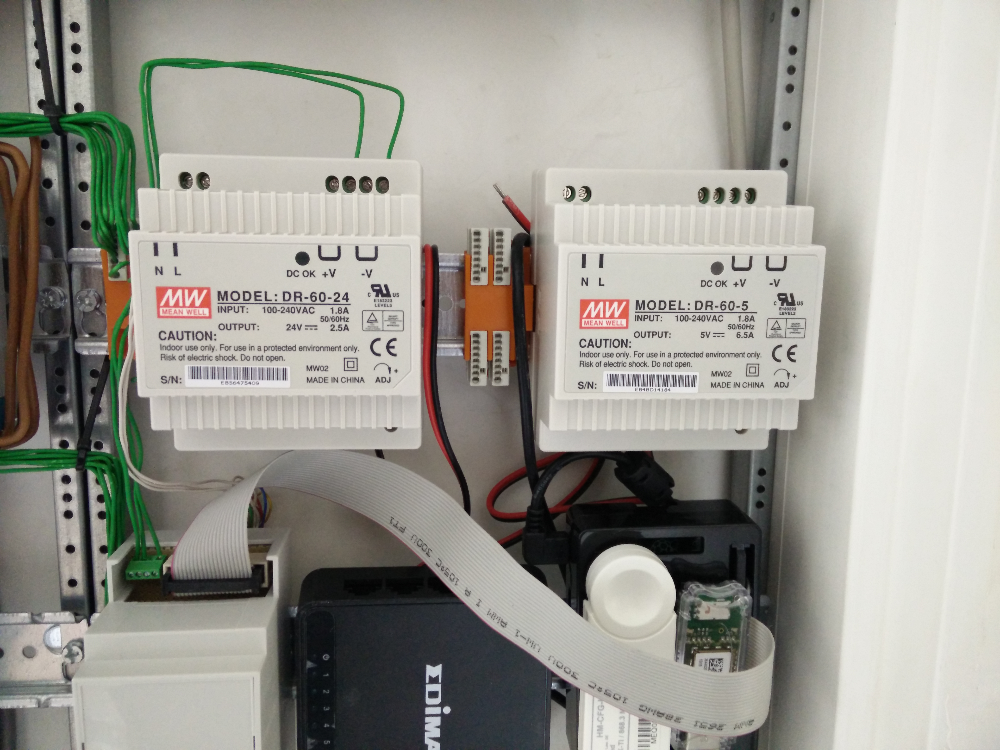
.. |image8| image:: media/image9.jpeg
.. |image9| image:: media/image10.png
   :width: 2.76978in
   :height: 2.91667in
.. |image10| image:: media/image11.jpeg
   :width: 3.10417in
   :height: 3.10417in
.. |image11| image:: media/image12.jpeg
.. |image12| image:: media/image13.jpeg
   :width: 4.01389in
   :height: 2.47782in
.. |image13| image:: media/image14.jpeg
.. |image14| image:: media/image15.jpeg
.. |image15| image:: media/image16.jpeg
   :width: 2.25404in
   :height: 3.52023in
.. |image16| image:: media/image17.jpeg
.. |image17| image:: media/image18.jpeg
   :width: 0.56962in
   :height: 1.73489in
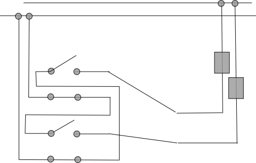
.. |image19| image:: media/image20.jpeg
.. |image20| image:: media/image21.jpeg
   :width: 1.97222in
   :height: 1.97222in
.. |image21| image:: media/image22.jpeg
   :width: 1.97222in
   :height: 1.97222in
.. |image22| image:: media/image23.jpeg
   :width: 1.97222in
   :height: 1.74306in
.. |image23| image:: media/image24.jpeg
   :width: 1.97222in
   :height: 1.97222in
.. |image24| image:: media/image25.jpeg
.. |image25| image:: media/image26.jpeg
.. |image26| image:: media/image27.jpeg
.. |image27| image:: media/image28.jpeg
.. |image28| image:: media/image29.jpeg
.. |image29| image:: media/image30.jpeg
.. |image30| image:: media/image31.jpeg
.. |image31| image:: media/image32.jpeg
   :width: 3.93681in
   :height: 5.24861in
.. |image32| image:: media/image33.jpeg
   :width: 2.0in
   :height: 2.0in
.. |image33| image:: media/image34.jpeg
   :width: 2.0in
   :height: 2.0in
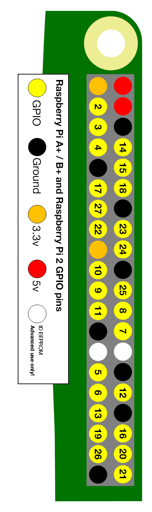
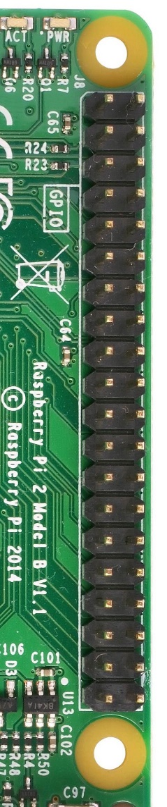
.. |image36| image:: media/image37.jpeg
   :width: 2.0in
   :height: 2.0in
.. |image37| image:: media/image38.png
   :width: 2.0in
   :height: 2.0in
.. |image38| image:: media/image39.jpeg

.. |image40| image:: media/image41.jpeg
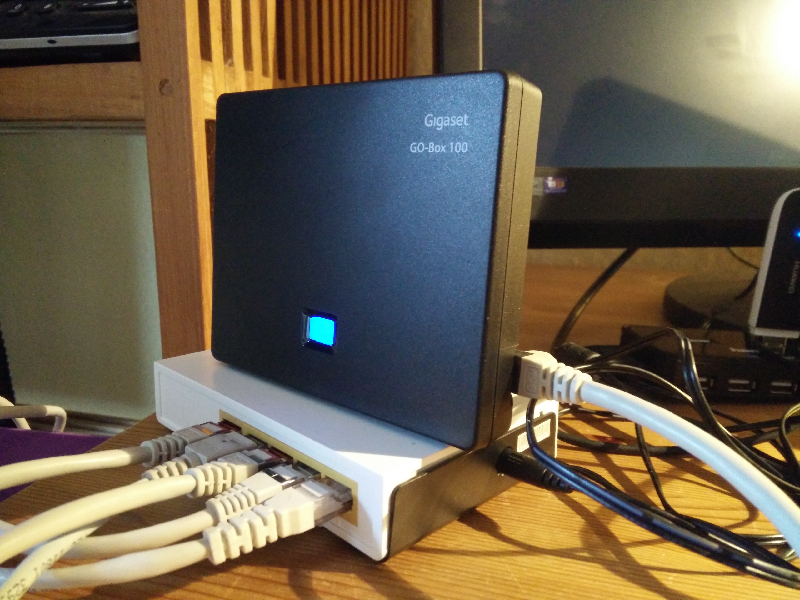
.. |image42| image:: media/image43.jpeg
.. |image43| image:: media/image44.png
   :width: 4.64583in
   :height: 3.11389in
.. |image44| image:: media/image45.png
   :width: 4.64583in
   :height: 3.11389in
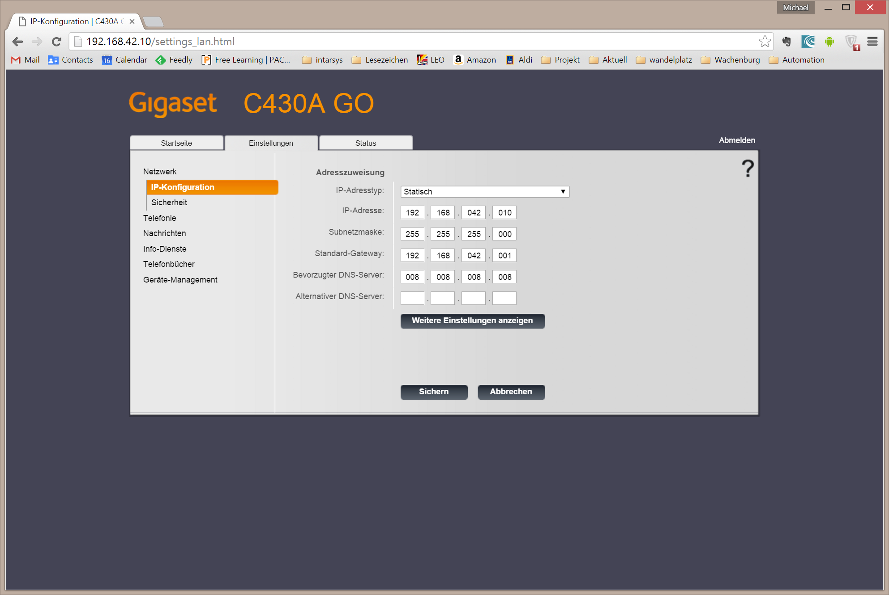
.. |image46| image:: media/image47.png
   :width: 4.64583in
   :height: 3.11389in
.. |image47| image:: media/image48.png
   :width: 4.64583in
   :height: 3.11389in
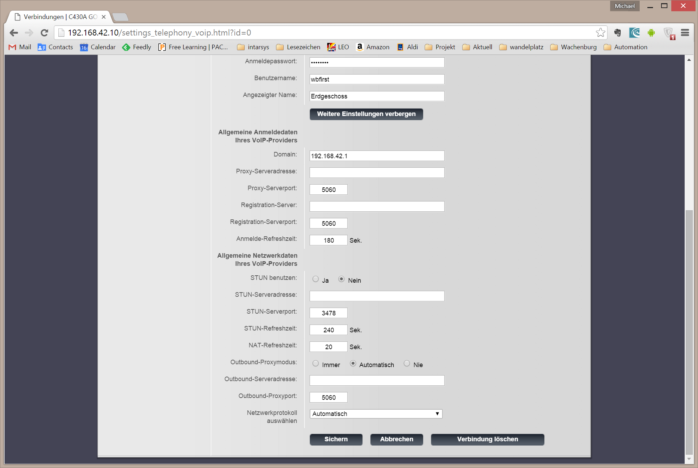
.. |image49| image:: media/image50.png
   :width: 4.64583in
   :height: 3.11389in
.. |image50| image:: media/image51.png
   :width: 4.64583in
   :height: 3.53264in
.. |image51| image:: media/image52.png
   :width: 4.02183in
   :height: 2.69444in
.. |image52| image:: media/image53.png
   :width: 4.64583in
   :height: 3.11250in
.. |image53| image:: media/image54.png
   :width: 4.64583in
   :height: 3.31875in
.. |image54| image:: media/image55.png
   :width: 4.64583in
   :height: 3.27431in
.. |image55| image:: media/image56.png
   :width: 4.64583in
   :height: 3.27431in
.. |image56| image:: media/image57.png
   :width: 4.64583in
   :height: 3.27431in
.. |image57| image:: media/image58.png
   :width: 4.64583in
   :height: 3.27431in
.. |image58| image:: media/image59.png
   :width: 4.64583in
   :height: 3.27431in
.. |image59| image:: media/image60.png
   :width: 4.64583in
   :height: 3.27431in
.. |image60| image:: media/image61.png
   :width: 4.64583in
   :height: 3.27431in
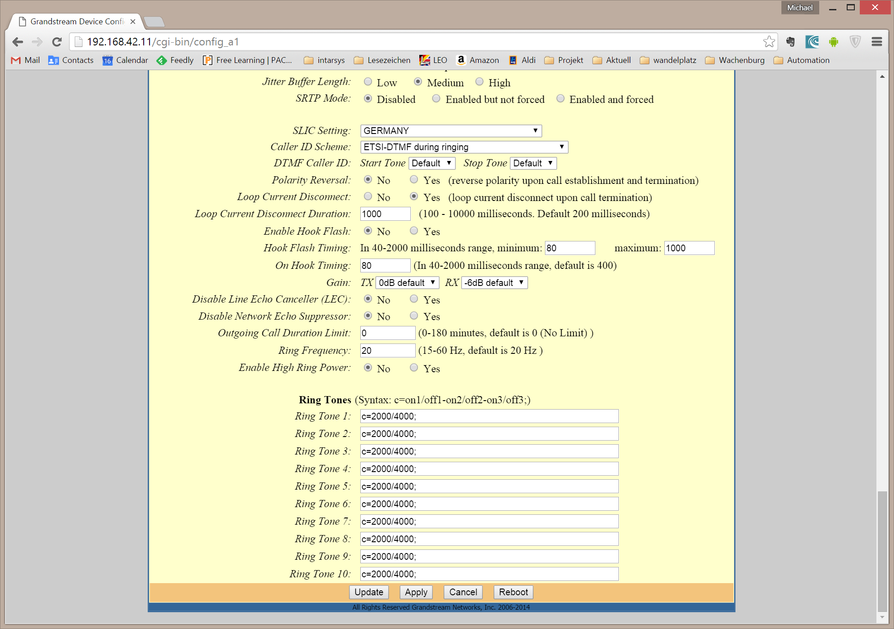
.. |image62| image:: media/image63.jpeg
   :width: 4.28472in
   :height: 4.28472in
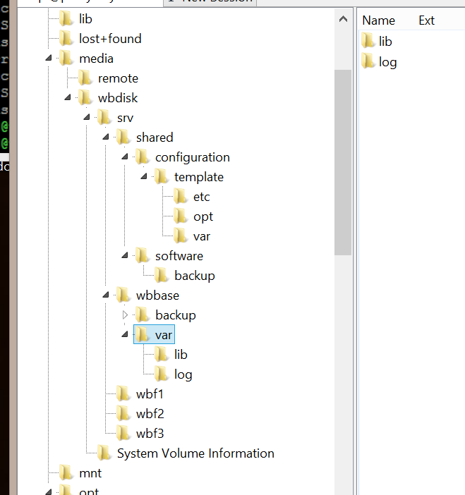
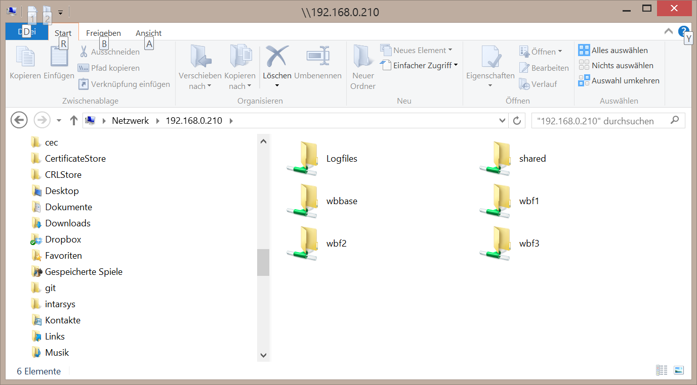
.. |image65| image:: media/image66.jpeg
   :width: 5.03878in
   :height: 6.71856in
.. |image66| image:: media/image67.png
   :width: 6.30069in
   :height: 4.07431in
.. |image67| image:: media/image68.png
   :width: 4.15716in
   :height: 4.44444in
.. |image68| image:: media/image69.png
   :width: 5.11712in
   :height: 2.72917in
.. |image69| image:: media/image70.png
   :width: 4.36175in
   :height: 4.31944in
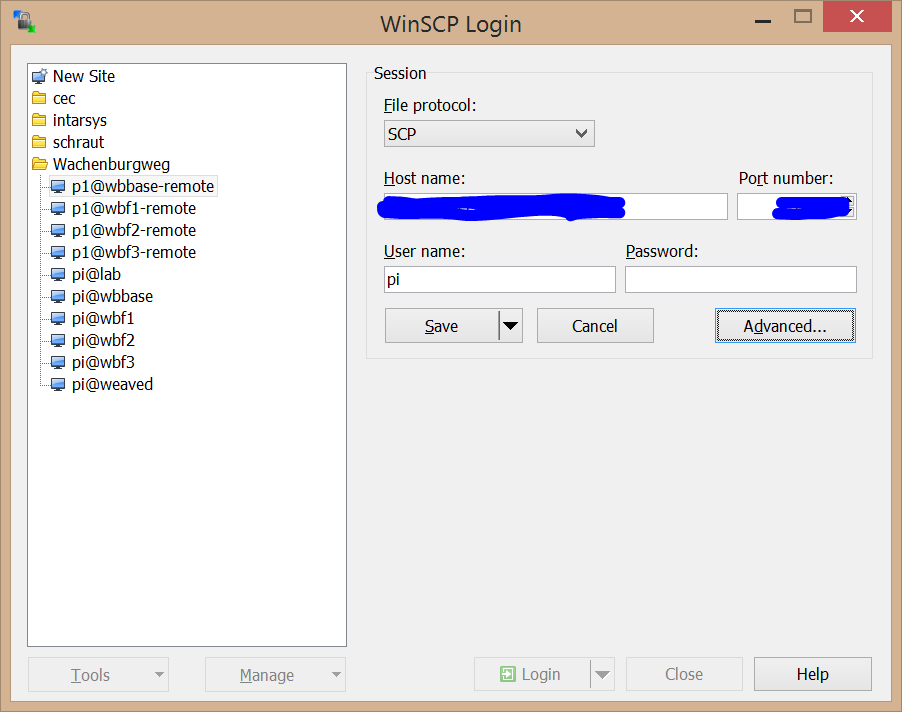
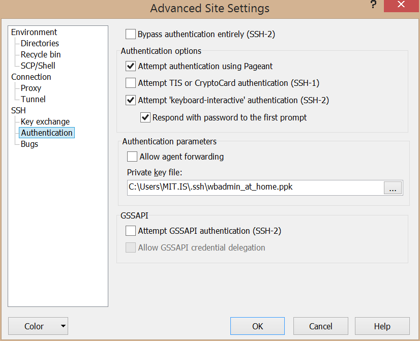
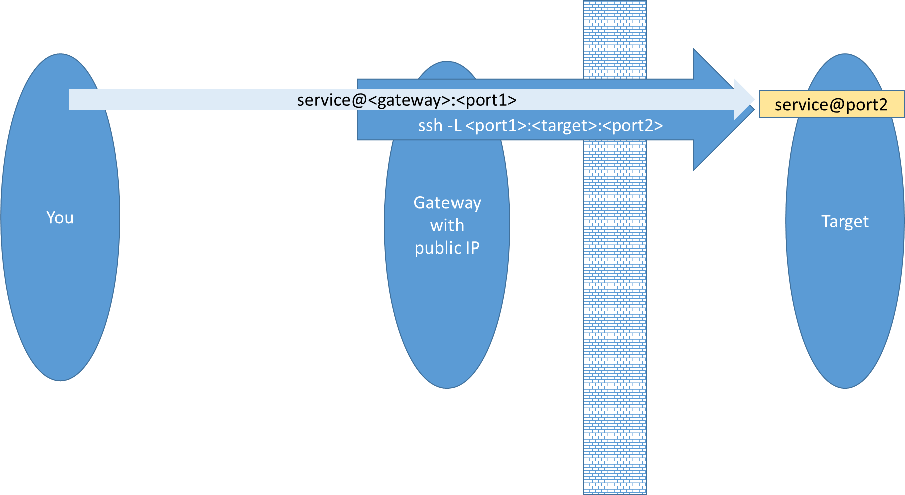
.. |image73| image:: media/image74.png
   :width: 5.48454in
   :height: 3.00054in
.. |br| raw:: html

     