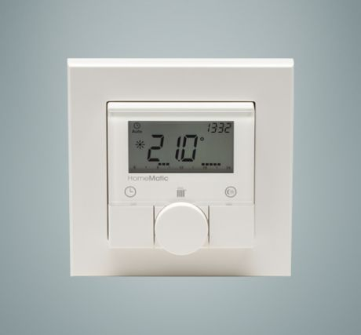
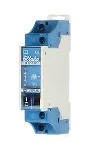
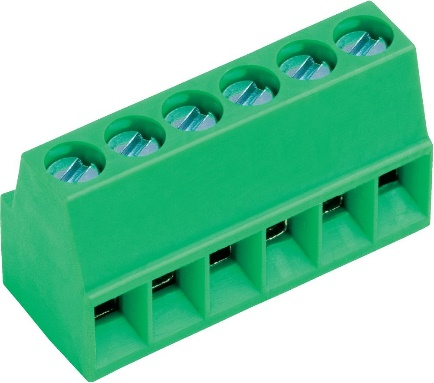
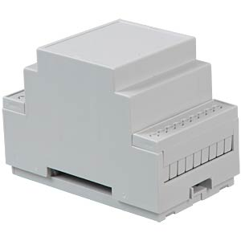
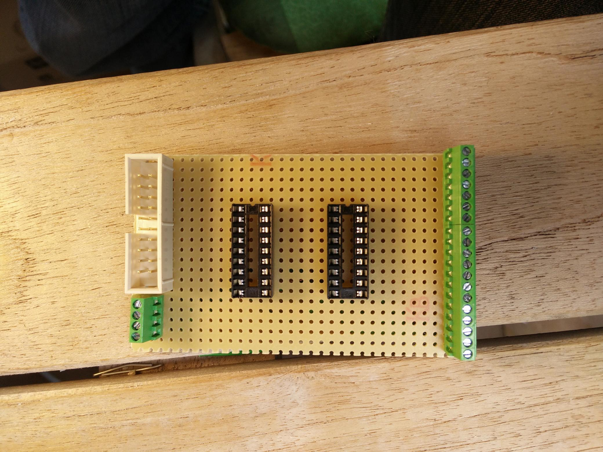
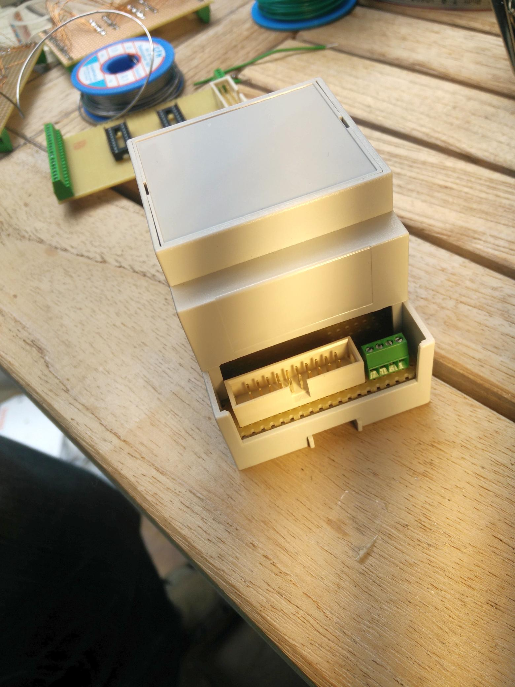
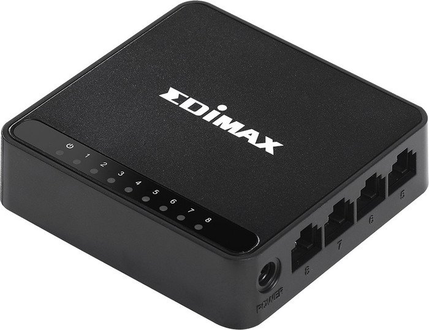
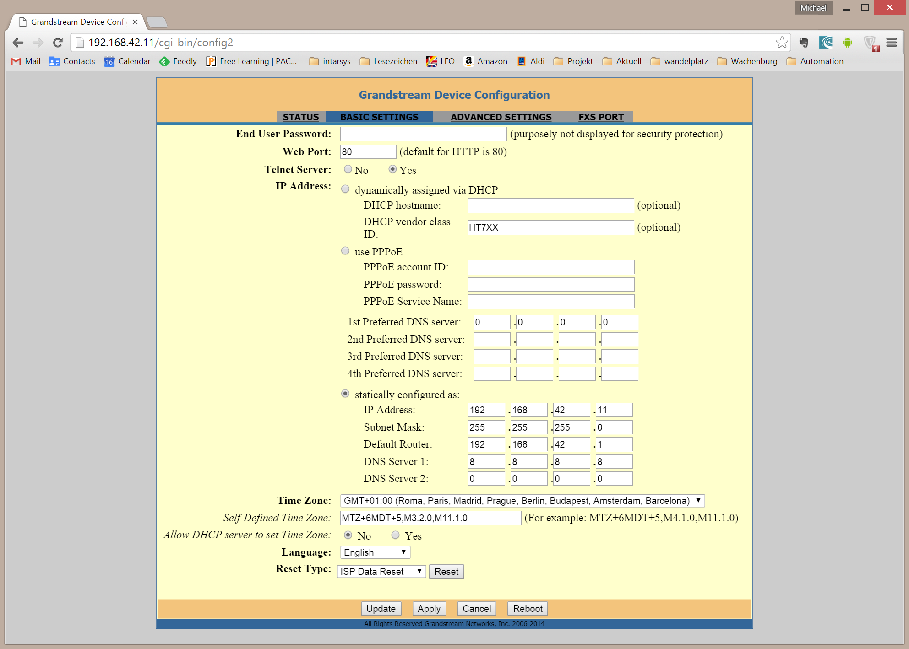
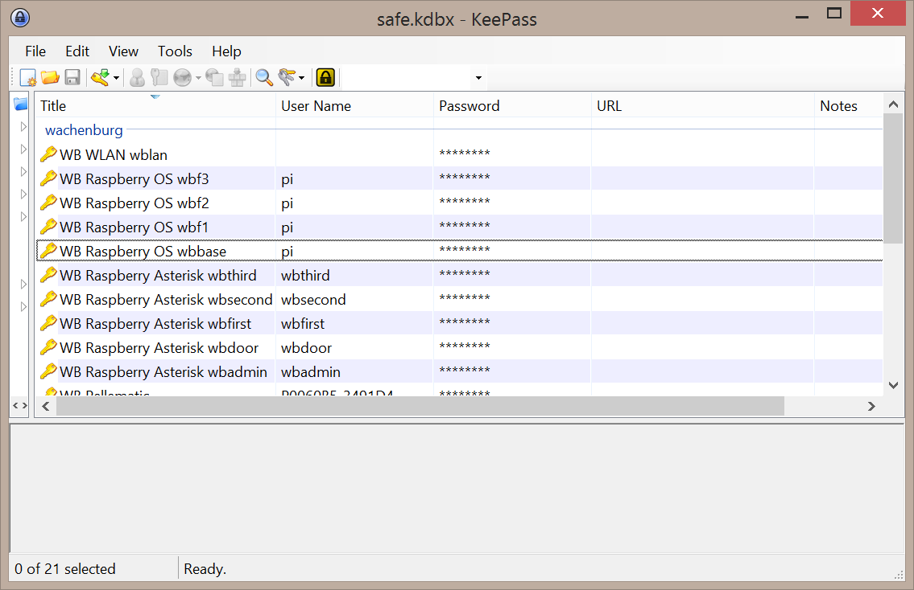

Part VI
=======

These are the appendices, a bunch of information added for reference
purposes.

Troubleshooting
---------------

-  have a backup around

-  fstab tmp too small

-  update-rc.d -f ntp remove

-  touch definition files

Oekofen Pellematic Datapoints
-----------------------------

These are the datappoints reverse engineered from the Oekofen Pellematic heating, date of manufacture in 2015.

+-----------------------------------------------+-------------------------+
| CAPPL:FA[0].asche_externe_aschebox            |                         |
+-----------------------------------------------+-------------------------+
| CAPPL:FA[0].ausgang_motor[0]                  |                         |
+-----------------------------------------------+-------------------------+
| CAPPL:FA[0].ausgang_motor[1]                  |                         |
+-----------------------------------------------+-------------------------+
| CAPPL:FA[0].ausgang_motor[11]                 |                         |
+-----------------------------------------------+-------------------------+
| CAPPL:FA[0].ausgang_motor[2]                  |                         |
+-----------------------------------------------+-------------------------+
| CAPPL:FA[0].ausgang_motor[3]                  |                         |
+-----------------------------------------------+-------------------------+
| CAPPL:FA[0].ausgang_motor[4]                  |                         |
+-----------------------------------------------+-------------------------+
| CAPPL:FA[0].ausgang_motor[5]                  |                         |
+-----------------------------------------------+-------------------------+
| CAPPL:FA[0].ausgang_motor[7]                  |                         |
+-----------------------------------------------+-------------------------+
| CAPPL:FA[0].ausgang_motor[8]                  |                         |
+-----------------------------------------------+-------------------------+
| CAPPL:FA[0].ausgang_stoermelderelais          |                         |
+-----------------------------------------------+-------------------------+
| CAPPL:FA[0].betriebsart_fa                    |                         |
+-----------------------------------------------+-------------------------+
| CAPPL:FA[0].frischwasser_soll_temp            |                         |
+-----------------------------------------------+-------------------------+
| CAPPL:FA[0].L_abgastemperatur                 |                         |
+-----------------------------------------------+-------------------------+
| CAPPL:FA[0].L_abgastemperatur_vorhanden       |                         |
+-----------------------------------------------+-------------------------+
| CAPPL:FA[0].L_agt_zuend_flammueb              |                         |
+-----------------------------------------------+-------------------------+
| CAPPL:FA[0].L_alterkessel                     |                         |
+-----------------------------------------------+-------------------------+
| CAPPL:FA[0].L_anzahl_zuendung                 |                         |
+-----------------------------------------------+-------------------------+
| CAPPL:FA[0].L_aussentemperatur                |                         |
+-----------------------------------------------+-------------------------+
| CAPPL:FA[0].L_aussentemperatur_vorhanden      |                         |
+-----------------------------------------------+-------------------------+
| CAPPL:FA[0].L_br1                             |                         |
+-----------------------------------------------+-------------------------+
| CAPPL:FA[0].L_brennerlaufzeit_anzeige         |                         |
+-----------------------------------------------+-------------------------+
| CAPPL:FA[0].L_brennerstarts                   |                         |
+-----------------------------------------------+-------------------------+
| CAPPL:FA[0].L_bsk_status                      |                         |
+-----------------------------------------------+-------------------------+
| CAPPL:FA[0].L_drehzahl_ascheschnecke_ist      |                         |
+-----------------------------------------------+-------------------------+
| CAPPL:FA[0].L_drehzahl_uw_ist                 |                         |
+-----------------------------------------------+-------------------------+
| CAPPL:FA[0].L_einschublaufzeit                |                         |
+-----------------------------------------------+-------------------------+
| CAPPL:FA[0].L_feuerraumtemperatur             |                         |
+-----------------------------------------------+-------------------------+
| CAPPL:FA[0].L_feuerraumtemperatur_soll        |                         |
+-----------------------------------------------+-------------------------+
| CAPPL:FA[0].L_feuerraumtemperatur_vorhanden   |                         |
+-----------------------------------------------+-------------------------+
| CAPPL:FA[0].L_fuellstand_aktuell              |                         |
+-----------------------------------------------+-------------------------+
| CAPPL:FA[0].L_kap_sensor_raumentnahme         |                         |
+-----------------------------------------------+-------------------------+
| CAPPL:FA[0].L_kap_sensor_zwischenbehaelter    |                         |
+-----------------------------------------------+-------------------------+
| CAPPL:FA[0].L_kesselstatus                    |                         |
+-----------------------------------------------+-------------------------+
| CAPPL:FA[0].L_kesseltemperatur                |                         |
+-----------------------------------------------+-------------------------+
| CAPPL:FA[0].L_kesseltemperatur_soll_anzeige   |                         |
+-----------------------------------------------+-------------------------+
| CAPPL:FA[0].L_luefterdrehzahl                 |                         |
+-----------------------------------------------+-------------------------+
| CAPPL:FA[0].L_mittlere_laufzeit               |                         |
+-----------------------------------------------+-------------------------+
| CAPPL:FA[0].L_pausenzeit                      |                         |
+-----------------------------------------------+-------------------------+
| CAPPL:FA[0].L_pe_schnecke_sauganlage          |                         |
+-----------------------------------------------+-------------------------+
| CAPPL:FA[0].L_pelletsfuellstand               |                         |
+-----------------------------------------------+-------------------------+
| CAPPL:FA[0].L_reserve_temp1                   |                         |
+-----------------------------------------------+-------------------------+
| CAPPL:FA[0].L_saugintervall                   |                         |
+-----------------------------------------------+-------------------------+
| CAPPL:FA[0].L_saugzugdrehzahl                 |                         |
+-----------------------------------------------+-------------------------+
| CAPPL:FA[0].L_sillstandszeit                  |                         |
+-----------------------------------------------+-------------------------+
| CAPPL:FA[0].L_status_saugsonde1               |                         |
+-----------------------------------------------+-------------------------+
| CAPPL:FA[0].L_status_saugsonde2               |                         |
+-----------------------------------------------+-------------------------+
| CAPPL:FA[0].L_status_saugsonde3               |                         |
+-----------------------------------------------+-------------------------+
| CAPPL:FA[0].L_unterdruck                      |                         |
+-----------------------------------------------+-------------------------+
| CAPPL:FA[0].L_unterdruck_soll_anzeige         |                         |
+-----------------------------------------------+-------------------------+
| CAPPL:FA[0].L_unterdruck_vorhanden            |                         |
+-----------------------------------------------+-------------------------+
| CAPPL:FA[0].L_zwischenbehaelter_aktuell       |                         |
+-----------------------------------------------+-------------------------+
| CAPPL:FA[0].leistung_brennstoffkorrektur      |                         |
+-----------------------------------------------+-------------------------+
| CAPPL:FA[0].saugsonden_modus                  |                         |
+-----------------------------------------------+-------------------------+
| CAPPL:FA[0].unterdruck_modus                  |                         |
+-----------------------------------------------+-------------------------+
| CAPPL:FA[0].wiegezelle_fuellstandserkennung   |                         |
+-----------------------------------------------+-------------------------+
| CAPPL:FA[0].wiegezelle_fuellstandserkennung_gk|                         |
+-----------------------------------------------+-------------------------+
| CAPPL:LOCAL.anlage_betriebsart                |                         |
+-----------------------------------------------+-------------------------+
| CAPPL:LOCAL.aussentemperatur_vorhanden        |                         |
+-----------------------------------------------+-------------------------+
| CAPPL:LOCAL.externe_anforderung_aktiviert     |                         |
+-----------------------------------------------+-------------------------+
| CAPPL:LOCAL.fa_hkr_mode                       |                         |
+-----------------------------------------------+-------------------------+
| CAPPL:LOCAL.fernwartung_einheit               |                         |
+-----------------------------------------------+-------------------------+
| CAPPL:LOCAL.hk[0].aktives_zeitprogramm        |                         |
+-----------------------------------------------+-------------------------+
| CAPPL:LOCAL.hk[0].alias                       |                         |
+-----------------------------------------------+-------------------------+
| CAPPL:LOCAL.hk[0].auto_extern                 |                         |
+-----------------------------------------------+-------------------------+
| CAPPL:LOCAL.hk[0].betriebsart[0]              |                         |
+-----------------------------------------------+-------------------------+
| CAPPL:LOCAL.hk[0].betriebsart[1]              | Aus = 0                 |
|                                               | Auto = 1                |
|                                               | Heizen = 2              |
|                                               | Absenken = 3            |
+-----------------------------------------------+-------------------------+
| CAPPL:LOCAL.hk[0].betriebsart[2]              |                         |
+-----------------------------------------------+-------------------------+
| CAPPL:LOCAL.hk[0].quelle                      |                         |
+-----------------------------------------------+-------------------------+
| CAPPL:LOCAL.hk[0].raumfuehler_zuweisung       |                         |
+-----------------------------------------------+-------------------------+
| CAPPL:LOCAL.hk[0].raumtemp_absenken           |                         |
+-----------------------------------------------+-------------------------+
| CAPPL:LOCAL.hk[0].raumtemp_heizen             |                         |
+-----------------------------------------------+-------------------------+
| CAPPL:LOCAL.hk[0].raumtempabweichung_fernb    |                         |
+-----------------------------------------------+-------------------------+
| CAPPL:LOCAL.hk[0].solarheiz_betriebsart[0]    |                         |
+-----------------------------------------------+-------------------------+
| CAPPL:LOCAL.hk[0].solarheiz_betriebsart[1]    |                         |
+-----------------------------------------------+-------------------------+
| CAPPL:LOCAL.hk[0].solarheiz_betriebsart[2]    |                         |
+-----------------------------------------------+-------------------------+
| CAPPL:LOCAL.hk[0].vorhanden                   |                         |
+-----------------------------------------------+-------------------------+
| CAPPL:LOCAL.L_aussentemperatur_ist            |                         |
+-----------------------------------------------+-------------------------+
| CAPPL:LOCAL.L_fernwartung_datum_zeit_sek      |                         |
+-----------------------------------------------+-------------------------+
| CAPPL:LOCAL.L_hk[0].pumpe                     |                         |
+-----------------------------------------------+-------------------------+
| CAPPL:LOCAL.L_hk[0].raumtemp_ist              |                         |
+-----------------------------------------------+-------------------------+
| CAPPL:LOCAL.L_hk[0].raumtemp_soll             |                         |
+-----------------------------------------------+-------------------------+
| CAPPL:LOCAL.L_hk[0].status                    |                         |
+-----------------------------------------------+-------------------------+
| CAPPL:LOCAL.L_hk[0].vorlauftemp_ist           |                         |
+-----------------------------------------------+-------------------------+
| CAPPL:LOCAL.L_hk[0].vorlauftemp_soll          |                         |
+-----------------------------------------------+-------------------------+
| CAPPL:LOCAL.L_ke_brennerkontakt_1             |                         |
+-----------------------------------------------+-------------------------+
| CAPPL:LOCAL.L_pu[0].ausschaltfuehler_ist      |                         |
+-----------------------------------------------+-------------------------+
| CAPPL:LOCAL.L_pu[0].ausschaltfuehler_soll     |                         |
+-----------------------------------------------+-------------------------+
| CAPPL:LOCAL.L_pu[0].einschaltfuehler_ist      |                         |
+-----------------------------------------------+-------------------------+
| CAPPL:LOCAL.L_pu[0].einschaltfuehler_soll     |                         |
+-----------------------------------------------+-------------------------+
| CAPPL:LOCAL.L_pu[0].pumpe                     |                         |
+-----------------------------------------------+-------------------------+
| CAPPL:LOCAL.L_pu[1].ausschaltfuehler_ist      |                         |
+-----------------------------------------------+-------------------------+
| CAPPL:LOCAL.L_pu[1].ausschaltfuehler_soll     |                         |
+-----------------------------------------------+-------------------------+
| CAPPL:LOCAL.L_pu[1].einschaltfuehler_ist      |                         |
+-----------------------------------------------+-------------------------+
| CAPPL:LOCAL.L_pu[1].einschaltfuehler_soll     |                         |
+-----------------------------------------------+-------------------------+
| CAPPL:LOCAL.L_pu[1].pumpe                     |                         |
+-----------------------------------------------+-------------------------+
| CAPPL:LOCAL.L_pu[2].ausschaltfuehler_ist      |                         |
+-----------------------------------------------+-------------------------+
| CAPPL:LOCAL.L_pu[2].ausschaltfuehler_soll     |                         |
+-----------------------------------------------+-------------------------+
| CAPPL:LOCAL.L_pu[2].einschaltfuehler_ist      |                         |
+-----------------------------------------------+-------------------------+
| CAPPL:LOCAL.L_pu[2].einschaltfuehler_soll     |                         |
+-----------------------------------------------+-------------------------+
| CAPPL:LOCAL.L_pu[2].pumpe                     |                         |
+-----------------------------------------------+-------------------------+
| CAPPL:LOCAL.L_weather[0]                      |                         |
+-----------------------------------------------+-------------------------+
| CAPPL:LOCAL.L_weather_clouds                  |                         |
+-----------------------------------------------+-------------------------+
| CAPPL:LOCAL.L_ww[0].ausschaltfuehler_ist      |                         |
+-----------------------------------------------+-------------------------+
| CAPPL:LOCAL.L_ww[0].einschaltfuehler_ist      |                         |
+-----------------------------------------------+-------------------------+
| CAPPL:LOCAL.L_ww[0].temp_soll                 |                         |
+-----------------------------------------------+-------------------------+
| CAPPL:LOCAL.L_zaehler_fehler                  |                         |
+-----------------------------------------------+-------------------------+
| CAPPL:LOCAL.pellematic_vorhanden[0]           |                         |
+-----------------------------------------------+-------------------------+
| CAPPL:LOCAL.pu[0].vorhanden                   |                         |
+-----------------------------------------------+-------------------------+
| CAPPL:LOCAL.pu[1].vorhanden                   |                         |
+-----------------------------------------------+-------------------------+
| CAPPL:LOCAL.pu[2].vorhanden                   |                         |
+-----------------------------------------------+-------------------------+
| CAPPL:LOCAL.weather_config                    |                         |
+-----------------------------------------------+-------------------------+
| CAPPL:LOCAL.ww[0].betriebsart[1]              |                         |
+-----------------------------------------------+-------------------------+
| CAPPL:LOCAL.ww[0].temp_absenken               |                         |
+-----------------------------------------------+-------------------------+
| CAPPL:LOCAL.ww[0].temp_heizen                 |                         |
+-----------------------------------------------+-------------------------+

Abbreviations
-------------

+----------------+-------------------------+
| Abbreviation   | Meaning                 |
+================+=========================+
| HA             | Home Automation         |
+----------------+-------------------------+
| SBC            | Single Board Computer   |
+----------------+-------------------------+
|                |                         |
+----------------+-------------------------+

\*nix 101
---------

Package management
~~~~~~~~~~~~~~~~~~

Show installed packages & versions

.. code::

	dpkg-query -l [filter] 

mount
~~~~~

To reload after changes

.. code::

	mount -a

shebang
~~~~~~~

The first line of a script file can be used as special marker to
identify the interpreter context to execute the file content.

.. code::

	#!/bin/sh

This will for example execute as a plain shell script.

History explains this as a concatenation of sharp (the ‘#' sign) and
bang (the unix slang for the '!').

python
~~~~~~

sudo apt-get install python-pip

sudo pip install requests

.. code::

	#!/usr/bin/python

make executable!

Users & Passwords
~~~~~~~~~~~~~~~~~

Change password
^^^^^^^^^^^^^^^

You can change your password using

.. code::

	passwd

You'll be prompted to enter your current password, then asked for a new
passwordand a confirmation. Once your new password is verified, you'll
be shown a success message and it will be immediately in effect.

Remove password
^^^^^^^^^^^^^^^

In certain occasions you may want to remove a users password (wich means
he can not login), especially you may want to remove the possibility for
the user "root" to login interactively.

.. code::

	sudo passwd root -d

Create a user
^^^^^^^^^^^^^

To create an additional user "foo" you can

.. code::

	sudo adduser foo

This will add a new user after prompting for a new password.

Remove a user
^^^^^^^^^^^^^

If you want to get rid of a user, type

.. code::

	sudo userdel -r foo

The "-r" option will remove the home folder, too.

Service Management
~~~~~~~~~~~~~~~~~~

Deactivate

.. code::

	sudo service {dienst} stop
	sudo update-rc.d -f {DIENST} remove

Activate

.. code::

	sudo update-rc.d {DIENST} defaults

Send command to background
~~~~~~~~~~~~~~~~~~~~~~~~~~

.. code::

	&

Concatenating output
~~~~~~~~~~~~~~~~~~~~

.. code::

	( command1 ; command2 ; command3 ) | cat

whoami
~~~~~~

groups
~~~~~~

rm
~~

rm removes a file or directory

Safety belt

.. code::

	rm -I

Prompt once if you're about to delete recursively or a lot of files.

-r recursive delete. To delete directories you must always explicitly
use -r

File system magic
~~~~~~~~~~~~~~~~~

Show file system of a file
^^^^^^^^^^^^^^^^^^^^^^^^^^

.. code::

	df -T /else/where

Networking
~~~~~~~~~~

netstat
^^^^^^^

Now lets have a look at the current routing information with "netstat
-r"

.. code::

	Kernel-IP-Routentabelle
	Ziel Router Genmask Flags MSS Fenster irtt Iface
	default * 0.0.0.0 U 0 0 0 ppp0
	10.64.64.64 * 255.255.255.255 UH 0 0 0 ppp0
	192.168.42.0 * 255.255.255.0 U 0 0 0 eth0

crontab
~~~~~~~

To edit a crontab entry call

.. code::

	sudo crontab -e

or

.. code::

	crontab -e

depending on if you want to edit the root or current user specific
crontab. The crontab definitions are stored in /var/spool/cron/crontabs,
but you should not edit the crontab definitions directly.

Here a short summary of crontab syntax.

.. code::

	* * * * * <user> <command>
	| | | | |
	| | | | +----- day of week (0 is sunday)
	| | | +------- month (1 - 12)
	| | +--------- day (1 - 31)
	| +----------- hour (0 - 23)
	+------------- minute (0 - 59),

	| */n every n unit
	| x-y from unit x to unit y

Short forms

+--------------+-------------------+-----------------+
| Short form   | Meaning           | cron synax      |
+==============+===================+=================+
| @reboot      | once upon start   |                 |
+--------------+-------------------+-----------------+
| @daily       | once per day      | 0 0 \* \* \*    |
+--------------+-------------------+-----------------+
| @hourly      | one per hour      | 0 \* \* \* \*   |
+--------------+-------------------+-----------------+
| @weekly      | once per week     | 0 0 \* \* 0     |
+--------------+-------------------+-----------------+
| @monthly     | once per month    | 0 0 1 \* \*     |
+--------------+-------------------+-----------------+
| @yearly      | once per year     | 0 0 1 1 \*      |
+--------------+-------------------+-----------------+

To list the crontab for the current user

.. code::

	crontab -l

Tools
-----

Connecting
~~~~~~~~~~

WinSCP

Putty

Some network tools
~~~~~~~~~~~~~~~~~~

wget
^^^^

commandline HTTP client.

NMAP
^^^^

Simple host discovery

.. code::

	sudo apt-get install nmap

.. code::

	nmap -sP 192.168.2.1/24

netcat
^^^^^^

The net swiss army knife

.. code::

	sudo apt-get install ncat

File listings
-------------

/etc/fstab
~~~~~~~~~~

Indices and tables
==================

- :ref:`genindex`
- :ref:`modindex`
- :ref:`search`

.. |image0| image:: media/image1.jpeg
.. |image1| image:: media/image2.png
   :width: 3.18056in
   :height: 2.12500in
.. |image2| image:: media/image3.jpeg
   :width: 2.26389in
   :height: 2.26389in
.. |image3| image:: media/image4.jpeg
   :width: 2.18750in
   :height: 1.63889in
.. |image4| image:: media/image5.jpeg
.. |image5| image:: media/image6.jpeg
.. |image6| image:: media/image7.jpeg
   :width: 3.57639in
   :height: 2.77778in
.. |image7| image:: media/image8.jpeg
.. |image8| image:: media/image9.jpeg
.. |image9| image:: media/image10.png
   :width: 2.76978in
   :height: 2.91667in
.. |image10| image:: media/image11.jpeg
   :width: 3.10417in
   :height: 3.10417in
.. |image11| image:: media/image12.jpeg
.. |image12| image:: media/image13.jpeg
   :width: 4.01389in
   :height: 2.47782in

.. |image14| image:: media/image15.jpeg
.. |image15| image:: media/image16.jpeg
   :width: 2.25404in
   :height: 3.52023in

.. |image17| image:: media/image18.jpeg
   :width: 0.56962in
   :height: 1.73489in
.. |image18| image:: media/image19.png
.. |image19| image:: media/image20.jpeg
.. |image20| image:: media/image21.jpeg
   :width: 1.97222in
   :height: 1.97222in
.. |image21| image:: media/image22.jpeg
   :width: 1.97222in
   :height: 1.97222in

.. |image23| image:: media/image24.jpeg
   :width: 1.97222in
   :height: 1.97222in

.. |image25| image:: media/image26.jpeg
.. |image26| image:: media/image27.jpeg
.. |image27| image:: media/image28.jpeg

.. |image29| image:: media/image30.jpeg

.. |image31| image:: media/image32.jpeg
   :width: 3.93681in
   :height: 5.24861in
.. |image32| image:: media/image33.jpeg
   :width: 2.0in
   :height: 2.0in
.. |image33| image:: media/image34.jpeg
   :width: 2.0in
   :height: 2.0in
.. |image34| image:: media/image35.png
   :width: 2.0in
   :height: 2.0in
.. |image35| image:: media/image36.jpeg
   :width: 2.0in
   :height: 2.0in
.. |image36| image:: media/image37.jpeg
   :width: 2.0in
   :height: 2.0in
.. |image37| image:: media/image38.png
   :width: 2.0in
   :height: 2.0in

.. |image39| image:: media/image40.jpeg
.. |image40| image:: media/image41.jpeg
.. |image41| image:: media/image42.jpeg
.. |image42| image:: media/image43.jpeg
.. |image43| image:: media/image44.png
   :width: 4.64583in
   :height: 3.11389in
.. |image44| image:: media/image45.png
   :width: 4.64583in
   :height: 3.11389in
.. |image45| image:: media/image46.png
   :width: 4.64583in
   :height: 3.11389in
.. |image46| image:: media/image47.png
   :width: 4.64583in
   :height: 3.11389in
.. |image47| image:: media/image48.png
   :width: 4.64583in
   :height: 3.11389in
.. |image48| image:: media/image49.png
   :width: 4.64583in
   :height: 3.11389in
.. |image49| image:: media/image50.png
   :width: 4.64583in
   :height: 3.11389in
.. |image50| image:: media/image51.png
   :width: 4.64583in
   :height: 3.53264in
.. |image51| image:: media/image52.png
   :width: 4.02183in
   :height: 2.69444in
.. |image52| image:: media/image53.png
   :width: 4.64583in
   :height: 3.11250in

.. |image54| image:: media/image55.png
   :width: 4.64583in
   :height: 3.27431in
.. |image55| image:: media/image56.png
   :width: 4.64583in
   :height: 3.27431in
.. |image56| image:: media/image57.png
   :width: 4.64583in
   :height: 3.27431in
.. |image57| image:: media/image58.png
   :width: 4.64583in
   :height: 3.27431in
.. |image58| image:: media/image59.png
   :width: 4.64583in
   :height: 3.27431in
.. |image59| image:: media/image60.png
   :width: 4.64583in
   :height: 3.27431in
.. |image60| image:: media/image61.png
   :width: 4.64583in
   :height: 3.27431in
.. |image61| image:: media/image62.png
   :width: 4.64583in
   :height: 3.27431in
.. |image62| image:: media/image63.jpeg
   :width: 4.28472in
   :height: 4.28472in
.. |image63| image:: media/image64.png
   :width: 4.42242in
   :height: 4.71098in
.. |image64| image:: media/image65.png
   :width: 6.10208in
   :height: 3.37708in
.. |image65| image:: media/image66.jpeg
   :width: 5.03878in
   :height: 6.71856in

.. |image67| image:: media/image68.png
   :width: 4.15716in
   :height: 4.44444in
.. |image68| image:: media/image69.png
   :width: 5.11712in
   :height: 2.72917in
.. |image69| image:: media/image70.png
   :width: 4.36175in
   :height: 4.31944in
.. |image70| image:: media/image71.png
   :width: 4.70833in
   :height: 3.71664in
.. |image71| image:: media/image72.png
   :width: 4.65278in
   :height: 3.77945in
.. |image72| image:: media/image73.png
   :width: 5.44547in
   :height: 2.97917in
.. |image73| image:: media/image74.png
   :width: 5.48454in
   :height: 3.00054in
.. |br| raw:: html

     